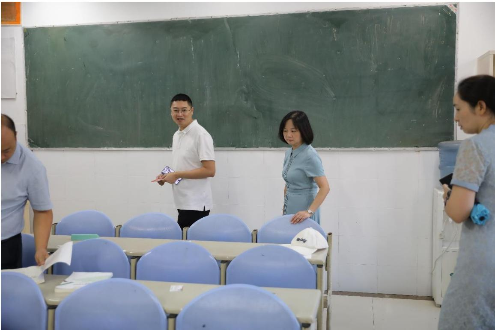
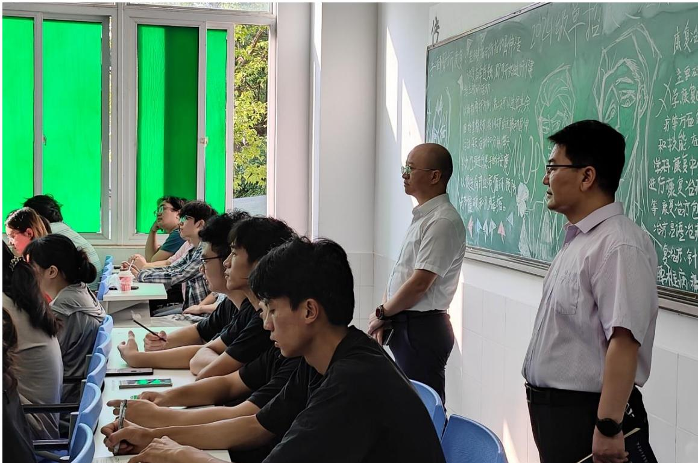
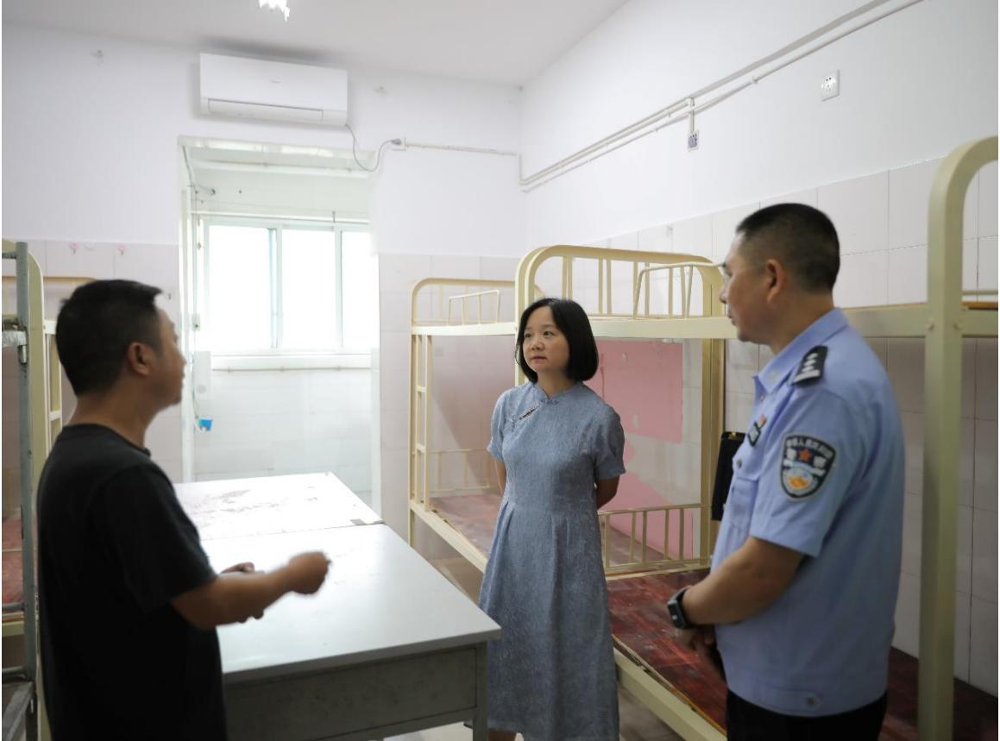
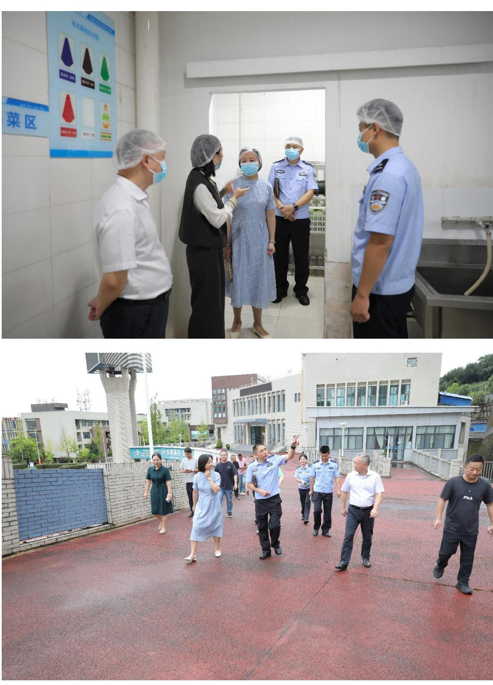
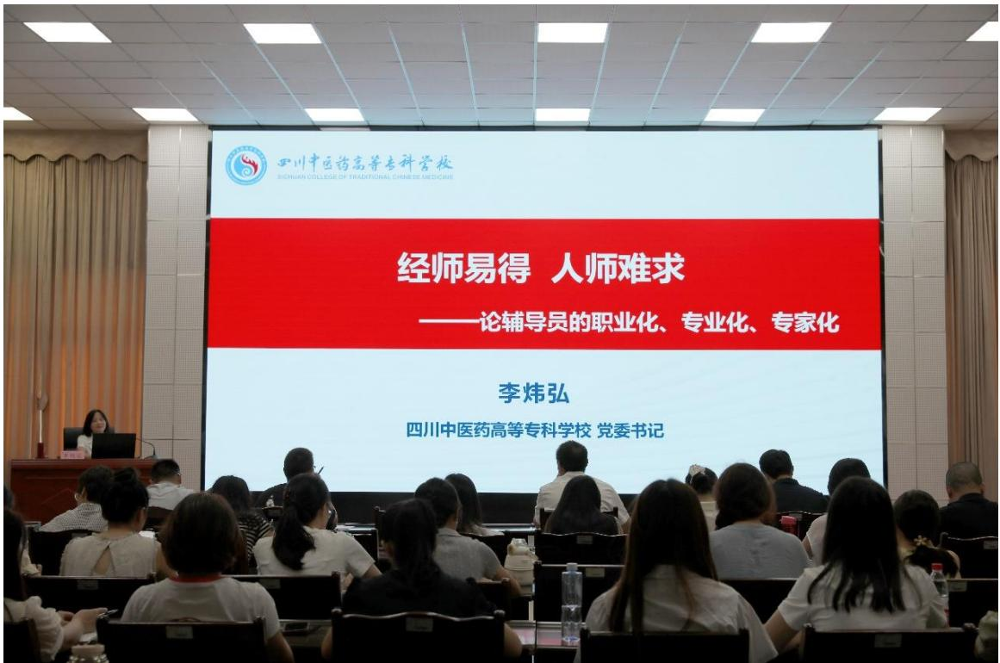
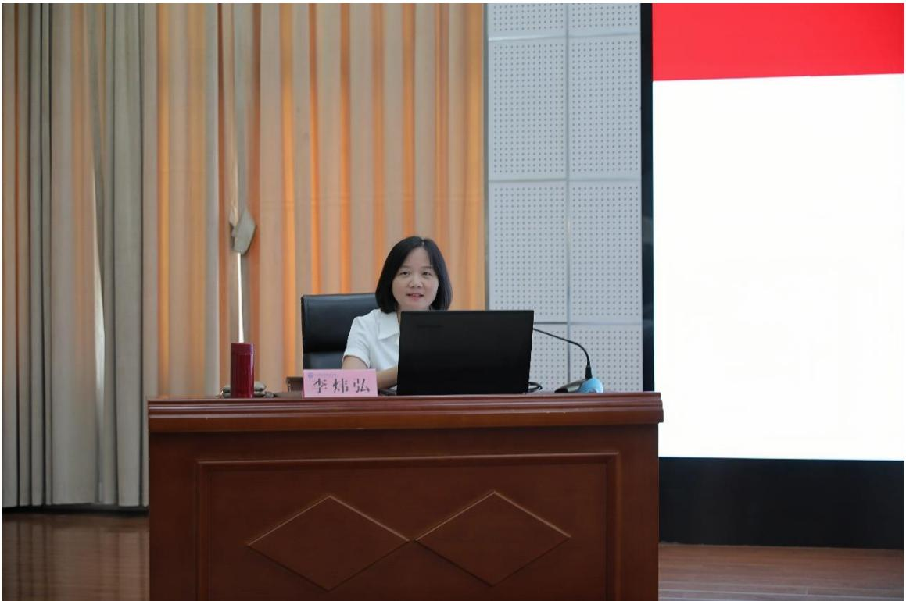
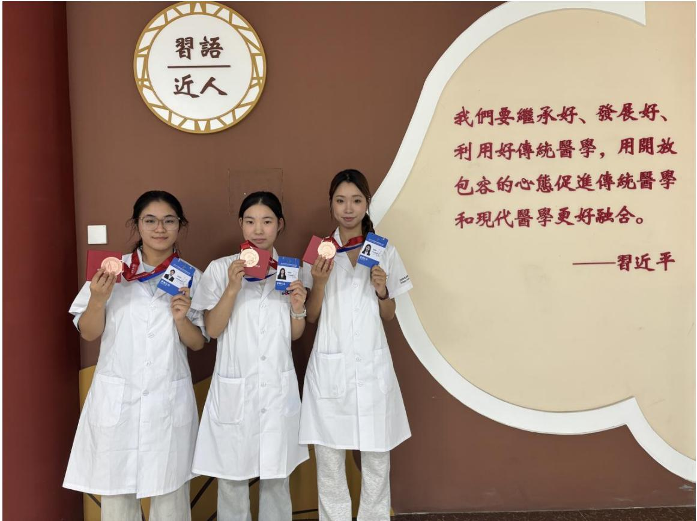
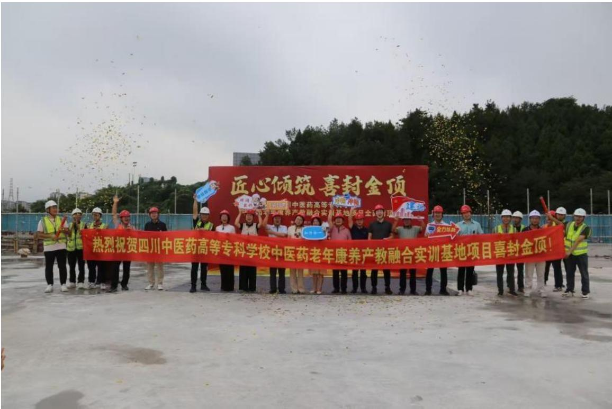
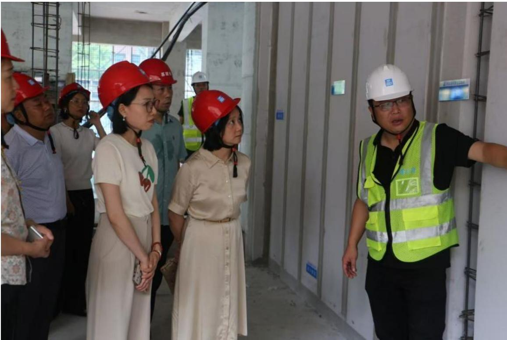
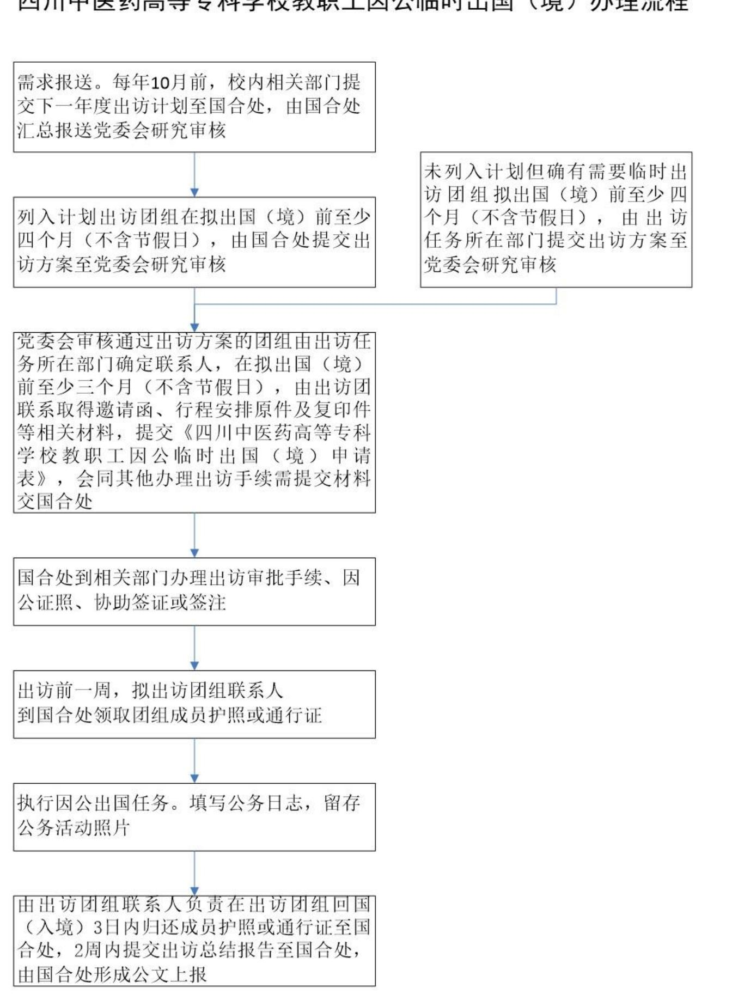

学校介绍 .  
学校开展新学期教学检查 保障教学工作平稳有序 3  
我校开展 2025 年秋季开学安全检查 . 5  
校党委书记李炜弘为辅导员作专题辅导报告 . 7  
我校在 2025 年世界职业院校技能大赛中荣获铜奖... 8  
我校中医药老年康养产教融合实训基地项目顺利封顶 . 10  
四川中医药高等专科学校“校友联络信使”聘任管理办法（试行） 13  
四川中医药高等专科学校校友工作管理办法（试行） 14  
四川中医药高等专科学校学生出国（境）留学研修申请表 . 16  
Email .. 17  
四川中医药高等专科学校学生自费出国（境）留学责任书 18  
四川中医药高等专科学校 ... 20  
关于印发《四川中医药高等专科学校学生赴港澳台交流学习管理办法(试行)》的通知 .... 20  
四川中医药高等专科学校教职工因公临时出国（境）办理流程 .. 27  
四川中医药高等专科学校关于印发我校《信息公开实施办法》的通知 .. 29

# 学校介绍

四川中医药高等专科学校是经教育部批准设置的公办全日制普通高等专科学校，坐落于四川省第二大城市、中国唯一科技城——绵阳，是四川省“双高计划”建设单位。

学校始建于1958年，2006年2月由教育部批准升格为四川中医药高等专科学校。现占地面积962.99亩，全日制在校生近7000人；现有直属附属医院1所，非直属附属医院7所，教学医院48所，实习医院（企业）124所；现有专任教师500余人，研究生学历教师占比 $5 2 . 3 3 \%$ ，高级专业技术职务专任教师占比 $3 7 . 2 \%$ 。拥有国务院特殊津贴专家 4 人；全国老中医药专家学术经验继承指导老师等全国知名专家6人，四川省学术技术带头人、四川省突出贡献优秀专家、四川省名中医36人。建有绵阳市中医药研究所等10个省市级研究平台；近五年承担省级及以上项目47项，发表SCI等高水平论文90余篇，授权专利197项，获省市科技进步奖11 项；开展国省级教育教学改革项目 18 项，获得省级教学成果奖 2 项。被列为国家“卓越医生”教育培养计划试点高校、教育部第三批现代学徒制试点高校、第二批“ $1 { + } \mathrm { X }$ 证书制度”试点单位、国家医师资格考试实践技能考试基地（中医类）、全国急救教育试点学校、成都中医药大学本科教学点、绵阳师范学院联办本科教学点；是中国医学职教整合联盟、成渝双城经济圈医药卫生联盟、四川省中医药职业教育协会（集团）理事长单位。

学校开设 29 个专科专业，设置医药卫生大类专业 23 个，包括中医学、临床医学、口腔医学、针灸推拿、中医骨伤、预防医学专科层次国控专业6个。中医学专业群为四川省高水平专业群，临床医学、针灸推拿和护理专业为中央财政重点支持专业，护理和针灸推拿专业为教育部创新发展行动计划骨干专业，也是省级重点专业。为川内外培养出12万余名医药卫生和健康服务人才，包括长江学者、三甲医院院长、全国人大代表、全国名中医等。

在省委教育工委、省教育厅和市委、市政府的关心支持下，学校相继获得团中央中国百个优秀青年志愿者服务集体、教育部高校校园文化建设优秀成果评选优秀单位、四川省中医药文化宣传教育基地、四川省“三全育人”试点单位、四川省依法治校示范校、四川省平安校园优秀单位等荣誉称号。与俄罗斯、英国、台湾等10多个国家和地区启动了友好学术交流等合作，助力绵阳中医药资源优势向产业优势转化。

站在新的起点上，学校将高举中国特色社会主义伟大旗帜，以习近平新时代中国特色社会主义思想为指导，全面贯彻党的二十大精神，全面落实党的教育方针和习近平总书记关于教育强国的重要论述，紧紧围绕立德树人根本任务，牢牢把握新时代高等教育和中医药发展新机遇，主动融入四川现代化建设新征程，积极服务中国科技城建设和打造成渝副中心，全面参与实施绵阳“五市战略”，团结奋斗、追求卓越，为建设特色鲜明的全国知名区域一流中医药本科院校而踔厉奋进。

（数据截止到 2025 年 3 月 14 日）

校训：“德馨 博学 创新 奉献”

德馨：“馨,香之远闻者也。——《说文》”。唐•刘禹锡在《陋室铭》中有“惟吾德馨”的名句，意为品德高尚、德行美好。指求学治学要以德立学、以德立身、以德立行，乃学校治学育人之根本。

博学：博，意为多、大。“学，识也。——《广雅》”，意为掌握很多的知识。指求学治学要做到海纳百川、博大精深，乃学校治学育人之目标。

创新：创造新的事物。“创，始也”。新，与旧相对。《魏书》有“革弊创新”，《周书》中有“创新改旧”。是指求学治学要敢于除旧革新、不破不立，乃学校治学育人之动力；

奉献：“奉献”一词最早见于《史记·刺客列传》，意思是恭敬地交付，呈献，不求回报，体现了奉献者的无私和崇高精神。是指求学治学必须传承的精神内涵，乃学校治学育人之追求。

# 学校精神：团结奋斗 追求卓越

团结奋斗：“团结”是为了共同的目标和利益，凝聚在一起，相互支持、协作，摒弃分歧和矛盾，形成一个紧密的整体。“奋斗”则指为了实现目标而付出不懈的努力，包括克服困难、迎接挑战、持续进取等。“团结奋斗”强调的是众人齐心协力、心往一处想、劲往一处使，为了共同的理想、事业或目标而努力拼搏、勇往直前。这是历代医专人积极向上、不畏艰难、共同进步的精神风貌和行动力量。

追求卓越：“追求”表明了一种积极主动、坚持不懈的态度和行动，体现了对目标的渴望和执着。“卓越”意味着在品质、能力、成就等方面超出一般，达到优秀、杰出、非凡的程度。它不仅涵盖了出色的成果和表现，还包括在过程中展现出的高超的技艺、创新的思维、优秀的品德等多个方面。“追求卓越”指的是一个人或一个团体不断努力，以超越平常的标准，达到极高的、优秀的水平为目标。这是医专人所需要并具备的不断超越自我，发挥到极致的一种价值取向和工作、学习状态。

校风：求真务实、严谨高效教风：严谨治学、敬业爱生学风：勤奋严谨、求实创新

人才培养定位：培养技能型、应用型、创新型高素质医药人才发展目标定位：全国知名区域一流中医药本科院校

# 学校开展新学期教学检查 保障教学工作平稳有序

发布时间：2025-09-02

9月1日上午，校党委书记李炜弘，党委副书记、校长李祥分别带队对全校教学工作开展情况进行了全面检查，党委委员、副校长梁晓峰参加检查。

李炜弘带队对南园各班课堂教学管理、教师到岗履职、学生出勤及精神状态、教学设备设施运行情况等进行了检查，对开学教学工作给予肯定，并强调要持续教学反馈，不断提升教学质量，为学生创造良好的学习环境。

李祥带队先对全校教学场所视频监控系统运行情况进行了全面检查，随后对北园和西园教学设施、课堂教学情况进行实地检查，深入课堂进行听课；还就新学期教材使用、课程安排、教师培训等情况与师生进行了深入交流。

此次开学教学检查，强化教学管理及教学服务，为新学期人才培养及教风、学风建设工作打好基础。学校将持续常态化开展教学检查，确保学校教学工作顺利开展，促进学校人才培养质量不断提升。

# 我校开展 2025 年秋季开学安全检查

发布时间：2025-09-01

8月29日，党委书记李炜弘，纪委书记李文虎带领相关部门负责人，联合金家林派出所干警，深入南、北、西园开展秋季开学安全检查，全面排查各类安全隐患。检查组实地走访了食堂、超市、学生公寓、实验室、教学楼等重点场所，对可能存在的安全风险进行了细致分析和研判。

李炜弘在检查中指出，安全是学校事业发展的根本前提，必须坚决守牢安全这条红线。她要求各职能部门以高度的责任心与紧迫感，聚焦关键区域、短板环节及高风险部位，全面加强自查自纠，迅速推进问题整改。对已发现的安全隐患，要第一时间响应，制定科学整改方案，严格落实闭环管理，坚决杜绝风险隐患，确保校园持续安全稳定。

针对检查中发现的问题，保卫处联合相关职能部门加强沟通协作，齐抓共管，进一步强化安全意识，压实主体责任，确保各项整改措施落实到位，实现安全隐患闭环管理，全力营造平安、稳定、和谐的校园环境。

# 校党委书记李炜弘为辅导员作专题辅导报告

发布时间：2025-08-28

8 月 26 日，校党委书记李炜弘以《经师易得 人师难求——论辅导员的职业化、专业化、专家化》为题，为全校辅导员作专题辅导报告。各学院党总支书记、副书记，学生科长，学管干事，专兼职辅导员、班主任及党委学生工作部全体人员参加学习。

李炜弘围绕“讲规矩、讲职责、讲情怀、讲方法、讲素养、讲事业”等六个环节，结合丰富的育人案例，系统深入地阐述了辅导员的职责定位与使命担当，分析了开展学生工作的方式方法和辅导员职业发展的路径。她强调，“讲规矩”是辅导员履职的根本保障，要坚守“师德师风零容忍”的底线，严格执行各项规章制度；“讲职责”要求辅导员全面践行思想引领、党团建设、学风培育、日常事务管理等九大职责，落实精准育人；“讲情怀”重在弘扬“心有大我、至诚报国”的教育家精神，以仁爱之心陪伴学生成长；“讲方法”强调要通过传承帮带、学习实践、总结创新不断提升工作实效；“讲素养”突出政治素养与专业能力并重，筑牢育人根基；“讲事业”是辅导员职业发展的弘道追求，要深刻认识到辅导员是国家与教育的需要，要努力成为个人为之奋斗终身的事业，坚持走职业化、专业化、专家化的成长道路。

本次专题辅导突出理论与实践相结合、严管与厚爱相结合，为我校辅导员队伍把脉问诊、举旗定向，为推进我校辅导员队伍职业化、专业化、专家化发展指明了路径、提供了动力。参加培训的辅导员们纷纷表示，将坚定育人初心使命，不断加强学习与实践，努力成为学生的人生导师和知心朋友，为学生成长保驾护航，为学校发展添砖加瓦。

（文/党委学生工作部 黄依伦 图/党委宣传统战部 吴丹）

# 我校在 2025 年世界职业院校技能大赛中荣获铜奖

发布时间：2025-09-02

9月1日，在教育部组织开展的2025年世界职业院校技能大赛总决赛争夺赛中，我校药学院的美洲大蠊团队作为四川省代表队之一参赛并荣获医药生产与经营赛道（高职组）的铜奖，实现我校在该赛事上的新突破。

本次大赛由教育部等多个部门联合主办，是全国职业教育领域的高水平、高规格顶级赛事，该赛道共有120 个学校的 150 余支队伍参赛。备赛期间，我校药学院指导教师团队（任劲松、林秋霞、韩瑞伟、钟海蓉、姜建辉、阎凌翔等）围绕美洲大蠊精心开展项目设计，解决美洲大蠊产业质量控制痛点与患者依从性瓶颈，采用一系列技术创新实现 “虫药焕新”。

赛场上，张如意、刘福苗、胡佳雨三位同学沉着应战，凭借扎实的理论功底与娴熟的操作技能，在激烈比拼中脱颖而出。从显微镜下的精准鉴别到炮制工艺的精细调控，从剂型设计的科学论证到现场答辩的逻辑阐述，全方位展现了我校“岗课赛证”融通培养模式下的实践育人成效。

此次获奖，不仅是对我校师生努力付出的肯定，也是医专人团结奋斗、追求卓越精神的卓越表现。未来，学校将持续深化“三教”改革，不断创新“以赛促学、以赛促教、以赛促改、以赛促建”的育人机制，全面提升办学水平和育人质量，为中医药事业高质量发展注入青春动能。

（文/图 药学院 袁文、何宏宇、汤丹丹）

# 我校中医药老年康养产教融合实训基地项目顺利封顶

发布时间：2025-08-27

8 月 25 日下午，我校举行了中医药老年康养产教融合实训基地项目封顶仪式。

校党委书记李炜弘携班子成员出席仪式，市委教育工委委员、局党组成员、副局长王琳玲，绵阳市教育与体育局规划基建科科长谢娟，中建三局西南公司四川分公司执行总经理王亚东、中建三局西南公司总工刘刚，以及参与项目建设的全体建设者、管理者共同见证了这一重要时刻。

仪式上，李炜弘发表致辞。她首先回顾了项目建设历程，指出该项目自去年12月开工以来，历经8个月的紧张施工，顺利实现主体结构封顶，这离不开每一位建设者的辛勤付出与不懈努力，并向所有参与项目建设的人员表达最诚挚的感谢。

针对项目后续建设，李炜弘提出了三点“希望”。一是质量要更精细。希望各单位继续紧密配合，发扬工匠精神，把每一块瓷砖、每一根管线、每一个设备都安装到位，确保建成的是精品工程、放心工程。二是协作要更高效。希望大家心往一处想、劲往一处使，确保项目明年3月如期竣工、顺利投用。三是工程要更廉洁。希望各方能始终坚守廉洁底线，加强相互监督，建立健全廉洁监督机制，把该项目建成一个质量过硬、干部清廉的“双优工程”。

致辞结束后，在现场全体人员的共同见证下，李炜弘等校领导、王琳玲等教体局领导以及中建三局领导一同移步至项目浇筑口，共同挥动铁锹，为项目封顶浇筑最后一方混凝土。随着混凝土缓缓注入，现场响起热烈的掌声，我校中医药老年康养产教融合实训基地项目封顶仪式圆满落幕。

后续建设中，建设各方将再接再厉、精益求精，严格把控工程质量，坚守安全生产底线，加快施工进度、提升施工效率，力争圆满完成既定目标，为打造高水平中医药老年康养产教融合实训基地不懈奋斗！

（文/图：基建处 彭浩）

四川中医药高等专科学校“校友联络信使”聘任管理办法（试行）

四川中医药高等专科学校关于印发《四川中医药高等专科学校“校友联络信使”聘任管理办法（试行）》的通知各部门、各学院：《四川中医药高等专科学校“校友联络信使”聘任管理办法（试行）》经2025年第16次校长办公会审定，现印发给你们，请遵照执行。特此通知。四川中医药高等专科学校2025年5月26日

—2—四川中医药高等专科学校“校友联络信使”聘任管理办法（试行）第一章总则第一条为进一步做好校友工作，完善校友联络工作组织体系，搭建学校与校友间双向互动平台，促进校友和学校事业同频共振、健康发展。在每年毕业前夕，在应届毕业生中选聘优秀毕业生担任兼职校友联络员，即“校友联络信使”，充实我校校友工作队伍，配合学校（校友联络中心）、二级学院（校友联络分中心）以及各地校友联络站开展校友工作。为规范管理，特制定本办法。第二条“校友联络信使”工作指导思想：弘扬医专精神、传递母校动态、凝聚校友情谊、彰显校友风采。第二章校友联络信使聘任条件第三条热爱祖国，遵纪守法，道德品质优良，第四条热爱母校，关注母校发展，热心校友工作，具有良好的服务和奉献精神。第五条具有较强的责任心和良好沟通协调能力。第六条热心服务同学，有良好的群众基础，有较

强的号召

—3—力和影响力。第七条符合以下条件的毕业生可优先选聘：中共党员（含中共预备党员）；当年省级或校级优秀毕业生；在校期间曾担任班级（班长、团支书）、学院（学生会主席、各部门部长）主要干部，具有较丰富的学生工作经历。第三章校友联络信使享有权利第八条受邀参加学校、学院、校友联络中心、分中心和地方校友联络站举办的各种学习、交流活动。第九条定期获得学校和校友组织的信息、资讯、动态推送。第十条优先推荐为校友代表参与校友工作。第十一条定期获得学校的校园文创或其他校园产品、刊物等。第四章校友联络信使主要职责第十二条促进校友与校友、校友与母校之间的联络和交流，及时向校友和学校通报相关信息，收集校友对母校的意见和建议并及时反馈。第十三条负责保持与本年级、本班级同学的联系，掌握同学动态。每年 6 月份汇总更新本年级、本班级校友通讯录，以电子版形式向学校校友联络中心和学院反馈。与其他信使保持密切联系，广泛联络所在地其他院系、届别的校友，汇总信息及时发

—4—送至校友联络中心和相关学院。第十四条关注学校官方网站、微信、微博、抖音等媒体平台，积极转发母校平台发布的相关信息。宣传母校发展成就，扩大学校社会影响力。第十五条关注身边校友在各行业的励志、突出、优秀等事迹及取得的重要业绩，积极向学校校友联络中心和学院提供信息或稿件，传递正能量。第十六条协调组织校友返校活动，积极参与所在地校友联络站的筹建或活动。第十七条严格落实保密责任。未经校友本人同意或授权，严禁非法转载、转发、使用校友个人信息。造成不良影响或后果的，须承担相应法律责任。第五章校友联络信使聘任管理第十八条原则上各二级学院每个毕业班级选聘 1 名班级校友联络信使，每个年级选聘1名年级校友联络信使。第十九条校友联络信使采用个人申请与学院推荐结合的形式实施聘任程序。由班干部、学生会干部或热心校友事业的毕业生担任。1.填写《校友联络信使审批表》（见附件 1），交学院审核。2.各学院审核汇总后填写《校友联络信使信息统计表》（见附件2），报送至学校校友联络中心办公室（医院服务与国际合

—5—作处）。3.校友联络中心根据相关要求选拔聘任。4.校友联络中心办公室公布受聘名单。第二十条组建校友联络信使工作群，学校校友工作相关部门、各分中心负责人入群，用于校友工作、校友活动通知发布，校友信息、校友风采报送，及校友工作经验交流等。第二十一条每年6月前完成当年校友联络信使聘任、培训等工作。第二十二条对于因各种原因不能正常履行职责的校友联络信使，校友联络中心、分中心或视情况进行调整。第六章附则第二十三条本办法自颁布之日起实施，由医院服务与国际合作处负责解释。

四川中医药高等专科学校校友工作管理办法（试行）

—1—川医专〔2025〕67号四川中医药高等专科学校关于印发《四川中医药高等专科学校校友工作管理办法（试行）》的通知各部门、各学院：《四川中医药高等专科学校校友工作管理办法（试行）》经2025年第16次校长办公会审定，现印发给你们，请遵照执行。特此通知。四川中医药高等专科学校2025年5月26日

—2—四川中医药高等专科学校校友工作管理办法（试行）一、总则第一条我校校友工作的宗旨是通过构建高效、温馨的沟通平台，紧密联结遍布各地、各行业的校友，促进校友与母校之间的情感交流、信息共享，助力校友事业发展；挖掘和发挥校友资源优势，为学校的教育教学改革、科研创新、社会服务及国际化发展注入强劲动力；传承中医药文化、弘扬中医药精神，携手校友共同为推动中医药事业的传承与创新贡献力量。第二条我校校友范围包括原绵阳地区卫生学校、绵阳中医学校、绵阳医科学校、四川省绵阳水利电力学校、四川省绵阳农业学校、四川中医药高等专科学校各时期毕业生、肄业生、进修生和各时期在以上学校工作的教职工。二、工作内容第三条建设校友信息化平台。推动校友工作数字化、智能化，夯实校友工作基础。 $\textcircled{1}$ 建立校友信息数据库，广泛收集校友信息，为校友工作提供数据支撑。$\textcircled{2}$ 开发并维护校友网站和移动应用，为校友提供交流、咨询、自助服务等便捷功能。 $\textcircled{3}$ 强化安

—3—全意识和措施，保障校友数据安全。第四条构建校友工作格局。建立校友组织服务管理体系，促进校友工作多样化、长效化。 $\textcircled{1}$ 完善校友工作组织体系，加强校友工作队伍建设，形成校友工作的常态化。 $\textcircled{2}$ 加强校友联络工作，及时更新校友信息，确保各类校友信息的时效性和准确性。 $\textcircled{3}$ 逐步建立区域、行业、专业、年级校友联络站等校友组织，加强校友工作的组织能力。第五条赋能校友持续成长。建立校友职业成长全周期支持体系，加强对校友的关怀与服务，赋能校友职业发展。 $\textcircled{1}$ 建立校友终身学习体系，为校友提供相关专业领域的培训、继续教育课程及职业技能培训、认证及相关咨询服务。 $\textcircled{2}$ 建立信息、资源对接机制，为校友在科研项目、科技成果转化、产业链对接、升级等方面提供支持。 $\textcircled{3}$ 开展一对一精准定制服务，组织校内外专家开展校友职业、校友产业调研，精准对接校友发展困难和诉求，为校友职业发展排忧解难。第六条资源反哺促高质量发展。积极构建校友反哺长效机制，充分发挥校友资源优势，推动学校事业高质量发展。 $\textcircled{1}$ 完善捐赠支持体系，鼓励和支持校友通过捐赠、捐助、捐建等方式关心和支持学校发展建设。 $\textcircled{2}$ 发挥校友社会资源优势，广泛开展合作，支持学校人才培养、科研攻关、成果转化、毕业生就业等方面的工作。 $\textcircled{3}$ 打造校友文化品牌，开展各类校友主题活动，扩大媒体宣传，增强学校影响力，为学校发展营造良好氛围。

—4—三、组织体系第七条我校校友联络中心（以下简称“中心”）是学校校友组织的领导机构，由校长担任中心主任，副校级领导担任中心副主任。中心按学校党委的总体工作部署，全面组织领导学校校友工作。中心办公室设在医院服务与国际合作处，部门负责人担任办公室主任。第八条中心办公室负责落实拟定校友工作规划和协调并执行校友工作战略。制定校友工作年度计划及长期发展规划，明确工作目标、任务分工与考核办法，将校友工作纳入年度目标考核。负责搭建校友服务平台，整合校内外资源，为校友提供全方位、多层次的服务与支持。负责校友活动的统筹与协调。负责二级学院及相关部门校友工作的指导、检查和评价。负责校友工作的宣传推广。第九条二级学院设立校友联络分中心（以下简称“分中心），是校友工作的主要工作力量。各二级学院要将校友工作纳入工作日程，由学院党政班子统筹安排部署。负责归属本学院的各类校友信息的收集、整理、完善和更新。抓好毕业生转化校友的工作。负责校友联络工作、维护校友关系，挖掘优秀校友资源。积极开展校友服务，引导校友参与学校人才培养、科研项目合作，促进共同发展。组织实施本学院校友活动，配合

做好校友工作的宣传推广。

—5—原水电校、农业学校校友联络分中心设在医院服务与国际合作处。第十条校外建立各类校友联络站。依托优秀校友，按地理区域、行业等方式布局建设校友联络站，由热心校友担任联络站负责人，在中心和分中心的指导下，负责联系并服务所在区域或行业的校友，组织区域性的校友活动，加强校友间的沟通与交流。收集并反馈校友意见与建议，为母校的发展提供决策参考。第十一条其他校友组织的设立，由设立单位报送方案，由中心审查后成立。四、考核评价第十二条中心办公室拟定校友工作计划并组织实施。中心办公室依据学校重点工作任务要求开展考核。第十三条针对考核中发现的问题与不足，由部门制定整改措施并抓好落实，中心办公室进行不定期督促抽查。第十四条对组织、管理和开展校友工作表现突出的部门与个人，依据学校目标考核相关规定，给予表彰与奖励。第十五条定期开展校友联络站运行情况检查，对组织有力、服务优秀的校友联络站给予表彰。对检查中存在的问题要进行指导和整改。五、附则

—6—第十六条本办法自颁布之日起实施，由医院服务与国际合作处负责解释。

# 四川中医药高等专科学校学生出国（境）留学研修申请表

<table><tr><td colspan="8">出生</td></tr><tr><td colspan="3" rowspan="2">姓名 政治 民族</td><td rowspan="2">性别</td><td colspan="3">日期</td><td rowspan="3">照片</td></tr><tr><td colspan="2">所在</td></tr><tr><td colspan="3">面貌 专业</td><td>系部 班级</td><td></td><td>辅导员</td></tr><tr><td colspan="3">学号</td><td>身份证</td><td></td><td></td></tr><tr><td>QQ</td><td colspan="2"></td><td colspan="3">手机</td><td></td></tr><tr><td>联系 方式 Emai1</td><td colspan="7"></td></tr><tr><td>此次</td><td>时间</td><td colspan="6">自 年至 年 月</td></tr><tr><td>出国 （境 ）</td><td>目的</td><td colspan="6"></td></tr><tr><td colspan="2">所申请院校/项 情况 目</td><td colspan="6"></td></tr><tr><td colspan="2">父母姓名及联系方式</td><td colspan="6"></td></tr><tr><td colspan="2">父母工作单位及职务</td><td colspan="6"></td></tr><tr><td colspan="2"></td><td colspan="6"></td></tr><tr><td colspan="2">家庭详细住址</td><td colspan="6"></td></tr><tr><td colspan="6">个人简历及奖惩情况（从高中开始，可另附 A4 纸） 申请人签字： 申请人家长签字: 年月</td></tr></table>

<table><tr><td>日</td><td></td><td></td></tr><tr><td colspan="3">所在系部意见： 经系部初选，于　年　月　日至　年　月　日公示，无异议。同意推荐　赴　交流学习。</td></tr><tr><td></td><td>负责人签字:</td><td></td></tr><tr><td>年月日</td><td></td><td>（盖章）</td></tr><tr><td>教务处意见：</td><td></td><td></td></tr><tr><td></td><td>负责人签字: （盖章）</td><td></td></tr><tr><td>国际合作交流处（港澳台事务办公室）备案意见：</td><td></td><td>年 月日</td></tr><tr><td></td><td></td><td></td></tr><tr><td></td><td></td><td></td></tr><tr><td></td><td></td><td></td></tr><tr><td></td><td></td><td></td></tr><tr><td></td><td></td><td></td></tr><tr><td></td><td></td><td></td></tr><tr><td></td><td></td><td></td></tr><tr><td></td><td></td><td></td></tr><tr><td></td><td></td><td></td></tr><tr><td></td><td></td><td></td></tr><tr><td></td><td>（盖章）</td><td></td></tr><tr><td></td><td></td><td></td></tr><tr><td></td><td></td><td></td></tr><tr><td></td><td></td><td></td></tr><tr><td></td><td></td><td></td></tr><tr><td></td><td></td><td></td></tr><tr><td></td><td></td><td></td></tr><tr><td></td><td></td><td></td></tr><tr><td></td><td></td><td></td></tr><tr><td></td><td>年</td><td></td></tr><tr><td></td><td></td><td>月</td></tr><tr><td></td><td></td><td></td></tr><tr><td></td><td></td><td></td></tr><tr><td></td><td></td><td></td></tr><tr><td></td><td></td><td></td></tr><tr><td></td><td></td><td></td></tr><tr><td></td><td></td><td></td></tr><tr><td></td><td></td><td></td></tr><tr><td></td><td></td><td></td></tr><tr><td></td><td></td><td></td></tr><tr><td></td><td></td><td></td></tr><tr><td></td><td></td><td></td></tr><tr><td></td><td></td><td></td></tr><tr><td></td><td></td><td></td></tr><tr><td></td><td></td><td></td></tr><tr><td></td><td></td><td></td></tr><tr><td></td><td></td><td></td></tr><tr><td></td><td></td><td></td></tr><tr><td></td><td></td><td></td></tr><tr><td></td><td></td><td></td></tr><tr><td></td><td></td><td></td></tr><tr><td></td><td></td><td></td></tr><tr><td></td><td></td><td></td></tr><tr><td></td><td></td><td></td></tr><tr><td></td><td></td><td></td></tr><tr><td></td><td></td><td></td></tr><tr><td></td><td></td><td></td></tr><tr><td></td><td></td><td></td></tr><tr><td></td><td></td><td></td></tr><tr><td></td><td></td><td></td></tr><tr><td></td><td></td><td></td></tr><tr><td></td><td></td><td></td></tr><tr><td></td><td></td><td></td></tr><tr><td></td><td></td><td></td></tr><tr><td></td><td></td><td></td></tr><tr><td></td><td></td><td></td></tr><tr><td></td><td></td><td></td></tr><tr><td></td><td></td><td></td></tr><tr><td></td><td></td><td></td></tr><tr><td></td><td></td><td></td></tr></table>

# 四四四 四四四四四四（四）四四四四四

四四四四四四四四四四四四四四四四四四四、四四四四四四四四四四四四四四四四四四四四四。四四四四： 四四四四：

# 四.四四四四

1、四四四四四四四四四，四四（四）四四四四四四四四四四四、四四四四四四四四四四四四四四四，四四四四四四四四四四四四四，四四四四四四四四四四四四四四四四四四四。

2、四四四四四四，四四四四四四四四四四、四四四四，四四四四四四；四四四四四四四四四四四。

3、四四四四四四四四四四四四四四四四四四。四四四四四四四四四四四四，四四四四四四四四四四四四四，四四四四四四四四四四四四四四四四四四四四，四四四四四四四四四，四四四四四四四四四四四。

# 四.四四四四

1、四四四四四四，四四四四四四四四四，四四四四四四四四，四四四四四四四四四四四，四四四四、四四四四四四四四四四四四四四。

2、四四四四四四四四四四四四四四四四，四四四四四四四四四。

3、四四四四四四四四。四四四四，四四四四四四，四四四四四四四四四四四四四四。

4、四四四四四四四四四四四四四四四四四四四四，四四四四四，四四四四四四四四四，四四四四四四四四。

四．四四四四四四四四四四四四四四四四，四四四四四四四四。四四四四四四四四四四四四四四四四四四四四四四四四四四四。

四四四四四四四四四四四四四四四四，四四四四四四四四四四四四四四四四，四四四四四四四四四四四四四四四。四四四四四四四四四四四。

四四四四： 四四四四： 四四四四 四四： 四 四 四

四川中医药高等专科学校关于印发《四川中医药高等专科学校学生赴港澳台交流学习管理办法(试行)》的通知

四四四：

四四四四四四四四四四四四四、四四四四四四四四四四四四四（四四四四四四四）四  
四四四四四四四四四，四四四四四四，四四四四四四四四，四四四四四《四四四四四四四四四  
四四四四四四四四四四四四四四四四(四四)》，四四四四四四，四四四四四。四四四四。

# 四川中医药高等专科学校教职工因公临时出国（境）办理流程

四川中医药高等专科学校学生赴港澳台交流学习管理办法（试行）

四四四 四 四

四四四 四四四四四四四四四四四四四、四四四四四四四四四四四四四（四四四四四四四）四四四四四四四四四四，四四四四四四，四四四四四四四四，四四四四四四四四四四四四四四四四四四四四四四。

四四四 四四四四四四四四四四四四，四四四四四四四四四四四四四四四四，四四四四四四。

# 四四四 四四四四

四四四 四四四四四四四四，四四四四四四四四四四四四四四四四四四四四四四四四四四四。四四四四四四四四四四四四四四四四四四四四四四四四四四四四四四四四四四。

四四四 四四四四四四四四四四四，四四四四四四四四四《四四四四四四四四四四四四四四四（四）四四四四四四四》（四四 1）、《四四四四四四四四四四四四四四四四四（四）四四四四四》（四四 2）四四四四四四四四四四四四四（四四四四四四四四四四）、四四四四四四四四四四四。四四四四四四四，四四四四四四四四四四。

# 四四四 四四四四四四四

四四四 四四四四四四四四四四四四四四四四四、四四四四、四四四四四四四。

四四四 四四四四四四四四四四四四四四四，四四四四四四四四四四四四四四四四四四四四四四四四四四四、四四四四、四四四四四四四四四四。

四四四 四四四四四四四四四四四四四四四四四四四四四，四四四四四四四四四:

（四） 四四四四，四四四四；  
（四） 四四四四四四；  
（四） 四四四四四四四四四四四；  
（四） 四四四四，四四四四四四四四四四四。

四四四 四四四四四四四四四四四，四四四四四四四四四四，四四四四四四四四四四四四四四四，四四四四四四四四四四。

四四四 四四四四（四） 四四四四四四四四四四四四四四四四四四四，四四《四四四四四四四四四四四四四四四（四）四四四四四四四》，四四四四四四四；（四） 四四四四四四四四四四四四四四四四四四四四四四四四四四四、四四，四四四四四四；

四四四 四四（四）四四四四四四四四四，四四四四四、四四四四四四四四四四四四四四《四四四四四四四四四四四四四四四（四）四四四四四四四》、《四四四四四四四四四四四四四四四四四（四）四四四四四》四四，四四四四四四四四四四四四四四四四四四四。

# 四四四 四四四四四四四四四

四四四四 四四四四四四四四，四四四四四四四四四四四四四四四四四四四四四四四四，四四《四四四四四四四四四四四四四四四（四）四四四四四四四四四四四四四四四四》（四四 3）四四四四四四。四四四四四四四四四四四，四四四四四四四四，四四四四四四四，四四四四四四四四四四四四四四四四四四四四四四四，四四四四四四四四四四四四四四四，四四四四四四四四。

四四四四 四四四四四四四四四四四四四四四四四四四四，四四四四四四四四四四四四四四四四四四四四：

（四） 四四四四四，四四四四四四四四四四四四四；（四） 四四四四四四四四四四四四 3 四四四四四，四四四四四四四四四四，四四四四四四四四四四四四四，四四四四四四四四四四四，四四四四四。

# 四四四 四四四四

四四四四 四四四四四四四四四四四四四四四四四四四四四四四，四四四四四四四四四四四四四四四四四四四四。

四四四四 四四四四四四，四四四、四四四四四四四四四四四四四四四四四四四  
四。四四四四四四四四四四四，四四四四四。四四四四 四四四四四四四四四四，四四四四四四四，四四四四、四四四四四  
四四、四四四四四四四，四四四、四四四四四四四四四四四四四四四四四四。四四四

四四四四四四 四四，四四四四四四四。

四四四四 四四四四四四四四四四四四四四四四四四四四，四四四四四四四四四四四四四（四）四四四四。

四四四四 四四四四四四四四四四四四四四四四四四四四四四，四四四四四四四四四四，四四四四四四四四四四，四四四四。四四四四四四四四四四四四四，四四四四四四四四四四四四。

四四四四 四四四四四四四四四四四四四四四，四四四四四四四四四四四四四四四四四四四四四四，四四四四四四四四四四四四四四；四四四四四四，四四四四四四四四四四四四四；四四四四四四四四四四四四四四四四四四四四四四四。

# 四四四 四四四四

四四四四 四四四四四四四四四四四四四四四四四四四四四四四四四四四四四四四四四。

四四四四 四四四四四四四四四四四四四四四四四四、四四四、四四四四四四四四四四四四四四四四四四四四四四四四四四四四四四四四。

四四四四四 四四四四四，四四四四四四四四四四四、四四四四四四四四四四四四四四四四四四四四四四四四四四四四。

四四四 四 四

四四四四四 四四 四四四四四四。

四四四四四 四四四四四四四四四四四四四。四四四四四四四四四四四四四四四

四四：  
1. 四四四四四四四四四四四四四四四（四）四四四四四四四；2. 四四四四四四四四四四四四四四四四四（四）四四四四四；3. 四四四四四四四四四四四四。

# 四川中医药高等专科学校教职工因公临时出国（境）办理流程

# 四川中医药高等专科学校关于印发我校《信息公开实施办法》的通知

各部门、学院：经 2022 年第 3 次校长办公会审定通过，现印发《四川中医药高等专科学校信息公开实施办法》；请遵照执行。特此通知四川中医药高等专科学校2022年3月 18 日

—2—第一章总则第一条为切实推进学校信息公开工作，提高学校工作的透明度，促进依法治校，充分发挥学校信息对公民、法人和其他组织的服务作用，根据《高等学校信息公开办法》（教育部令第29号，以下简称《办法》）以及上级有关要求，结合学校实际，特制定本办法。第二条本办法所称学校信息，是指学校在办学活动和提供社会公共服务过程中产生、制作或者获取，以一定形式记录、保存的信息，包括主动公开的信息、依申请公开的信息和依法不予公开的信息。第三条学校成立信息公开工作领导小组，校长任组长，分管信息公开工作的副校级领导任副组长，学校各部门（学院）负责人为成员，负责具体实施。第四条学校信息公开遵循公正、公平、便民的原则，凡公开的信息，不得危及国家安全、公共安全、经济安全、社会稳定以及学校安全和建设发展。

—3—第五条若学校发现违反第四条所规定的虚假信息或者不完整信息，将视情节在职责范围内及时发布准确信息予以澄清,责令其改正或追究其法律责任。第二章公开的内容第六条学校信息主动公开的范围：（一）学校名称、办学地点、办学性质、办学宗旨、办学层次、办学规模，内部管理体制、机构设置、学校领导等基本情况；（二）学校章程以及学校制定的各项规章制度；（三）学校发展规划和年度工作计划；（四）各层次、类型学历教育招生、考试与录取规定，学籍管理，学生申诉途径与处理程序；毕业生就业指导与服务情况等；（五）学科与专业设置，重点学科建设情况，课程与教学计划，实验室、仪器设备配置与图书藏量，教学与科研成果评选结果，国家组织的教学评估结果等；（六）学生奖学金、助学金、学费减免、助学贷款与勤工俭学的申请与管理规定等；（七）教师和其他专业技术人员数量、专业技术职务等级，岗位设置管理与聘用办法，教师争议解决办法等；（八）收费的项目、依据、标准与投诉方式；（九）财务、资产与财务管理制度，学校经费来源、年度经费预算决算方案，财政性资金、受捐赠财产的使用与管理情况，仪器设备、图书、药品等物资设备采购和重大基建工程的招投标；

（十）自然灾害等突发事件的应急处理预案、处置情况，涉及学校的重大事件的调查和处理情况；（十一）对外交流与中外合作办学情况，相关管理制度；（十二）法律、法规和规章规定需要公开的其他事项。第七条学校对下列信息不予公开：（一）涉及国家秘密的；（二）涉及商业秘密的；（三）涉及个人隐私的；（四）正在调查、讨论、审议、处理过程中的信息；（五）法律、法规和规章以及学校规定的不予公开的其他信息。其中第（二）项、第（三）项所列的信息，经权利人同意公开或者学校认为不公开可能对公共利益造成重大影响的，可以予以公开。第八条学校信息尚未确定是否属于国家秘密范围的，须依照保密法律法规规定的期限和程序暂缓公开，待性质或密级确定后，再行决定。第三章公开的途径和要求第九条学校信息主动公开的途径和形式：（一）通过学校网站、校报校刊等校内媒体予以公开；（二）通过报刊、杂志、广播、电视等校外媒体予以公开；

—5—（三）通过新闻发布会、年鉴、会议纪要或者简报等方式予以公开；（四）学校编制相关指南和目录置于学校有关机构的办公地点、档案馆、图书馆等便于公众及时获取学校信息的场所。第十条信息公开工作领导小组办公室设在行政办公室，是信息公开的工作机构，负责学校信息公开的日常工作，其主要职责包括：（一）具体承办学校信息公开事宜；（二）管理、协调、维护和更新学校公开的信息；（三）统一受理、协调处理、统一答复向学校提出的信息公开申请；（四）组织编制学校的信息公开指南、信息公开目录和信息公开工作年度报告；（五）协调对拟公开的学校信息进行保密审查；（六）组织学校信息公开工作的内部评议；（七）推进学校的信息公开工作；（八）承担与学校信息公开有关的其他职责。第十一条学校各二级部门应当及时向信息公开工作领导小组办公室提供主动公开的相关信息。发布的信息涉及其他部门的，应当与有关部门进行沟通、确认，保证公开的信息准确一致。对信息公开存在争议的，经由信息公开工作领导小组确认。

—6—第十二条学校各二级部门对信息不能确定是否可以公开时，应当依照本办法及时报请信息公开工作领导小组审定。第十三条属于主动公开范围的信息生成或变更后，公开部门应在20个工作日内予以公开或更新。学校决策事项需要征求教师、学生和学校其他工作人员意见的，公开征求意见的期限不得少于10个工作日。第十四条公民、法人和其他组织根据自身学习、科研、工作等特殊需要申请获取学校信息，须填报《信息公开申请表》，采用书面形式（信函和数据电文形式）向信息公开工作领导小组办公室及校内有关单位提出申请，信息公开工作领导小组办公室及有关单位应当根据本办法和相关规定在15个工作日内根据下列情况分别作出答复：（一）属于公开范围的，告知申请人获取该信息的方式和途径；（二）属于不予公开范围的，告知申请人并说明理由；（三）不属于本校职责范围的或者该信息不存在的，告知申请人，对能够确定该信息的职责单位的，告知申请人该单位的名称、联系方式；（四）申请公开的信息含有不应当公开的内容但能够区分处理的，告知申请人并提供可以公开的信息内容，对不予公开的部分，说明理由；

—7—（五）申请内容不明确或申请手续不完备的，告知申请人作出更改、补充；申请人若不补正，视为放弃本次申请；（六）同一申请人无正当理由重复向学校申请公开同一信息，已经作出答复且该信息未发生变化的，不再重复处理并告知申请人；（七）学校根据实际情况作出的其他答复。第十五条学校提供给申请人的信息不在主动公开信息之内的，学校按照相关收费标准收取检索、复制、邮寄等费用，收取的费用纳入学校财务管理。第四章监督和保障第十六条学校将信息公开工作开展情况纳入领导干部绩效考评体系。考评对象违反《办法》和本办法规定的，责令改正；情节严重的，对其直接负责的主管人员和其他直接责任人员予以通报批评或根据有关规定给予处分。第十七条信息公开工作领导小组办公室负责编制上一学年学校信息公开工作年度报告，并按相关规定报送上级主管部门。第十八条公民、法人和其他组织认为学校及校内部门未按照《办法》和本办法规定履行信息公开义务的，可以向学校监察部门以及上级主管部门举报。第五章附则第十九条本校系统内的学校信息公开工作，适用于本办法。

—8—第二十条法律、法规对主动公开高等学校信息的内容、形式有专门规定的，从其规定。第二十一条法律、法规对信息内容公开的期限另有规定的，从其规定。第二十二条本办法自发布之日起实施。

—9—附件1申请人信息公民姓名工作单位证件名称证件号码联系电话传真电子邮箱邮政编码联系地址法人/其他组织名称组织机构代码法人代表联系人姓名联系人电话传真电子邮箱邮政编码联系地址所需信息情况所需信息的内容描述所需信息的用途获取信息的方式（可多选）□电子邮件□传真□邮寄□自行领取声明：本人承诺，本申请表中所填写的各项内容均准确、有效，并对申请材料的真实性负责。申请人签名（盖章）：年月日

—10—附件2（共11大类57条）序号类别公开事项及责任部门（括号内未责任部门）有关文件1基本信息（6项）（1）学校名称、办学地点、办学性质、办学宗旨、办学层次、办学规模、内部管理体制、校级领导班子简介及分工、学校机构设置（党委办公室）、学科情况、专业情况、各类在校生情况（教务处）、教师和专业技术人员数量、专业技术职务等级（人事处）等办学基本情况《高等学校信息公开办法》（教育部令第29号）《高等学校章程制定暂行办法》（教育部令第31号）（2）学校章程及制定的各项规章制度（行政办公室）（3）教职工代表大会相关制度、工作报告（工会）《学校教职工代表大会规定》（教育部令第32号）（4）学术委员会相关制度、年度报告（科技产业处）《高等学校学术委员会规程》（教育部令第35号）（5）学校发展规划、年度工作计划及重点工作安排（行政办公室）《高等学校信息公开办法》（教育部令第29号）

—11—（6）信息公开年度报告（行政办公室）《教育部办公厅关于做好 2012-2013 学年度高校信息公开年度报告工作的通知》（教办厅函〔2013〕48号）2招生考试信息（8项）（7）各层次、类型学历教育招生、考试与录取规定，各层次、类型学历教育招生计划（招生就业处、继续教育学院）《国务院办公厅关于印发当前政府信息公开重点工作安排的通知》（国办发〔2013〕73 号）《高等学校信息公开办法》（教育部令第 29号）《教育部关于进一步推进高校招生信息公开工作的通知》（教学函〔2013〕9号）《普通高等学校招生违规行为处理暂行办法》（教育部令第36号）（8）保送、自主选拔录取、高水平运动员和艺术特长生招生等特殊类型招生入选考生资格及测试结果（招生就业处）（9）考生个人录取信息查询渠道和办法，各层次、类型学历教育录取人数和录取最低分（招生就业处、继续教育学院）（10）招生咨询及考生申诉渠道，新生复查期间有关举报、调查及处理结果（招生就业处、继续教育学院）（11）研究生招生简章、招生专业目录、复试录取办法，各院（系、所）或学科、专业招收研究生人数《教育部关于做好2014年全国硕士学位研究生招生工作的通知》（教学〔2013〕12号）《教育部办公厅关于做好2014年硕士学位研究生招生考试执法监督工作的通知》（教监厅〔2013〕2 号）（12）参加研究生复试的考生成绩（13）拟录取研究生名单（14）研究生招生咨询及申诉渠道3财务、资产及收费信息（7项）（15）财务、资产与财务管理制度（财务处）《高等学校信息公开办法》（教育部令第29号）（16）财政性资金、受捐赠财产的使用与管理情况（财务处）（17）校办企业资产、负债、国有资产保值增值等信息（资产管理处）

—12—（18）仪器设备、图书、药品等物资设备采购和重大基建工程的招投标（采购办、基建处）（19）学校经费来源、收支预算总表、收入预算表、支出预算表、财政拨款支出预算表（财务处）《国务院办公厅关于印发当前政府信息公开重点工作安排的通知》（国办发〔2013〕73号）《高等学校信息公开办法》（教育部令第29号）《教育部关于做好高等学校财务信息公开工作的通知》（教财〔2012〕4 号）《教育部关于进一步做好高等学校财务信息公开工作的通知》（教财函〔2013〕96号）（20）收支决算总表、收入决算表、支出决算表、财政拨款支出决算表（财务处）（21）收费项目、收费依据、收费标准及投诉方式（财务处）《高等学校信息公开办法》（教育部令第 29 号）4人事师资信息（5项）（22）校级领导干部社会兼职情况（党委办公室）《中共教育部党组关于进一步加强直属高校学校领导班子建设的若干意见》（教党〔2013〕39号）《中共教育部党组关于进一步加强直属高校党员领导干部兼职管理的通知》（教党〔2011〕22 号）（23）校级领导干部因公出国（境）情况（党委办公室）（24）岗位设置管理与聘用办法（人事处）《高等学校信息公开办法》（教育部令第29号）《党政领导干部选拔任用工作条例》《事业单位公开招聘人员暂行规定》（人事部令第6号）（25）校内中层干部任免、人员招聘信息（党委办公室、人事处）（26）教职工争议解决办法（人事处）5教学质量信（27）专科生占全日制在校生总数的比例（教务处）、《国家中长期教育改革和发展规划纲要

—13—息（9 项）教师数量及结构（人事处）（2010-2020 年）》《教育部办公厅关于普通高等学校编制发布2012年<本科教学质量报告>的通知》(教高厅函〔2013〕33号)（28）学科与专业设置、当年新增专业、停招专业名单（教务处）（29）全校开设课程总门数、实践教学学分占总学分比例、选修课学分占总学分比例等课程与教学计划（教务处）（30）主讲专科课程的教授占教授总数的比例、教授授本科课程占课程总门次数的比例（教务处）（31）重点学科建设情况（教务处）（32）实验室、仪器设备配置与图书藏量（实验实训中心、图书馆）（33）教学与科研成果评选结果（教务处、科技产业处）（34）国家组织的教学评估结果（教务处）（35）促进毕业生就业的政策措施和指导服务（招生就业处）《高等学校信息公开办法》（教育部令第29号）《教育部办公厅关于编制发布高校毕业生就业质量年度报告的通知》(教学厅函〔2013〕25号)（36）毕业生的规模、结构、就业率、就业流向（招生就业处）（37）高校毕业生就业

# 质量年度报告（招生就业处）

—14—（38）艺术教育发展年度报告（校团委）《学校艺术教育工作规程》（教育部令13号）《教育部关于推进学校艺术教育发展的若干意见》（教体艺〔2014〕1号）（39）专科教学质量报告（教务处）《教育部办公厅关于普通高等学校编制发布2012年<本科教学质量报告>的通知》(教高厅函〔2013〕33号)6学生管理服务信息（4项）（40）学籍管理办法（教务处）《高等学校信息公开办法》（教育部令第29号）（41）学生奖学金、助学金、学费减免、助学贷款、勤工俭学的申请与管理规定（学生工作部）（42）学生奖励处罚办法（学生工作部）《普通高等学校学生管理规定》（教育部令第21号）（43）学生申诉办法（学生工作部）《高等学校信息公开办法》（教育部令第29号）7学风建设信息（3项）（44）学风建设机构（学生工作部）《教育部关于切实加强和改进高等学校学风建设的实施意见》（教技〔2011〕1号）（45）学术规范制度（科技产业处）（46）学术不端行为查处机制（科技产业处）8 学位、学科信息（4 项）（47）授予博士、硕士、学士学位的基本要求《高等学校信息公开办法》（教育部令第 29 号）《关于进一步加强在职人员攻读硕士专业学位和授予同等学力人员硕士、博士学位管理工作的意见》（学位〔2013〕36号）（48）拟授予硕士、博士学位同等学力人员资格审查和学力水平认定

—15—（49）新增硕士、博士学位授权学科或专业学位授权点审核办法《关于开展增列硕士专业学位授权点审核工作的通知》（学位〔2013〕37号）《关于委托部分学位授予单位自行审核博士学位授权一级学科点和硕士学位授权一级学科点的通知》（学位〔2010〕18号）《关于发布〈国务院学位委员会关于授予具有研究生毕业同等学力人员硕士、博士学位的规定〉的通知》（学位〔1998〕54号）《关于启用“全国同等学力人员申请硕士学位管理工作信息平台”的通知》（学位办〔2011〕70号）（50）拟新增学位授权学科或专业学位授权点的申报及论证材料9对外交流与合作信息（2项）（51）对外交流与中外合作办学情况（行政办公室）《高等学校接受外国留学生管理规定》（教育部令第9号）《教育部关于进一步加强高等学校中外合作办学质量保障工作的意见》（教外办学〔2013〕91号）（52）对外交流与中外合作办学管理相关规定（行政办公室）10 校企合作（53）校企合作、校校合作、校地合作等事项（科技产业处）创新创业（54）创新创业相关事项（创新创业中心）11其他（3项）（55）巡视组反馈意见，落实反馈意见整改情况（党委办公室）《中共中央关于印发〈中国共产党巡视工作条例（试行）〉的通知》（中发〔2009〕7号）《中共教育部党组关于进一步加强和改进巡视工作的意见》（教党〔2013〕3号）

—16—（56）自然灾害等突发事件的应急处理预案、预警信息和处置情况，涉及学校的重大事件的调查和处理情况（武装保卫处）《高等学校信息公开办法》（教育部令第29号）（57）法律、法规和规章制度需要公开的其他事项