部门简介 .我校参加四川省应用型本科高校联盟第九次工作会暨四川省普通本科高等学校应用人才培养研讨会 ... 2把课堂搬进乡村，让设计扎根乡野——《乡村美学概论》课程高川乡项目实践教学纪实 .... 5共探教育数字化 赋能数智人才培养——中国民办教育协会高等教育数字化专委会走访调研绵阳城市学院 . 8实验室安全知识竞赛圆满落幕，以赛促学筑牢校园安全基石 15聚焦数据驱动赋能学科建设 深化校际交流共促人才培养——绵阳城市学院现代商学院迎四川文化艺术学院经管学院考察交流纪实 .. 19绵阳城市学院关于启动 2026 届本科毕业论文（设计）工作的通知 . 22关于印发《绵阳城市学院教室使用与管理办法》的通知(绵城教字〔2025〕15 号).. 26关于印发《绵阳城市学院关于在教育教学中使用 AI 的规范（试行）》的通知(绵城教字〔2025〕10 号).. . 26关于印发《绵阳城市学院本科毕业论文（设计）质量抽检办法》的通知（绵城院字〔2025〕52 号）.. ... 26关于印发《绵阳城市学院教学差错与事故的认定和处理办法（试行）》的通知（绵城院字〔2025〕11 号） . 26

部门简介

教务处是负责学校课业管理、学籍管理、考试与成绩管理、非学历考试管理、教材管理、教学经费监督使用等教学运行管理工作以及专业建设、课程建设、教材建设、教学改革等教学建设工作的部门。

工作职责：

1.课业管理。负责全校公共教学资源使用情况的统计、分析、反馈以及建设需求。组织教学任务、课表编制，日常调停课、学生选课、全校教师理论教学工作量计算等日常课业管理工作。  
2.学籍管理。负责全校学生学籍注册、学籍异动等学籍管理，毕业资格、学位资格审核与注册、毕业证书、学位证书等学历学位管理和证书管理工作。  
3.考试与成绩管理。负责普通全日制在校生专业培养方案内的课程考试（正考、重修、补考、换证等）任务的落实、试卷印制与管理、考试组织和成绩修改、认定、置换等考试与成绩管理工作。4.非学历考试管理。负责组织学校承担的各类校内非学历考试和校外考试对内对外部门的协调、相关人员的培训、考试的组织与实施工作并做好相关经费预算、结算等经费管理工作。  
5.教材管理。负责全校普通全日制学生的教材选用、审核、征订和订购计划编制及教材发放、盘库、清理工作。  
6.教学经费监督使用。负责合理规划、分配、使用和监督教学经费，以确保教学活动的顺利开展，提高教学质量和资源利用效率。  
7.专业建设。负责组织制定学校专业设置和建设规划，并组织实施，进行专业申报和备案工作，同时负责全校人才培养方案的总体设计、组织制定与调整及教学计划的执行及反馈工作。  
8.课程建设。负责组织开展全校各级各类课程建设项目的申报、评审与管理，并做好相关建设经费的管理工作。  
9.教材建设。组织各级各类教材建设项目的申报、评审与管理工作。  
10.教学改革。负责组织全校各级各类教学改革和质量工程项目申报、评审与管理，并组织各级教学成果奖申报、评选、上报及推广应用。

# 我校参加四川省应用型本科高校联盟第九次工作会暨四川省普通本科高等学校应用人才培养研讨会

日期：2025-07-09 浏览量：224

7月3日至 4日，四川省应用型本科高校联盟第九次工作会暨四川省普通本科高等学校应用人才培养研讨会在成都锦城学院举行。本次大会以“数智赋能、融合创新、特色发展”为主题，来自省内30多所高校负责人、专家、教师代表等近200人齐聚一堂，共话四川高校应用型人才培养，为建设教育强省和治蜀兴川贡献应用型高校智慧和力量。我校教学服务中心副主任罗小娇教授一行3人参会。

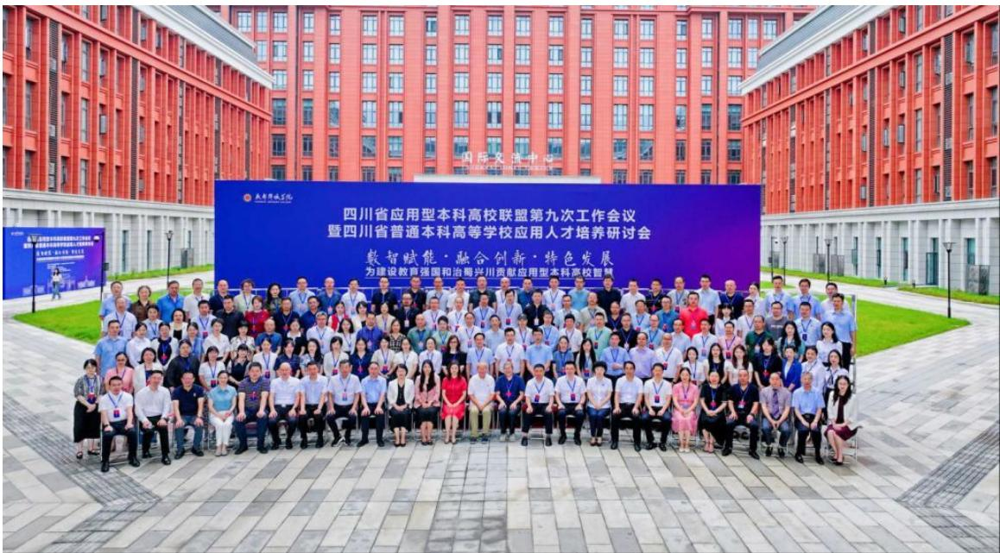

四川省应用型本科高校联盟理事长单位和应用人才培养指导委员会主任委员单位，成都工业学院校长刘保县介绍，本次研讨会规模再创新高，印证了应用型高等教育蓬勃发展的态势。面向未来，联盟和教指委将始终秉持“优势互补、资源共享、互惠互利、共同发展”的宗旨，持续致力于搭建高效交流与合作平台，助力应用型人才培养与各成员高校高质量发展。

四川省高等教育学会常务副会长、西南交通大学原常务副校长蒋葛夫教授在致辞中说，当前人工智能快速发展，这次研讨会也将 AI 赋能教育革新与人才培养等作为重要议题，希望各高校在人工智能赋能高等教育的工作中取得特色发展的机会。

四川省教育厅高教处副处长林艳表示，近年来，四川省委、省政府深入贯彻落实教育强国战略，坚定不移实施科教兴川和教育强省战略，在推动高等教育高质量发展进程中，高度重视应用型教育，逐步探索出了一条具有四川特色、时代特征的应用型教育发展之路。在她看来，本次会议具有很强的针对性和操作性，对四川应用型本科教育的整体水平提升具有深远意义。希望各高校坚持内涵式发展、高质量发展，不断增强办学实力和办学特色，答好“教育强国，四川何为”“强省建设，教育何为”的时代考卷。

大会现场，清华大学在线教育中心副主任、教育部在线教育研究中心交流联络部副主任徐燊作了题为《拥抱智能时代，探索未来高等教育新范式》的主题报告，分享了清华大学开展在线教育历程，探讨人工智能对大学教育变革的重大意义，让与会者清晰认识到人工智能时代为高等教育带来的巨大变革动力。

浙江大学求是特聘学者、中国高等教育学会工程教育专业委员会秘书长陆国栋教授就教学成果案例和实践智慧作主题报告，为在场的观众系统解析教学成果从“培育”到“升华”的关键路径，为大家提供了教学成果建设的“方法论”。

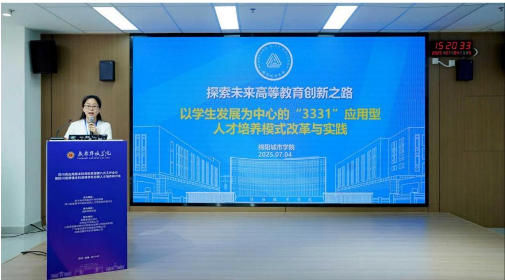

大会设置“AI赋能教育革新与人才培养”“跨学科构建与产教协同育人”“教育强国战略下应用型高校特色发展与范式创新”等三个主题论坛，为四川应用型人才培养的差异化、特色化发展献计献策。我校罗小娇教授应大会邀请，在教育强国战略下应用型高校特色发展与范式创新论坛上作“探索未来高等教育创新之路：以学生发展为中心的‘3331’应用型人才培养模式改革与实践”的主题报告，分享与推广学校教育教学成果，共享“绵城智慧”，交流“绵城经验”，为应用型高校的特色发展提供了重要“范式创新”思路，得到了与会专家、领导的广泛认同。

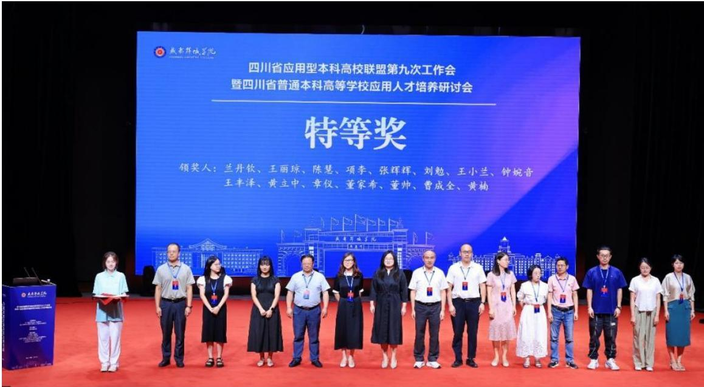

此外，本次会议向全省应用型高校征集论文，我校共10篇论文入选，获得优秀论文特等奖1项，二等奖3项的佳绩。

（来源：教学质量监测与评估中心 文字：李鹏）

# 把课堂搬进乡村，让设计扎根乡野——《乡村美学概论》课程高川乡项目实践教学纪实

日期：2025-06-23 浏览量：207

近日，《乡村美学概论》课程师生赴安州区高川乡，结合“一师联一企”开展项目实践教学活动。在谢小林、吴洋、张欢三位教师的带领下，49名学生深入高川乡村一线，特邀行业专家冯杰全程指导，通过“理论 $^ +$ 实践”融合教学模式，探索乡村美学赋能乡村振兴的创新路径。

校地联动启新篇，共话乡村发展愿景

上午10时，活动在高川乡政府4楼会议室正式启动。高乡长在致辞中表示：“高川乡正面临建设带来的发展机遇，如何将规划设计与乡村美学结合，是关键。”她充分肯定校地合作模式，期待师生团队为高川注入“美学基因”。

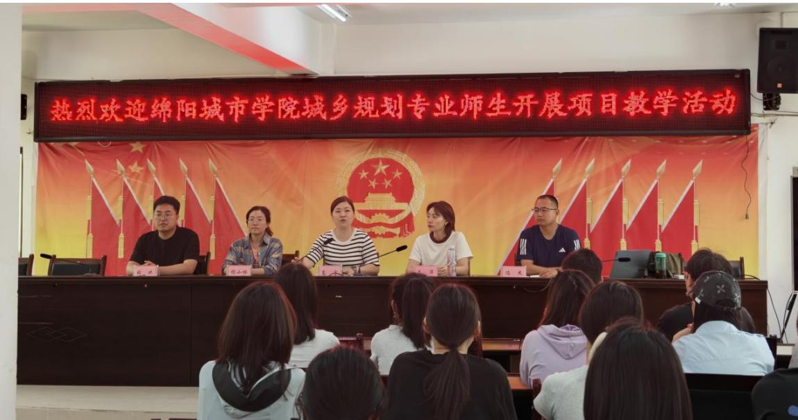

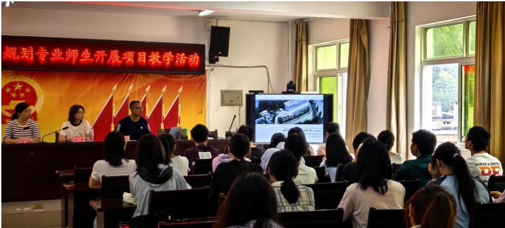

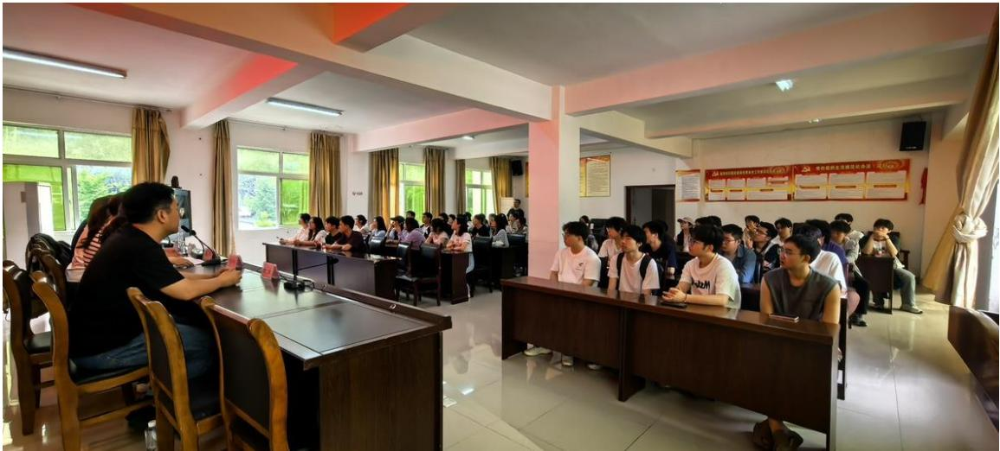

理论扎根土地，案例启迪思维

冯杰老师以“高川高铁站站前广场”项目为切入点，剖析设计方案中的空间叙事逻辑，并引入2025年日本大阪世园会案例，强调“生态优先、文化传承”的规划理念。“乡村建设需平衡功能与审美，更要解决历史遗留问题。”他结合高川实际，指出土地利用碎片化、三线建设遗址活化难等痛点，为后续实践埋下伏笔。

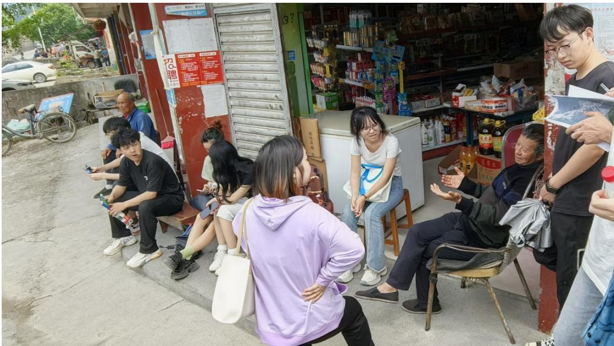

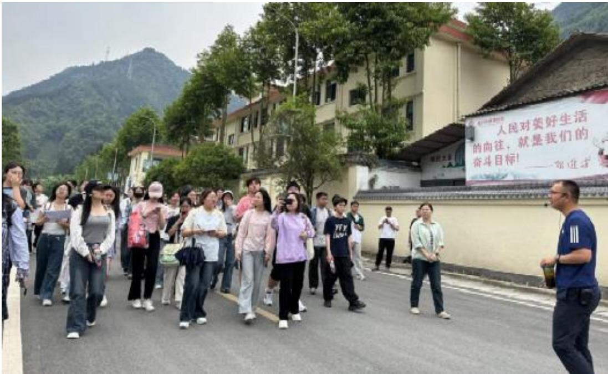

脚步丈量乡土，解码美学基因

师生团队辗转四大核心点位开展实地教学。在高铁站入口区域，冯杰解析交通枢纽与乡村肌理的衔接策略；口袋公园现场，谢小林老师启发学生思考“微空间”的社群价值；滨河绿带考察中，吴洋老师示范生态驳岸的美学营造技法；面对三线建设时期废旧电影院，张欢老师带领学生探讨“工业遗产 $^ +$ 文旅”的改造可能性。

直面现实难题，实践书写答案

在站前广场施工工地，冯杰结合钢筋结构模型，详解施工卡点的技术突破方案。“传统浆砌石工艺与新型材料的冲突，恰是美学落地的挑战。”学生们现场记录边坡支护、植被选种等细节，将课堂理论转化为解题工具。午后，团队分组开展自主调研：有的走访村民收集需求问卷，有的测绘老街巷道肌理，还有的用影像记录乡土建筑细节，乡政府更贴心安排农家午餐，让调研充满“烟火温度”。

以美为媒，育人与兴村同频共振

此次实践教学不仅构建起“校-企-地”三方协同平台，更让学生直面乡村真实场景。正如课程负责人谢小林所言：“乡村美学不是纸上谈兵，只有在田埂间读懂土地的逻辑，才能设计出有生命力的作品。”

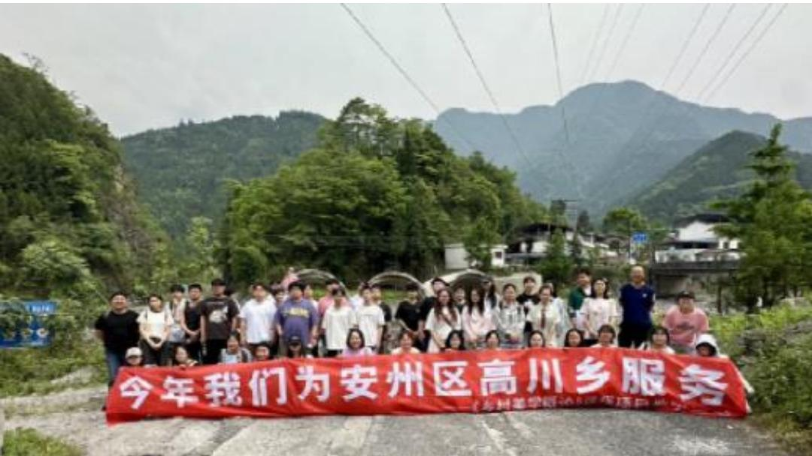

夕阳西下，满载调研数据与思考的师生踏上归程，而高川乡的乡村振兴画卷，正因美学的浸润徐徐铺展。

现代城市建设学院供稿：谢小林

共探教育数字化 赋能数智人才培养——中国民办教育协会高等教育数字化专委会走访调研绵阳城市学院

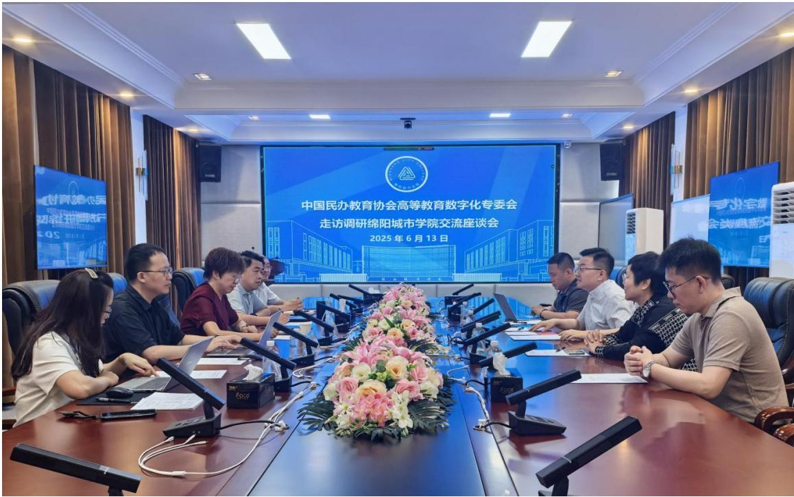

6月13日上午，中国民办教育协会高等教育数字化专委会秘书长、吉利人才集团战略协作总监丁力玮一行走访调研绵阳城市学院并进行座谈交流。座谈会在绵阳城市学院游仙校区书院会议室举行，双方围绕民办高校数字化转型与产教融合展开深入交流与探讨。绵阳城市学院执行校长林秀英、校长助理钟磊、校长助理蒲施宇、人工智能研究院院长牛小明、教学服务中心副主任罗小娇等校方代表参与座谈。

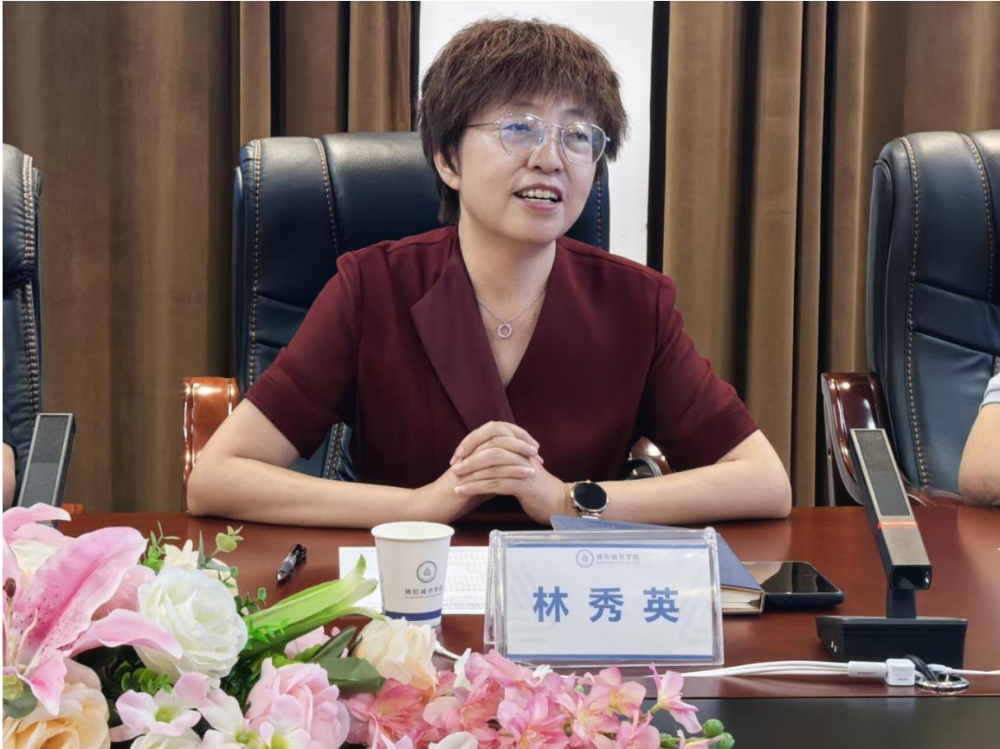

会议由绵阳城市学院执行校长林秀英主持。她首先对专委会一行的到访表示热烈欢迎，并简要介绍了学校的发展历程和办学特色。林校长表示，绵阳城市学院自建校以来，始终坚持“有教育理想的人，办理想的教育，培养有理想追求的人”的办学理念，以“服务学生终身发展”为中心，以 3331 人才培养模式和 3331 学校治理模型为两翼，积极探索人工智能时代高等教育发展，构建五大生态系统和对应实践示范基地，致力于打造多维度协同育人全场景教育生态体系，推动学生从学业到职业、再到事业的全周期发展。学校非常注重培养学生的实践能力和创新精神，并积极探索数字化教育转型路径，希望通过此次交流，进一步推动学校在数字化教育领域的创新发展。

中国民办教育协会高等教育数字化专委会秘书长丁力玮介绍了专委会的工作重点和未来规划。他指出，当前民办教育面临诸多挑战，数字化转型是民办高校实现高质量发展的关键路径。专委会致力于搭建数字化教育平台，整合优质资源，推动民办高校在人工智能、虚拟实验平台等领域的应用，助力学校提升教学和管理效率。

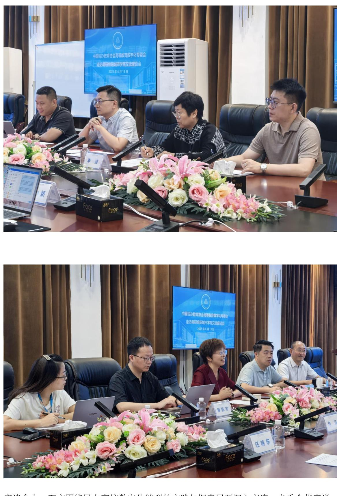

座谈会上，双方围绕民办高校数字化转型的实践与探索展开深入交流。专委会代表详细介绍了相关数字化平台建设的进展，包括资源共享、师资培训、智慧校园标准制定等内容。丁秘书长强调，数字化转型不仅是技术升级，更是教育理念和模式的革新。专委会希望通过与企业、高校的合作，构建数字化教育生态，为民办高校提供全方位

的支持。

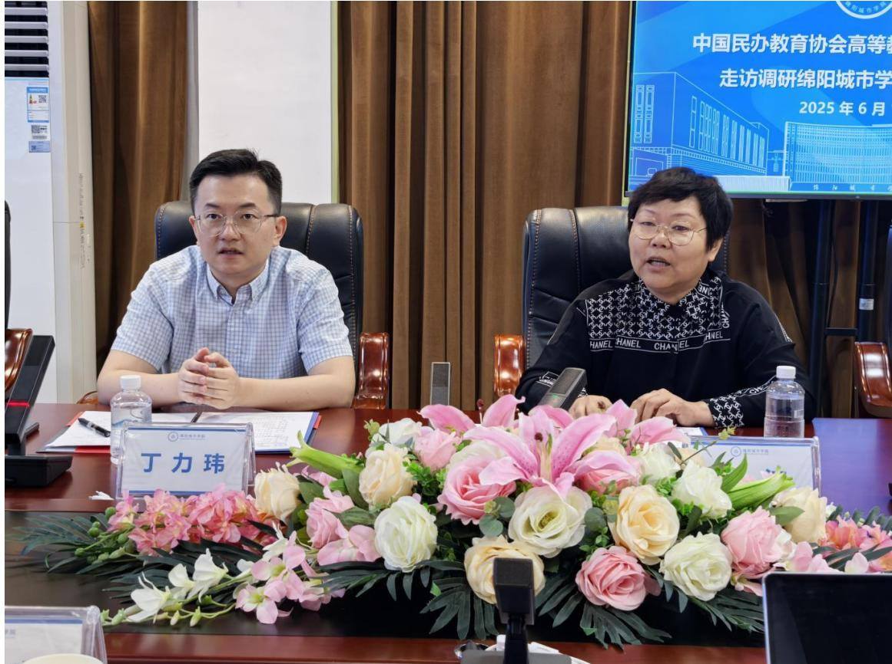

在自由交流环节，双方就未来合作方向达成多项共识。丁秘书长表示，专委会将充分发挥桥梁作用，支持绵阳城市学院与龙头企业对接，在课程共建、实习就业、师资培训等方面开展深度合作。同时，专委会将和学校共同探索和参与行业标准的研究，提升学校的数字化教育水平。

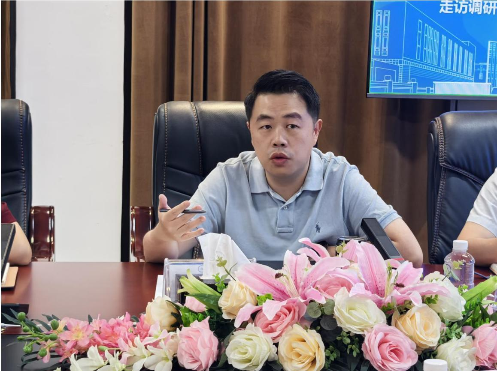

绵阳城市学院校长助理钟磊指出，此次交流为学校数字化转型提供了新思路和新机遇。学校将以此次座谈会为契机，进一步深化与专委会的合作，推动数字化技术与教育教学的深度融合，为培养具有人工智能素养和跨界应用能力的高素质应用型人才奠定坚实基础。

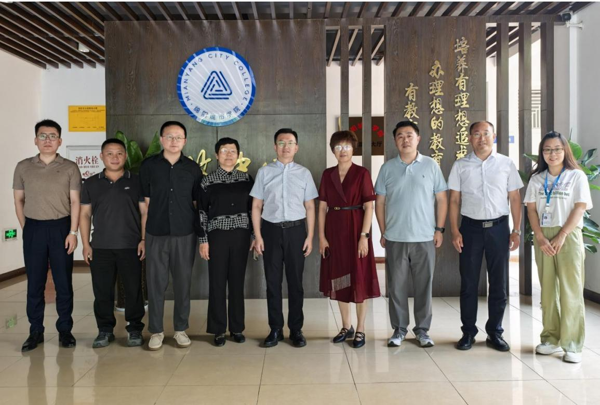

座谈会在热烈的氛围中圆满结束，与会人员合影留念。此次调研交流活动不仅加深了双方的了解，也为我校教育数字化转型与产教融合提供了新思路。丁秘书长表示，未来，中国民办教育协会高等教育数字化专委会将继续发挥平台优势，携手更多高校和企业，共同探索数字化教育的新模式、新路径，为民办高等教育的创新发展注入新动能。林校长表示，学校将以此次座谈为起点，加快落实相关合作事项，助力教育强国建设。

（供稿部门：教学服务中心综合办 图文：李莉莉）

# 实验室安全知识竞赛圆满落幕，以赛促学筑牢校园安全基石

日期：2025-06-09 浏览量：33

2025年6月6日，我校“安全护航专业，实践筑牢防线”主题实验室安全知识竞赛现场赛决赛暨颁奖典礼在安州校区演播厅成功举行。本次活动由实践教学与基地管理处承办、共青团绵阳城市学院委员会协办，旨在通过创新形式深化师生实验室安全意识，提升应急处置能力，为教学科研工作保驾护航。副校长何礼果教授、安州区消防救援大队张欢美参谋、安州区人民医院急救科周川医生、实践教学与基地管理处处长李程、学生处副处长龚新雯、保卫处副处长刘志敏等领导专家出席活动，与来自各专业学院的8支决赛队伍及师生代表共同见证这场安全知识的盛宴。

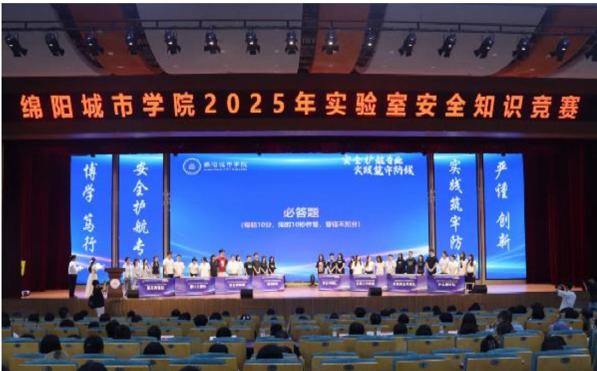

活动伊始，副校长何礼果教授发表致辞。他指出，实验室安全是学校教学科研工作不可逾越的“生命线”和“高压线”。何校长强调，本次竞赛创新采用“寓教于赛、寓学于趣”的模式，核心目标是让安全规范内化为师生进入实验室的“第一反应”和行动自觉。他充分肯定了参赛学生的积极备赛，并对赛事组织单位及各二级学院提出殷切期望，要求大家以此次竞赛为重要契机，持续深化安全意识教育，层层压实安全责任，将安全理念融入日常教学科研的每一个环节。

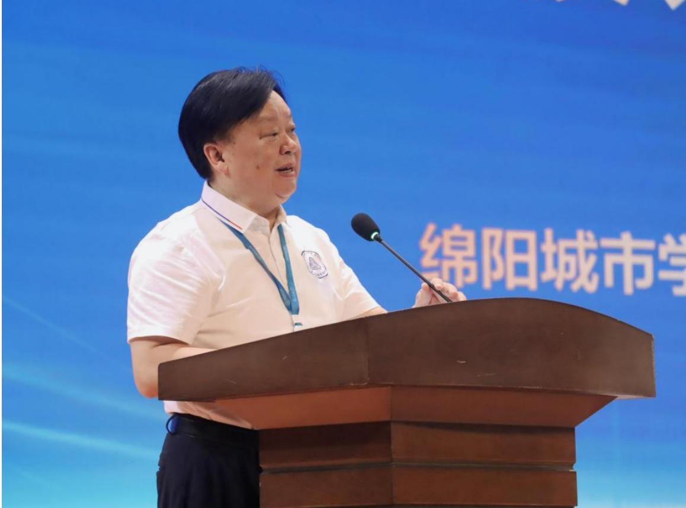

现场赛环节设计严谨，形式多样，充分检验了参赛队伍的综合安全素养：

必答题环节：聚焦实验室安全基础知识，各队沉着应对，展现出扎实的理论功底。

抢答题环节：紧张激烈，选手们在精准把握抢答时机的同时，迅速调动知识储备，现场气氛高潮迭起。

应急处置环节：是本场比赛的重头戏。各队通过抽签，模拟应对“触电急救”“实验室烟雾报警”等典型突发场景。选手们需完成从“事故判定”到“应急处置演示”，再到“后续处理陈述”的全流程操作，并合理运用现场道具。安州区消防救援大队张欢美参谋、安州区人民医院急救科周川医生等评审专家对每支队伍的表现进行了专业、细致的点评。专家们高度肯定了选手们对基础应急流程的掌握，同时针对部分操作细节中的不足，如个人防护、施救步骤规范性、报警信息完整性等，提出了宝贵的改进建议。专家们一致强调，真正的实验室安全，必须是理论知识与过硬实操能力的深度融合。

为强化实践指导，活动特别设置了急救知识演示环节。 周川医生现场示范了心脏复苏（CPR）和止血包扎等关键急救技能。其规范、清晰的操作演示，结合深入浅出的理论讲解，为在场师生提供了直观、权威的应急处置范本，赢得了阵阵掌声。

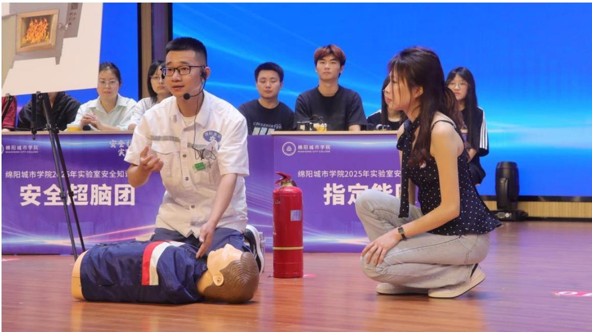

激动人心的颁奖典礼上，特邀各位评审为在前期设计类、视频类、语言类作品征集以及现场赛中表现优异的团队颁发了荣誉证书。综合考量各学院在赛事全程的组织动员、参与度及整体成绩，现代商学院荣获“优秀组织奖”。

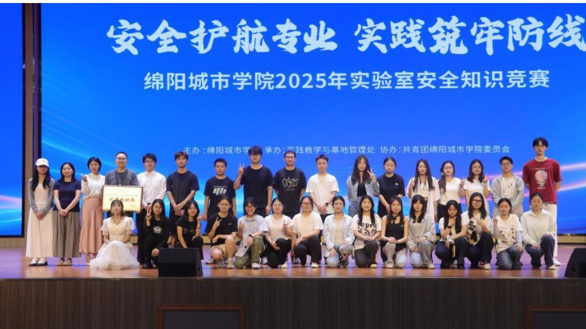

活动最后，实践教学与基地管理处处长李程作总结致辞。她向精心筹备活动的所有工作人员、倾情指导的专家评委、积极参与的师生表示诚挚感谢，并高度赞扬了参赛队伍展现出的良好精神风貌和专业素养。李程处长深刻阐释了本次竞赛的核心价值：它不仅是一场比赛，更是推动“安全第一、预防为主”理念深入人心的生动实践。她号召全体同学以此次竞赛为新的起点，在日常学习和实验中，时刻绷紧安全弦，严格遵守操作规程，并积极担当校园安全文化的传播者，师生携手共同构筑更加安全、稳定、有序的校园实验环境，为学校的教学科研事业高质量发展奠定坚实的安全基础。

本次实验室安全知识竞赛的成功举办，有效激发了师生学习安全知识的热情，显著提升了安全防范和应急处置能力，营造了“人人讲安全、个个会应急”的浓厚校园安全文化氛围，为我校实验室安全管理工作注入了新的活力。

# 聚焦数据驱动赋能学科建设 深化校际交流共促人才培养——绵阳城市学院现代商学院迎四川文化艺术学院经管学院考察交流纪实

日期：2025-06-09 浏览量：194

6月5日，四川文化艺术学院经济管理学院副院长覃家君带队，携教研干事刘娜、物流管理专业负责人王莉、金融工程专业骨干教师陈思宇、行政干事贾丹一行以及金融22级58名学生，莅临绵阳城市学院现代商学院考察交流。本次活动依托学院建成的大数据智能财经实践基地及承担的省级创新实验“数据驱动的证券投资分析与风险管理”项目，精心安排了实践基地参观、教学示范与深度座谈三个核心环节。

# 实地探访：高水平实验实训基地展现数据金融硬实力

活动伊始，四川文化艺术学院考察团一行在绵阳城市学院现代商学院实习实训基地主任方登科的陪同下，参观了我院实验实训基地以及大数据智能财经实践基地。方主任向来宾详细介绍了基地的功能定位、区域划分与核心设备资源。参访人员对基地体现出的技术先进性、资源集约化与管理系统性表示浓厚兴趣，并就平台日常运维、课程衔接、项目驱动教学模式等问题进行了初步交流。此次参观为后续深入的示范教学与研讨提供了直观认知基础和共同话语体系。

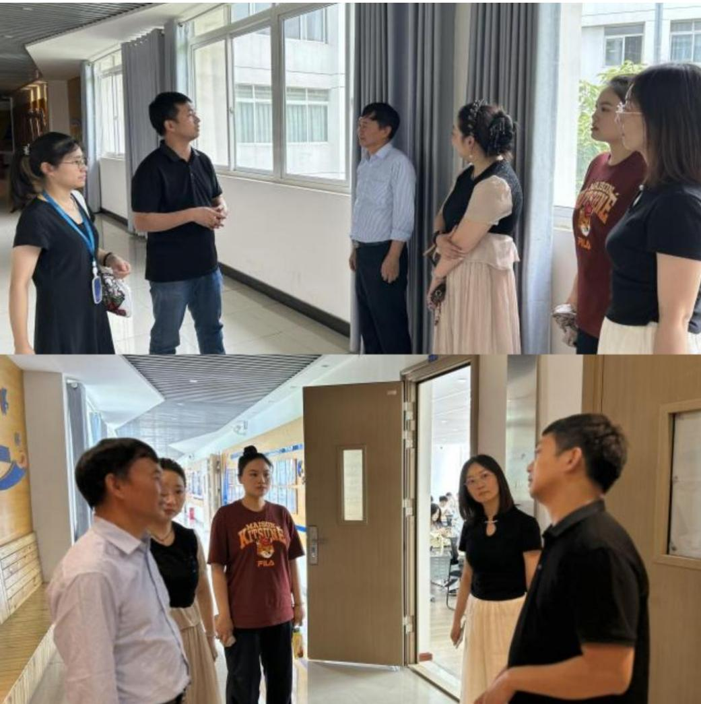

# 数字技术赋能：前沿教学示范演绎课堂创新风采

针对参访的金融工程专业学生团队，学院针对性地呈现了两场金融科技前沿应用示范课：

一是策略构建与回测的实战课堂，杨林老师利用Choice金融终端平台，进行了“选股策略设计与回测”的示范教学。课程结合真实市场环境，系统讲解了如何运用基本面深度分析与技术面量化指标构建动态选股模型，并现场展示了从策略设计到结果回验的全过程，让观摩者在数据实操中理解金融终端的应用。

二是实证研究与智能算法的深度结合，方登科老师聚焦学术前沿，进行了“融券卖空对企业创新影响的实证研究”论文复现的示范。他详细演示了如何利用金融大数据，结合现代计量方法进行严谨的实证分析，探讨了数据治理的关键环节和因果推断等核心研究方法，展现了大数据技术在学术研究中挖掘价值、揭示规律的强大效能。

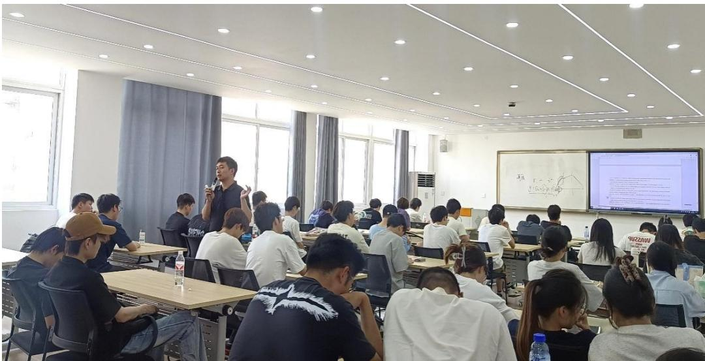

# 协同交流共进：共商应用型人才培养新路径

示范教学环节进行的同时，双方举行座谈会，展开深度交流。现代商学院院长邹江、教研办主任何林、金融工程专业负责人许鲜以及物流工程专业负责人陈扬，与四川文化艺术学院来访团队，围绕应用型金融人才培养、专业特色建设、课程体系优化以及实践平台共享等共同关切的议题进行了深入的探讨。比如，针对金融工程、物流管理等专业的课程体系重构、实践教学强化及产业技术融入需求，系统交流了成渝地区产业升级对人才能力的新要求。同时，立足资源共享与优势互补，我院倡议共建区域性专业课程共享库，通过虚拟教研室，开展智能财经教学法与产教融合课程共建共享，协同共进等举措。

四川文化艺术学院经济管理学院副院长覃家君对我院倾力打造的省级引领性实践基地及其在支撑创新教学中展现的成效给予高度评价，并对我院开放的交流态度表示感谢。绵阳城市学院现代商学院院长邹江指出，实验实训基地是学院深化产教融合、提升教育能级的战略支点，服务同领域兄弟院校亦是基地建设的重要使命与价值延伸。双方一致认为本次交流富有成效，是实质性合作的崭新起点，同意后续将由具体负责人对接落实本次座谈形成的共识，并持续探索更多协同创新契合点。

（文/杨林，图/现代商学院实验实训基地）

# 绵阳城市学院关于启动 2026 届本科毕业论文（设计）工作的通知

日期：2025-09-01 浏览量：764

# 各专业学院：

为贯彻落实《教育部本科毕业论文（设计）抽检办法（试行）》《普通高等学校本科教学工作合格评估指标和基本要求（试行）》，按照《绵阳城市学院本科毕业论文（设计）质量抽检办法》（绵城院字〔2025〕52号）《绵阳城市学院本科毕业论文（设计）管理办法》（绵城院字〔2024〕110号）等文件要求，做好2026届本科毕业论文（设计）工作，现将有关事宜通知如下：

# 一、总体要求

# （一）强化毕业论文（设计）教育

做好宣传动员，使全体师生从思想上充分认识做好毕业论文（设计）工作的重要意义。下发毕业论文（设计）工作手册，使教师和学生对毕业论文（设计）工作有一个较为系统的了解和认识。各专业学院应至少开展一次毕业论文（设计）专项教研活动，活动主题应包含：结合往届毕业论文（设计）的典型案例（含优秀案例、问题案例），系统分析论文撰写（如选题、框架、论证、格式）及指导工作（如指导频次、反馈针对性、过程管控）中存在的共性问题，并提出对应的改进措施，以及毕业论文（设计）相关文件解读等内容。

# （二）加强组织领导

各专业学院须成立毕业论文（设计）工作领导小组和答辩委员会，负责研究、部署、指导和检查本院的本科毕业论文（设计）工作，做到分工明确、责任到人。同时，要妥善处理好毕业论文（设计）与实习、就业等工作的关系，从时间安排、组织实施等方面加强毕业论文（设计）各环节的管理，将毕业论文（设计）工作的重点放在提升质量和培养学生实践能力上。

# （三）严把选题关

1.选题应符合专业培养目标，紧密结合生产和社会实际，难度和工作量适中，避免题目过大或过空，并体现专业综合训练和应用型人才培养要求。

2.各专业应有 $5 0 \%$ 以上的毕业论文（设计）选题来源于实验、实习、工程实践或社会调查等实践环节。

3.所有毕业论文（设计）选题须经审查批准后，方可向学生开放选择。

# （四）认真遴选指导教师

1.各专业学院应选聘具有中级及以上职称或研究生及以上学历，且具备一定教学和实践经验的教师担任指导教师。

2.应加强校企合作，聘请校外相关专业且符合条件的企业教师、管理人员和技术专家担任指导教师，可由其单独开展指导，或与校内教师联合开展协同指导。

3.为保证指导质量，每位教师指导的学生人数原则上不得超过以下限额：文管类专业不超过10人，理工类及艺术类专业不超过8人。若无特殊原因，不得中途更换指导教师。

# （五）强化文献综述撰写

指导教师应指导学生广泛阅读该研究领域的相关文献，对所引文献按照不同观点进行分类梳理和归纳，分析前人研究的不足之处，进而提出自己的见解，提升学术思辨能力。文献综述应在开题报告和论文中得到充分体现。

（六）做好质量监控

1.构建科学合理的质量监控体系，切实做好毕业论文（设计）各阶段的计划安排、过程检查和总结评估工作，严格把控开题报告、中期检查、学术不端检测、论文答辩和

成绩评定等关键环节质量。重修毕业论文（设计）须严格按照初修毕业论文（设计）标准执行。

2.加强毕业论文（设计）教学研究工作，立足各专业特色，积极探索教学与指导新模式，创新开展院级毕业论文（设计）各环节的建设与管理工作。

3.依据《普通高等学校本科专业类教学质量国家标准》，结合各专业人才培养目标和毕业要求，建立健全符合专业特色的本科毕业论文（设计）质量标准，并持续完善。

4.严格参照全国毕业论文（设计）抽检工作要求，进一步规范和完善毕业论文（设计）材料归档标准。

# （七）毕业论文（设计）与毕业实习有机结合

1.鼓励将毕业论文（设计）选题与实习单位实际问题相结合。指导教师应深入实习单位调研，指导学生将实习中遇到的实际问题转化为毕业论文（设计）选题。学生在选题后，应带着问题在实习过程中与校内外导师共同研究解决方案，最终完成毕业论文（设计）。

2.学生也可通过在毕业实习中发现的生产一线实际问题，在指导教师帮助下将问题提炼为研究项目，以项目为依托开展实践研究，实现“真题真做”，完成毕业论文（设计）。

（八）毕业论文（设计）信息化管理

1.2026届毕业论文（设计）采用“绵阳城市学院毕业论文（设计）管理系统”进行网上操作。实践教学与基地管理处统筹做好系统的培训、使用等工作。

2.系统登录。一是通过我校教务处网站主页，点击“快速导航”栏目的“毕业论文（设计）管理系统”，选择“毕业论文管理系统4.0入口”。二是直接登录网址：https://cloud.fanyu.com/organ/lib/ccswust。

3.账号及密码说明：教师账号为工号，初始密码将由学校另行通知；学生账号为学号，初始密码为“Mycc+身份证号码后六位”（例如Mycc111111）。登录后请及时修改初始密码，并绑定邮箱和微信号以便后期自行找回密码。如需修改系统密码，请联系各专业学院教研办。

4.依托毕业论文（设计）管理系统进行查重检测，毕业论文（设计）查重总相似比≤$2 5 \%$ 视为通过， $> 2 5 \%$ 的视为未通过。同时需同步进行AIGC检测,检测率要求控制在$2 0 \% { - } 4 0 \%$ 之间，各专业可结合学科特点、论文（设计）类型及培养要求，自行制定本专业的具体判定标准。

# 二、工作时间安排

1.启动阶段（2025 年 9 月 20 日前）：开展毕业论文（设计）工作动员、管理系统培

训、课题征集、指导教师遴选及学生选题等工作。

2.开题阶段（2025 年 10 月 10 日前）：完成任务书下发、开题报告撰写指导及开题汇报等工作。

3.中期阶段（2026 年 3 月 10 日前）：进行毕业论文（设计）中期检查等工作。

4.示范性答辩阶段（2026年4月20日前）：由学校组织毕业论文（设计）示范性答辩工作。

5.答辩阶段（2026年5月15日前）：完成毕业论文（设计）查重、评阅及答辩（含二次答辩）等工作。

6.提交成绩阶段（2026年5月20日前）：完成毕业论文（设计）成绩录入与汇总等工作。

7.推优阶段（2026年5月30日前）：开展校级优秀毕业论文（设计）评审工作，具体时间以通知为准。

8.校级抽检阶段（2026年6月10日前）：由学校组织毕业论文（设计）抽检及规范性检查工作，具体时间以通知为准。

9.归档阶段（2026年6月20日前）：完成毕业论文（设计）材料归档等工作。

# 三、其他

1.请各专业学院高度重视，认真组织，以上述通知要求为依据，及时制定本院2026届本科毕业论文（设计）工作实施方案，并按照相关时间节点要求有序推进各项工作。

2.按以下时间节点向实践教学与基地管理处报送以下资料：

（1）2025年10月10日前，报送2026届本科毕业论文（设计）工作实施方案，需包含毕业论文（设计）领导小组成立文件及各专业毕业论文（设计）质量标准。

（2）2025年11月10日前，报送毕业论文（设计）阶段性检查表（期初）、选题汇总表、指导教师一览表及指导人数一览表等材料的电子版、纸质版（需加盖公章）。

如有疑问，请及时联系实践教学与基地管理处：

游仙校区博艺楼 102，李老师：0816-2283993

安州校区中心楼 812，李老师：0816-6158020

附件：1.毕业论文（设计）工作手册（师生通用版）

2.毕业论文（设计）过程管理统计表（专业学院）

# 关于印发《绵阳城市学院教室使用与管理办法》的通知(绵城教字〔2025〕15 号)

https://jwc.mycc.edu.cn/info/1009/3237.htm

关于印发《绵阳城市学院关于在教育教学中使用 AI 的规范（试行）》的通知(绵城教字〔2025〕10 号)

https://jwc.mycc.edu.cn/info/1009/3189.htm

# 关于印发《绵阳城市学院本科毕业论文（设计）质量抽检办法》的通知（绵城院字〔2025〕52 号）

关于印发《绵阳城市学院本科毕业论文（设计）质量抽检办法》的通知（绵城院字〔2025〕52号）-绵阳城市学院教务处

# 关于印发《绵阳城市学院教学差错与事故的认定和处理办法（试行）》的通知（绵城院字〔2025〕11 号）

关于印发《绵阳城市学院教学差错与事故的认定和处理办法（试行）》的通知（绵城院字〔2025〕11号）-绵阳城市学院教务处