学校简介 ...  
学校章程 .. 3  
蔡东洲教授莅临历史文化与旅游学院指导学科专业建设 . 6  
文学院举办中文学科建设专题讲座 8  
我校学生在 2025 年美国大学生数学建模竞赛中取得新突破 10  
新工科产学研联盟专家团走进我校 把脉新工科专业建设 .. . 10  
国家艺术基金资助项目群舞《我记得》启动仪式暨专家研讨会在我校举行 ........ 14  
智能制造学院顺利通过电工职业技能等级认定机构审核评估 .. 15  
学校召开申硕工作总结暨学科建设大会 . 16  
城乡建设与规划学院举办第二届产教融合校地合作论坛 ... .. 20

学校简介

绵阳师范学院是四川省属全日制普通本科院校。学校坐落在中国科技城、李白出生地全国文明城市绵阳市。

春秋更迭，爝火薪传。学校2002年经国家教育部批准成立。2006年成为学士学位授予单位;2011年获准成为“服务国家特殊需求项目”试点单位，开始招收环境工程专业学位硕士研究生;2023年作为全国“三省五校”部省协同试点高校之一，高质量完成新一轮本科教育教学审核评估工作；2024 年获批成为审核增列且需要加强建设的硕士学位授予单位。建校以来，学校积淀形成了“自强不息、艰苦奋斗、务实创新、追求卓越”的精神，“育人为本，服务地方”的办学理念，“厚德、博学、笃行、弘毅”的校训，“弘文励教，止于至善”的教风，“学思并重，知行合一”的学风。

黄钟轻叩，九皋鸿渐。学校现有高新校区、游仙校区和丰谷校区，校园占地面积近两千亩，建筑面积近50万平方米，建有现代化的图书馆、教学楼、实验楼、体育场馆等服务设施。现有21个二级学院，3个专业学位硕士授权点，51个全日制本科专业、3个职业教育本科专业，覆盖9大学科门类。加强人才队伍建设，学校现有专任教师1255人，其中博士学位教师434人，占比 $3 4 . 5 8 \%$ ，硕士以上学位教师占比 $8 7 . 1 7 \%$ 。柔性引进和全职聘任国家级人才3人，获省市级以上称号性人才55人次。“全国优秀教师”“四川省优秀教师”“四川省师德楷模”“四川省五一劳动奖章”“四川省教学名师”“四川省‘四有’好老师”“绵阳市优秀教师”等荣誉称号38人次。现已形成研究生教育、全日制本专科高等教育、成人本专科高等教育及留学生教育的人才培养体系，在校研究生、全日制本专科学生、留学生20000余人。

弘文励教，止于至善。学校立足“教学型、地方型、应用型、师范型”的办学定位，实施“优教、强工、兴文、精艺、扶农”学科专业发展方略，培养服务基础教育的优秀师资和区域经济社会发展需要的高素质应用型人才。“大思政”建设成效显著，获批国家级课程思政示范课程1门、教学名师和团队1个；立项教育部高校思想政治理论课建设项目1项，省级课程思政示范专业2个、示范团队4个、示范课程19门，省级课程思政教学研究示范中心1个，省级课程思政标杆院1个，省级高校实验教学示范中心 4 个。教研成果丰硕，获批国家级、省级一流专业建设点 12 个，国家级、省级“四新”项目 7 项，省级应用型品牌专业 1 个，省级虚拟教研室 1 个；立项国家级、省级一流本科课程56门；荣获国家级教学成果奖2项，省级教学成果奖16项。学校15个师范专业全部通过师范类专业二级认证。

创新创业，蔚然成风。学校构建创新教育优秀师资培养模式，把创新创业教育融入人才培养全过程，取得丰硕成果。学校建有中国科协创新工作室、中国创造学会实验基地、四川省青少年科技创新教育基地。近五年，学生在“学科竞赛” “互联网+”“挑战杯”“创青春”等竞赛中获国家级、省级奖项近2400项次，获批国家级、省级创新创业立项1030余项。

教学相长，服务地方。学校坚持科研为地方经济建设和社会发展服务，构建“一山一水一城”科研格局，建有四川省重点实验室 1 个，四川省社科重点研究基地 2 个，省级高水平研究团队 1 个，四川省高校重点实验室（工程研究中心）6 个、四川省高等学校人文社科重点研究基地 1 家。“环境科学与工程”被列为四川省贡嘎计划重点建设学科。近五年，承担国家级、省级科研项目238项，教育部重大招标项目实现零的突破。获得四川省科技进步奖等各类科技成果奖 89 项。与省内外 474 余个地方政府、企业、高校、科研院所建立合作关系，在人才培养、科学研究等方面开展全方位合作。积极参与实施“精准扶贫”和“乡村振兴”战略，为当地经济社会和文化教育事业发展作出积极贡献。

以文化人，以文育人。学校着力培育校园文化，开展主题教育月、节庆日活动和“一院一品”建设。收集整理国家、省非遗项目传承人口述史料600余项，“‘一主两类五场’馆校协同育人模式的探索与实践”获第九届高校校园文化建设优秀成果推选展示优秀奖；“梦之声”合唱团多次赴省内外演出；大学生科技文化艺术节、社团风采节、志愿者服务等系列品牌活动已成为一道靓丽的风景线，形成了“博、雅、趣、活”的校园文化氛围。学校被授予“全国五四红旗团委”“四川省文明校园”称号。

开放办学，接轨国际。学校本着“共创共赢、共建共享、兼容并包、多元共融”的思路，加强国际传播能力建设，讲好中国故事，传播好中国声音，积极主动推进新时代高等教育对外开放工作，先后与美国、俄罗斯等国家、地区的多所高等院校和科研机构合作，开展师资培养、科研合作、学术交流、学生交流等活动。

弦歌颂雅，风华赓续。当前，学校坚定以习近平新时代中国特色社会主义思想为指导，坚持立德树人根本任务，践行为党育人、为国育才初心使命，锚定“一个目标”，聚焦“两大愿景”，按照“三步走”发展战略，全面实施“3538”总体部署，乘势而上开新局，抢抓机遇勇担当，为把学校建设成为特色鲜明、优势突出的区域一流应用型

大学而不懈奋斗。

（数据截至2025年6月）

学校章程

绵阳师范学院章程（2022年核准稿）序言绵阳师范学院是2002年经教育部批准，由绵阳师范高等专科学校和绵阳教育学院合并组建的全日制普通本科高等学校。其中，绵阳师范高等专科学校前身为始建于1956年的绵阳初中师资训练班；绵阳教育学院前身为始建于1986年的绵阳市中学师资培训中心，2000年绵阳师范学校并入绵阳教育学院。学校以“育人为本，服务地方”为办学理念，以“立足绵阳、面向四川、辐射西部，服务基础教育和区域经济社会发展”为服务面向，坚持“教学型、应用型、地方型、师范型”办学定位，积极服务国家战略和地方经济社会发展，努力办好人民满意的大学。第一章总则第一条根据《中华人民共和国教育法》《中华人民共和国高等教育法》《中华人民共和国教师法》《关于坚持和完善普通高等学校党委领导下的校长负责制的实施意见》《高等学校章程制定暂行办法》《高等学校学术委员会规程》等法律、法规、规章，绵阳师范学院

结合学校实际，制定本章程。第二条学校中文名称为绵阳师范学院，英文名称为MianyangTeachers’College。第三条学校现有游仙校区、高新校区和丰谷校区。游仙校区：四川省绵阳市游仙区仙人路一段 30 号，为学校法定注册地址。高新校区：四川省绵阳市高新区绵兴西路166号，为学校主校区；丰谷校区：四川省绵阳市涪城区丰谷镇南街 61 号。第四条学校是非营利性教育事业单位，具有独立法人资格，依法享有相应的权利，履行相应的义务，独立承担法律责任。院长是学校的法定代表人。第二章举办者与学校第五条学校的开办资金：1071 万元。第六条学校由四川省人民政府举办，实行省市共建、以省为主的管理体制。学校的主管部门是四川省教育厅。第七条学校坚持社会主义办学方向，全面贯彻党的教育方针，落实立德树人根本任务，履行人才培养、科学研究、社会服务、文化传承创新、国际交流合作等基本职能。培养德智体美劳全面发展，服务基础教育的优秀师资和区域经济社会发展需要的高素质应用型人才，努力建设特色鲜明、优势突出的区域一流应用型大学。第八条学校举办者和主管部门保障学校依法自主办学、自主管理；提供办学资金，保障办学经费来源；维护学校利益，促

进学校持续健康发展；履行法律、法规、规章规定的其他义务。主要履行以下职责：（一）核准学校章程，决定学校的分立、合并、终止以及变更名称等重要事项；（二）任命院长和其他必须由举办者任命的人员；（三）监督学校办学行为，指导学校发展规划；（四）考核评估学校办学水平和教育质量；（五）指导学校党的建设工作；（六）法律、法规和规章规定的其他权利。第九条学校享有下列权利：（一）依照法律、法规、规章和章程自主办学、自主管理，开展教学活动、科学研究、技术开发、文化传承创新和社会服务；（二）自主制定学校事业发展规划和人才培养方案；（三）根据社会需求和办学条件，依法自主设置和调整学科专业；（四）根据行政主管部门核定的办学规模，制定招生方案，自主调节学科专业招生比例，确定选拔学生的条件、标准、办法和程序；（五）自主制定教学计划、选编教材、组织实施教学活动；（六）自主确定党政职能部门、教学科研机构、业务部门和附属机构的设置和人员配备；（七）依法与境内外高等学校和科研、文化机构开展教育教

学和科学、技术、文化的交流与合作；（八）按照国家和省有关规定，评聘教师和其他专业技术人员的职务，完善分配制度；（九）对受教育者进行学籍管理，实施奖励或者处分；（十）对受教育者颁发相应的学业证书；（十一）管理、使用学校的设施和经费；（十二）拒绝任何组织和个人对教育教学活动的非法干涉；（十三）法律、法规、规章规定的其他权利。第十条学校应当履行下列义务：（一）遵守法律、法规、规章和学校章程；（二）贯彻党和国家教育方针，执行国家教育政策，保证教育教学质量；（三）维护受教育者、教师及其他职工的合法权益；（四）以适当方式为受教育者及其监护人了解受教育者的学业成绩及其他有关情况提供便利；（五）遵守国家收费规定，公开收费项目、标准；（六）依法接受监督；（七）法律、法规、规章规定的其他义务。第十一条学校设置文学、理学、教育学、工学、艺术学、管理学、法学、经济学、历史学、农学等学科门类。学校根据社会需求、办学宗旨和培养目标，设置、调整学科专业。第十二条学校教育形式包括学历教育和非学历教育，采用

全日制和非全日制教育形式。第十三条学校以本科教育为主，积极发展研究生教育、留学生教育，持续发展继续教育和现代职业教育。第十四条学校办学规模由国家有关部门根据社会需求、教育规划、办学条件及相关标准指标统筹核定。第十五条学校依法对完成学业的受教育者颁发学业证书或相应的学习证明。学校执行国家学位制度，依法授予受教育者学士学位、硕士学位等相应学位证书。第三章党的领导第十六条学校根据《中国共产党普通高等学校基层组织工作条例》的规定,建立中国共产党绵阳师范学院委员会，按照党章和党内法规有关规定开展党的活动，加强党的建设。党组织关系隶属于中国共产党绵阳市委员会。第十七条学校实行中国共产党绵阳师范学院委员会（以下简称学校党委）领导下的院长负责制。学校党委实行民主集中制，健全集体领导和个人分工负责相结合的制度。第十八条学校党委全面领导学校工作，承担管党治党、办学治校的主体责任，发挥把方向、管大局、作决策、抓班子、带队伍、保落实的领导作用，支持校长按照《中华人民共和国高等教育法》的规定积极主动、独立负责地开展工作，保证教学、科研、行政管理等各项任务完成。第十九条学校党委根据工作需要，经上级党组织批准，设立

常务委员会。书记、副书记、纪委书记、党委常委可由上级党组织选派或由学校依照党章和党内法规等选举产生。党员院长、副院长，组织部长、宣传部长、统战部长按照党的有关规定进入党委常委领导班子。第二十条学校党委职责包括：（一）宣传和执行党的路线方针政策，宣传和执行党中央、四川省委以及上级党组织和本组织的决议，坚持社会主义办学方向，依法治校，依靠全校师生员工推动学校科学发展，培养德智体美劳全面发展的社会主义建设者和接班人。（二）坚持马克思主义指导地位，组织党员认真学习马克思列宁主义、毛泽东思想、邓小平理论、“三个代表”重要思想、科学发展观、习近平新时代中国特色社会主义思想，学习党的路线方针政策和决议，学习党的基本知识，学习业务知识和科学、历史、文化、法律等各方面知识。（三）审议确定学校基本管理制度，讨论决定学校改革发展稳定以及教学、科研、行政管理中的重大事项。（四）讨论决定学校内部组织机构的设置及其负责人的人选。按照干部管理权限，负责干部的教育、培训、选拔、考核和监督。加强领导班子建设、干部队伍建设和人才队伍建设。（五）按照党要管党、全面从严治党要求，加强学校党组织建设。落实基层党建工作责任制，发挥学校基层党组织战斗堡垒作用和党员先锋模范作用。

（六）履行学校党风廉政建设主体责任，领导、支持内设纪检组织履行监督执纪问责职责，接受同级纪检组织和上级纪委监委及其派驻纪检监察机构的监督。（七）领导学校思想政治工作和德育工作，落实意识形态工作责任制，维护学校安全稳定，促进和谐校园建设。（八）领导学校群团组织、学术组织和教职工代表大会。（九）做好统一战线工作。对学校内民主党派的基层组织实行政治领导，支持其依照各自章程开展活动。支持无党派人士等统一战线成员参加统一战线相关活动，发挥积极作用。加强党外知识分子工作和党外代表人士队伍建设。加强民族和宗教工作，深入开展铸牢中华民族共同体意识教育，坚决防范和抵御各类非法传教、渗透活动。第二十一条设立中国共产党绵阳师范学院纪律检查委员会（以下简称学校纪委）。学校纪委是学校的党内监督专责机关，履行监督执纪问责职责，在学校党委和上级纪委双重领导下进行工作。主要任务是：（一）维护党章和其他党内法规，检查党的路线方针政策和决议的执行情况，协助学校党委推进全面从严治党、加强党风建设和组织协调反腐败工作。（二）经常对党员进行遵守纪律的教育，作出关于维护党纪的决定。（三）对党的组织和党员领导干部履行职责、行使权力进行监督，受理处置党员群众检举举报，开展谈话提醒、约谈函询。（四）检查和处理党的组织和党员违反党章和其他党内法规的比较重要或者复杂的案件，决定或者取消对这些案件中的党员的处分；进行问责或者提出责任追究的建议。（五）受理党员的控告和申诉，保障党员权利不受侵犯。第二十二条党员队伍建设（一）学校各级党组织构建多层次、多渠道的党员经常性学习教育体系，加强政治理论教育和党史教育，突出政治教育和政治训练，强化党章党规党纪教育、党的宗旨教育、革命传统教育、形势政策教育和知识技能教育，推进“两学一做”学习教育常态化制度化，建立和落实不忘初心、牢记使命的制度。（二）严格党的组织生活，坚持开展批评和自我批评，提高“三会一课”质量，开好民主生活会和组织生活会，健全落实谈心谈话、民主评议党员、主题党日等制度，确保党的组织生活经常、认真、严肃。（三）强化党员日常管理，及时转接党员组织关系，督促党员按期足额交纳党费。加强流动党员管理和服务，做好毕业生党员、出国（境）学习研究党员组织关系和党籍管理工作。关心党员思想、学习、工作和生活，健全党内关怀、帮扶长效机制。搭建党员发挥先锋模范作用平台，健全党员联系和服务群众工作体系。妥善处置不合格党员，严格执行党的纪律。（四）尊重党员主体地位，发扬党内民主，保障党员权利，推进党务公开。学校各级党组织讨论决定重要事项前，应当充分听取党员的意见，党内重要情况及时向党员通报。（五）按照坚持标准、保证质量、改善结构、慎重发展的方针和有关规定，把政治标准放在首位，加强对入党积极分子的教育、培养和考察，加强在高层次人才、优秀青年教师和优秀学生中发展党员工作。建立党员领导干部和党员学术带头人直接联系培养教师入党积极分子制度。将团组织推优作为确定学生入党积极分子的重要渠道。建立从高中到大学、从大学到研究生阶段入党积极分子接续培养机制，加大在高校低年级学生中发展党员力度。（六）学校党委设立党校。党校的主要任务是培训党员、干部和入党积极分子。第二十三条干部和人才工作（一）学校党委坚持党管干部原则，按照干部管理权限对学校干部实行统一管理。选拔任用干部，必须突出政治标准，坚持德才兼备、以德为先，坚持五湖四海、任人唯贤，坚持事业为上、公道正派，坚持注重实绩、群众公认，努力实现干部队伍革命化、年轻化、知识化、专业化，建设忠诚干净担当的高素质专业化干部队伍。选拔任用学校中层管理人员，由学校党委及组织部门按照有关规定进行分析研判和动议、民主推荐、考察，充分听取有关方面意见，经学校党委（常委会）集体讨论决定，按照规定程序办

理。（二）二级院（系）党组织在干部队伍建设中发挥主导作用，同学院行政领导一起，做好本单位干部的教育、培训、选拔、考核和监督工作，以及学生辅导员、班主任的配备、管理工作。对学院行政领导班子的配备及其成员的选拔，学院党组织可以向学校党委提出建议，并协助学校党委组织部门进行考察。（三）学校党委建立健全优秀年轻干部发现培养选拔制度，制定并落实年轻干部队伍建设规划，大胆选拔使用经过实践考验的优秀年轻干部。统筹做好女干部、少数民族干部和党外干部的培养选拔工作。（四）学校党委坚持党管人才原则，贯彻人才强省战略，实施更加积极、更加开放、更加有效的人才政策，健全人才培养、引进、使用、评价、流动、激励机制，大力弘扬科学家精神，营造潜心育人、潜心科研、激发创造活力的工作环境，用好用活党内和党外、国内和国外等各方面优秀人才，形成人才辈出、人尽其才的良好局面。加强对人才的政治引领和政治吸纳，健全党组织联系服务专家工作制度，不断提高各类人才的思想政治素质和业务素质。第二十四条思想政治工作（一）学校党委牢牢掌握党对学校意识形态工作的领导权，统一领导学校思想政治工作。发挥行政系统、群团组织、学术组织和广大教职工的作用，共同做好思想政治工作。

# 蔡东洲教授莅临历史文化与旅游学院指导学科专业建设

来源：历史文化与旅游学院编辑：张杰 阅读次数：267 次发布日期：2025 年 05 月 26 日

5月23日，历史文化与旅游学院在高新校区知行楼223会议室召开学科专业建设研讨会。会议聚焦学科方向凝练、团队建设、人才培养等核心议题开展深入研讨，为学院高质量发展注入新动能。西华师范大学二级教授、四川省学术和技术带头人、蜀道推介大使蔡东洲教授莅临指导，校长李敏出席座谈并讲话。研讨会由历史文化与旅游学院院长马泽民主持。

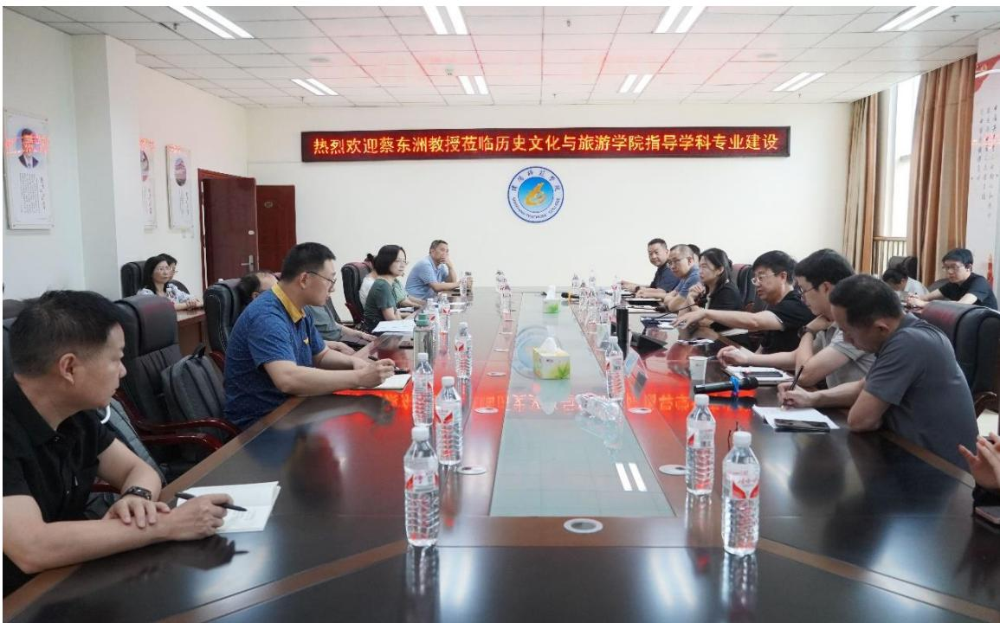

李敏在讲话中肯定了学院干部职工主动求知、积极进取的良好风貌，强调历史文化与旅游学院要主动把握新时代高等教育发展的历史方位，扎根区域经济社会发展需要，立足绵阳地方红色文化、传统文化和旅游资源，紧密结合国家战略需求，系统调整学科专业方向，着力组建跨学科研究团队，为特色学科建设、硕士点申报和学院内涵式发展筑牢基础。

蔡东洲教授在听取了学院学科建设与专业发展现状及规划后，结合自身多年学术研究与学科建设经验，对学院工作提出精准指导意见。他指出，学科建设要以教师研究方向为根基，学院方向、教师方向、学生毕业论文方向要同向同行，保持稳定、长期积累。要充分考虑文化传承使命、区域社会需求，通过挖掘“历史 $\cdot ^ { + }$ 旅游”“文化 $+$ 科技”等交叉点，实现从“单打独斗”到“团队作战”的体系化研究转型。针对学科发展路径，蔡东洲教授强调，要围绕确定方向开展系统性研究，形成标志性学术成果，从而提升学科影响力。要坚持“纵横交错”开展科研项目，纵向项目横向做、横向项目纵向做，“专注一个问题，深入研究下去”。

马泽民在主持座谈时对蔡东洲教授莅临指导、倾情相授表示感谢。他表示，蔡东洲教授的指导意见高屋建瓴、切中要害、务实可行，学院将以此次研讨为契机，全面落实各项工作部署，深化教育教学改革，提升办学实力，为社会培养更多优秀人才。科技处等职能部门负责人表示，将在学科专业发展、科研平台建设、课程体系优化等方面给予学院支持，推动学院学科建设与人才培养深度融合。

此次学科建设座谈研讨，为历史文化与旅游学院学科专业建设提供了实践路径，搭建起校际协同交流平台，进一步统一思想、凝聚共识，必将推动学院开启发展新篇章。

学校教务处、科技处、学科建设与发展规划处等部门负责人和学院全体教师参加研讨。

# 文学院举办中文学科建设专题讲座

作者：周华 来源：文学院编辑：智谦 阅读次数：256 次发布日期：2025 年 05 月 09 日为提升人才培养质量，文学院于5月8日开展了专业核心素养系列讲座。浙江大学博士生导师、教育部长江学者方一新、王云路教授应邀担任主讲嘉宾，蒋宗许教授主持讲座，文学院200余名师生聆听讲座。

方一新教授主讲题目为“论译经与中土作品语言的相互影响——以‘长物’等词语为例”。他在讲座中巧妙地引用了多部古籍，详尽地阐释了“长物”一词释义的丰富性，并逐一追溯了各种释义的出处。通过对“长物”一词释义演变过程的深入剖析，进一步揭示了译经与中土作品在语言上的相互影响、相互渗透的关系。这一独到的见解，不仅让同学们对“长物”一词的理解更加全面深刻，而且在无形中拓展了大家对学术研究的认知边界。随着方教授的不断讲解，同学们的思维和视野得到了拓展与提升，对学术探索的热情与兴趣也被进一步点燃。

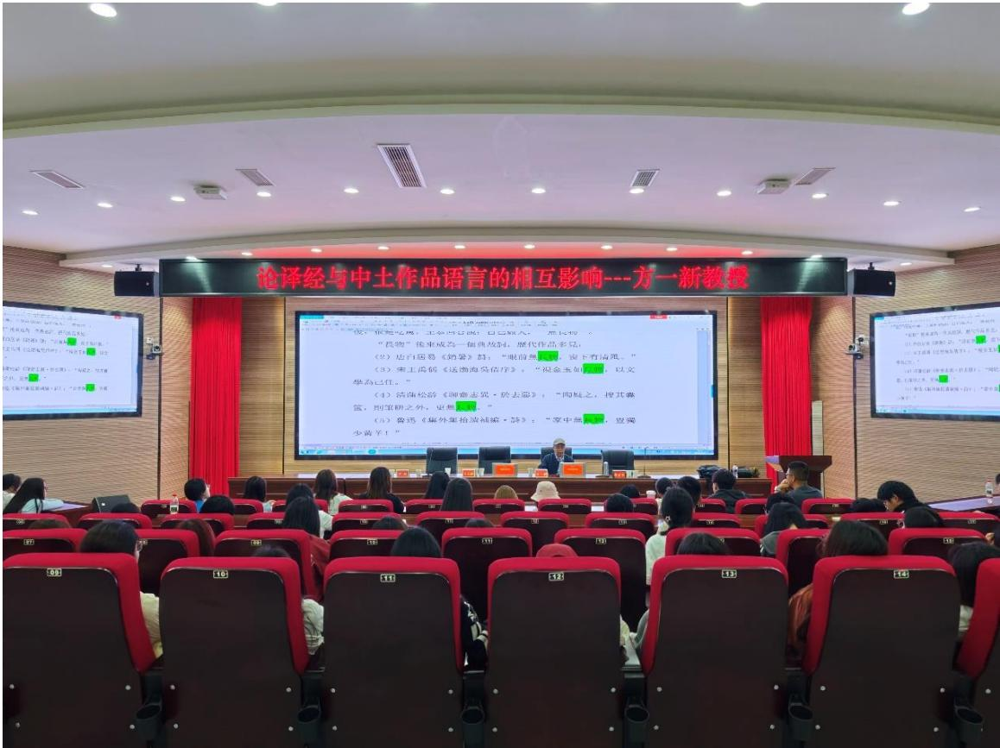

王云路教授以“穿越时空的汉字故事——从古语到今语的演变之旅”为题，将艰深的古文字与日常鲜活的人类活动相结合，给同学们带来了一场别开生面的学术盛宴。讲座中，王教授以“堯”字为例，讲述以“堯”为声符的汉字，都具有“高”这一特征，并以此总结出“核心义”这一重要概念，让在座的老师和同学深受启发。

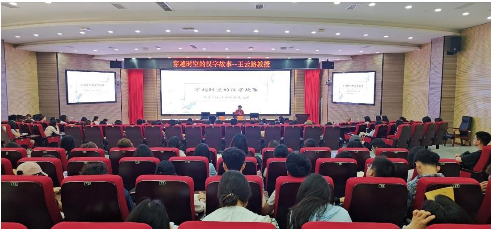

讲座过程中，同学们积极参与交流互动，对于两位教授提出的问题踊跃发言，现场气氛热烈。

两位名家的讲座均从细小问题入手，紧紧围绕经典原典展开，逻辑严谨，条理分明，于海量材料中找寻规律，破立结合，由浅入深引领听众步入知识的殿堂，极大地激发了同学们学习语言学、探索语言文字奥秘的浓厚兴趣，在场师生均深感获益良多。

# 人物链接

方一新，浙江大学文学院教授，汉语言研究所所长，浙江大学国家语言文字推广基地主任。兼任国家社科基金会评组专家，中国语言学会历史语言学分会副会长，浙江省文史研究馆馆员。出版《中古汉语语词例释》《训诂学概论》《中古近代汉语词汇学》《东汉疑伪佛经的语言学考辨研究》等著作，发表论文百余篇。获北京大学王力语言学奖，浙江省哲社成果一、二等奖，教育部高校人文社科成果二等奖，专著入选国家哲学社会科学成果文库。

王云路，浙江大学敦和讲席教授、浙江省特级专家、教育部长江学者特聘教授，第八届国务院学科评议组成员。主要从事汉语词汇与语义演变研究，著有《中古汉语语词例释》（合著）《中古汉语词汇史》《汉语词汇核心义研究》《中古诗歌语言研究》等。现任浙江大学古籍研究所所长、浙江大学中国语文研究中心主任、浙江大学人文学部学位委员会主任，《汉语史学报》主编、《中国训诂学报》主编，中国训诂学研究会会长、中国语言学会副会长、浙江省文史研究馆馆员等。

# 我校学生在 2025 年美国大学生数学建模竞赛中取得新突破

作者：王红梅 来源：数学与大数据学院编辑：张杰 阅读次数：564 次发布日期：2025 年 05 月 09 日【打印】近日，2025 年美国大学生数学建模竞赛（MCM/ICM）成绩公布，我校参赛团队斩获2项 Honorable Mention（国际二等奖，H 奖）与 1 项 Successful Participant（国际三等奖，S 奖）。

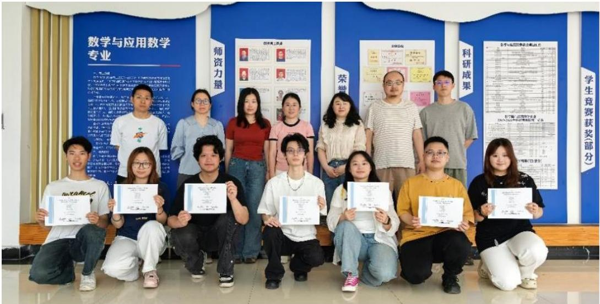

美国大学生数学建模竞赛（简称“美赛”）是由美国数学及其应用联合会（COMAP）主办的，具有重要国际影响力的数学建模竞赛。此次竞赛在今年1月23日—27日（美国东部时间）举行，吸引了来自美国、中国等国家与地区的著名高校共 27456（MCM21092，ICM6364）支队伍报名参加。题目围绕气候变化、能源转型等全球性热点问题，要求参赛者在4天内完成问题剖析、模型构建、数据求解及全英文论文撰写，对参赛者综合能力要求极高。

在学校教务处和数学与大数据学院的大力支持下，我校数学建模团队不断完善竞赛培训工作，并以竞赛为牵引，实现竞赛课程化，形成了一套“课程—培训—实践”系统高效的训练体系。目前，数学建模团队针对全校学生开设了“数学建模基础”“数学建模实验”等课程，涵盖不同学术层次，每年惠及学生人数逾千，为参与竞赛的学生提供了坚实的学术支持。展望未来，数学建模团队将持续推动竞赛与学术研究的相互促进，助力我校学生在国际数学建模竞赛中展现我校的学术风貌。

# 新工科产学研联盟专家团走进我校 把脉新工科专业建设

作者：张银莹 来源：人工智能学院编辑：智谦 阅读次数：375 次发布日期：2025 年 05 月 08 日【打印】

5月7日，由中国软件行业协会、信息技术新工科产学研联盟主办的“联盟专家进高校”系列活动第七十站落地我校高新校区。本次活动以“产出导向，适应新变，促进高质量人才培养”为主题，北京航空航天大学高小鹏教授、温州大学施晓秋教授、南京航空航天大学孙涵教授分别作专题报告。副校长王杨出席致辞，相关专业师生代表参与研讨交流。

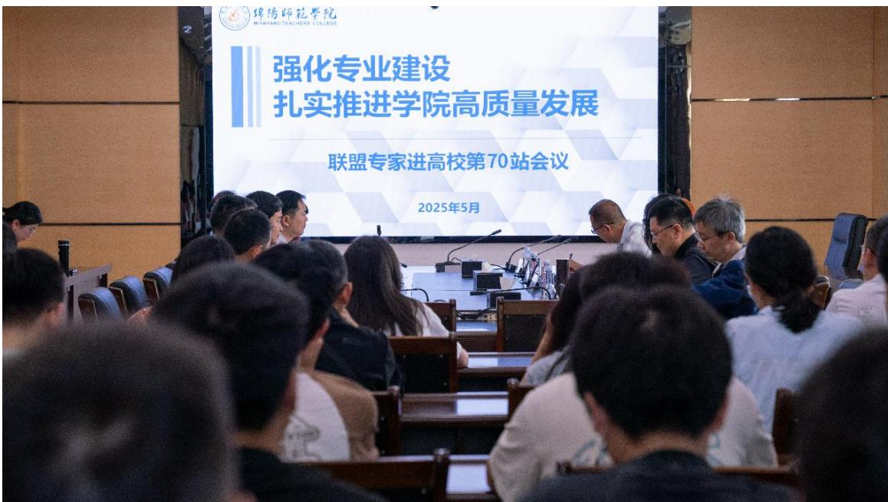

王杨在致辞中对专家们的到来表示诚挚欢迎与感谢，强调专业建设是学校发展的核心驱动力，学校将以此次会议为契机，推动教育革新纵深发展，切实服务区域产业转型升级。

在特邀报告环节，高小鹏、施晓秋、孙涵三位教授分别作题为“新时期下计算机专业教学体系调整的宏观思考”“产出导向的专业人才培养方案编制”以及“人工智能通识课程的一点思考”的主题报告。报告围绕新工科专业内涵建设中的相关问题，进行了既有高度有专业性又接地气有应用性地细致指导，为我校新工科发展提供了学科建设方法论与具体实施路径。

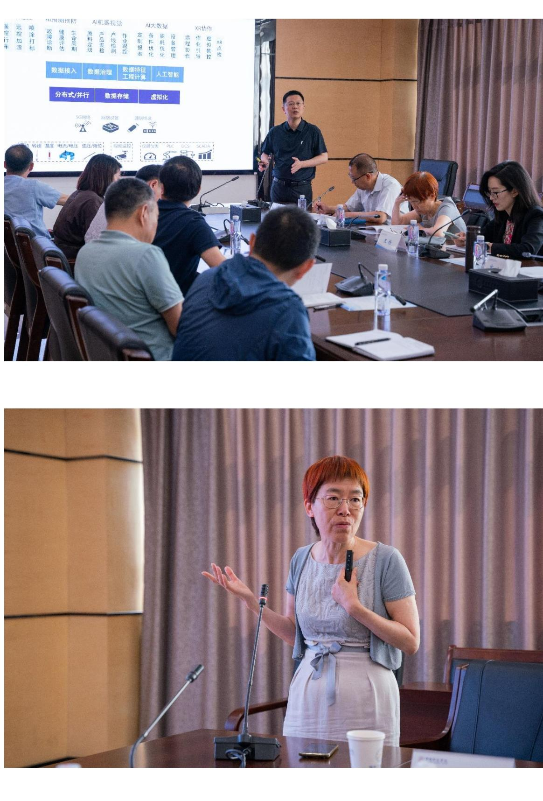

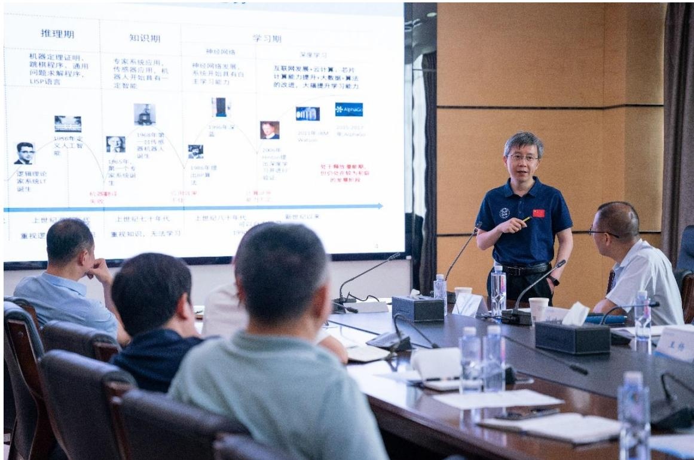

在下午的专业诊断及互动交流环节，校内外专家与学院教师围绕电子信息科学与技术专业硕士点申报展开深度交流。专家组对培养方案及课程材料进行了认真审阅，针对培养方案设计、课程体系衔接、毕业要求观测点分解等关键问题，结合学科前沿动态和认证标准提出改进建议。

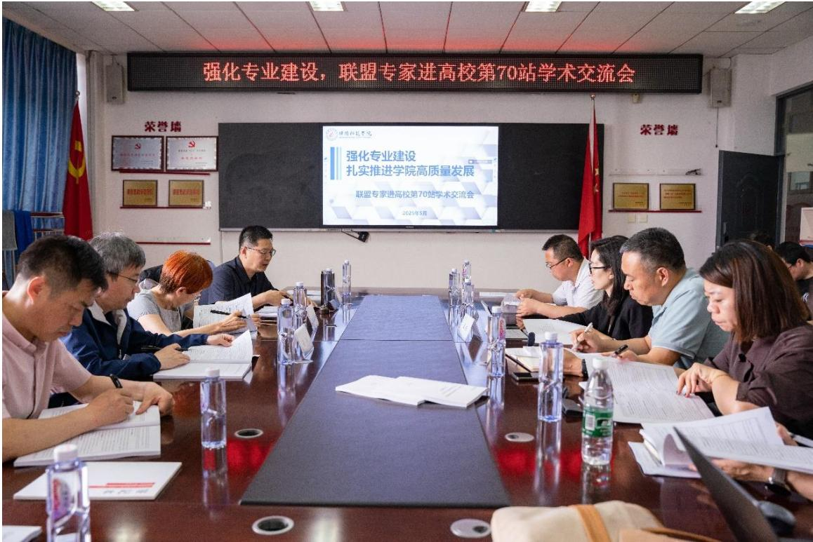

人工智能学院相关负责人表示，此次会议通过专家分享与交流，为学院专业优化和人才培养提供了新思路。学院将结合课程改革、实践能力培养等方向，积极探索符合区域需求的育人模式，为提升教学质量和应用型人才培养水平创造有利条件。

# 国家艺术基金资助项目群舞《我记得》启动仪式暨专家研讨会在我校举行

作者：杨雯 来源：音乐与舞蹈学院编辑：张杰 阅读次数：365 次发布日期：2025 年 05 月 07 日【打印】

4月28日，国家艺术基金2025年度舞台艺术创作资助项目群舞《我记得》在我校行知音乐厅举行启动仪式。国家一级演员、四川省舞蹈家协会名誉主席王玉兰，国家一级编导、原四川省歌舞剧院艺术总监何川，学校党委常委、副校长蒋伟，副校长何云晓，相关职能部门、音乐与舞蹈学院等负责人，音乐与舞蹈学院舞蹈表演专业全体师生参加启动仪式。

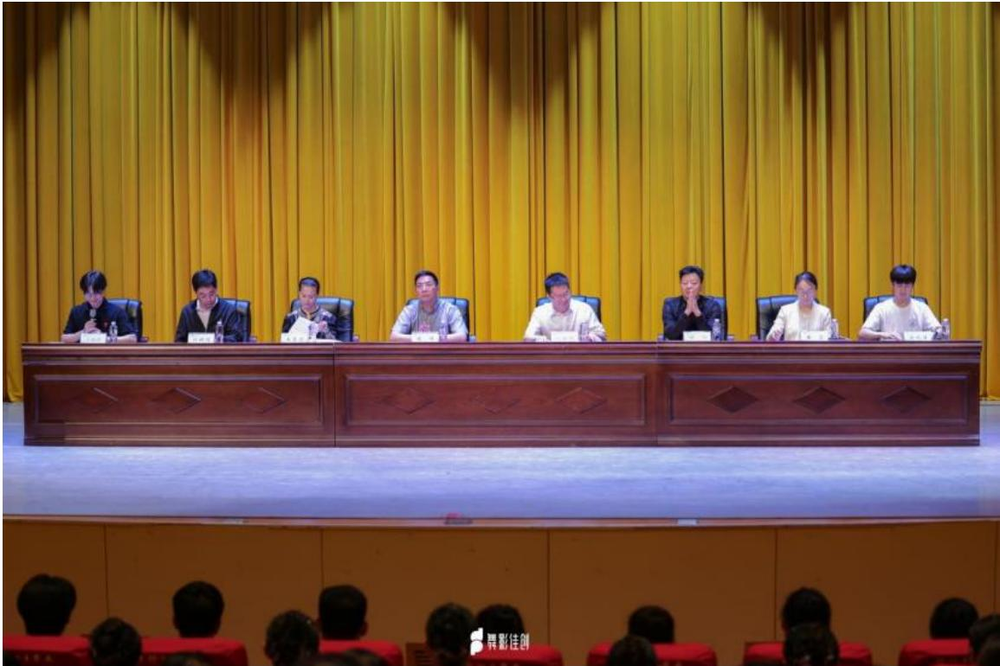

《我记得》项目是由我校音乐与舞蹈学院涂成佳老师于2024年12月立项的项目。该作品聚焦当代社会中患有阿尔茨海默病老年群体的生活状态，以当代舞为表现形式，巧妙运用“摇椅”这一生活物件作为叙事媒介，展现出强烈的人文关怀。

蒋伟在启动仪式上致辞。他指出，学校获批国家艺术基金，实现了在国家社科领域的又一突破，希望以推动项目实施为契机，积极开展交流与合作，加强与省内外同行的互学互鉴，不断提升学校的影响力和竞争力。王玉兰高度评价项目选题的社会价值与艺术水准，称其为近年来四川高校舞蹈创作的精品力作。涂成佳回顾了三年创作历程，表示将带领团队继续打磨作品，力求创造出兼具思想性与艺术性的舞台精品。

何云晓宣布项目正式启动。他表示，群舞《我记得》获得国家艺术基金资助立项既展示了青年教师在教学、科研上的创新精神，也展现了学生们在艺术实践中的无限潜力，是学校教学、科研、人才培养、创作成果的一次集中体现。

启动仪式结束后，举行了专家研讨会。来自省内的多位知名舞蹈艺术家、理论研究者齐聚一堂，围绕《我记得》的创作理念、艺术表达、社会价值及未来发展路径进行了深入探讨。何川对《我记得》的创意构思、编创手法及情感表达给予充分肯定。他鼓励创作团队继续深入挖掘主题内涵，探索更具突破性的舞台语言，为现当代舞的发展注入新的活力。

此次《我记得》项目的正式启动，不仅彰显了我校在艺术创作与科研融合方面的突出能力，也为学校“新文科”建设注入了新的活力。学校将继续坚持以美育人、以文化人，推动更多具有时代精神、社会价值和专业水准的艺术作品落地生根、开花结果。

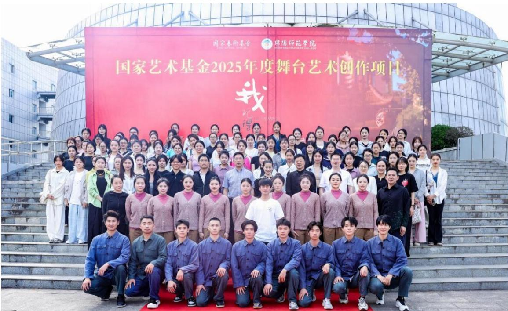

# 智能制造学院顺利通过电工职业技能等级认定机构审核评估

作者：王令 张良 来源：智能制造学院编辑：张杰 阅读次数：343次发布日期：2025年05月07日【打印】近日，智能制造学院顺利通过电工职业技能等级认定机构审核评估，标志着学院在技能人才培养与社会服务能力建设上迈出重要一步。

此次评估由市人社局与市公共实训和技能评价指导中心组织。专家组从资质条件、评价流程、设施设备、师资队伍等多方面，对学院展开全面审查。学院依据四川省相关文件精神，精心准备题库建设、考评专家资质、场地设施、考评制度等备案材料，成功通过“文件审核 $+$ 现场考察”技术评估。评估中，学院在理论考试、实操考核、质量督导等环节的标准化管理获专家组肯定，配备智能监控系统的标准化考场和“双轨考核模式”（理论 $^ +$ 实操）更是受到高度评价。

考取电工职业技能资格证意义重大。对个人而言，电工职业技能资格证是电工专业技能的权威证明，能让求职者在就业市场中更具优势，增加就业机会，持证人就业后有更多晋升空间，获得更好待遇和发展前景。

获得电工职业技能等级认定机构的资质，对学院而言具有深远意义。此资质不仅彰显了学院教育教学的质量，而且有助于提升学院在职业教育领域的声誉，吸引更多的优秀学生。同时，学院能够依据国家职业技能标准，为在校学生及社会人员提供电工技能等级的认定服务。这不仅为学生开辟了规范的职业技能提升路径，增强了其就业市场的竞争力；也为社会人员提供了职业转型和技能提升的良机，满足了社会对电工技能人才的需求，进而提升了学院服务社会的能力。

# 学校召开申硕工作总结暨学科建设大会

来源：学位与研究生教育处编辑：智谦 阅读次数：2272 次发布日期：2024 年 12 月 31 日【打印】征途万里风正劲，重任在肩再启程。为总结申硕经验，分析研判形势，谋划发展大局，以高标准学科建设引领学校事业高质量发展，12月30日，学校在厚德楼246室召开申硕工作总结暨学科建设大会。

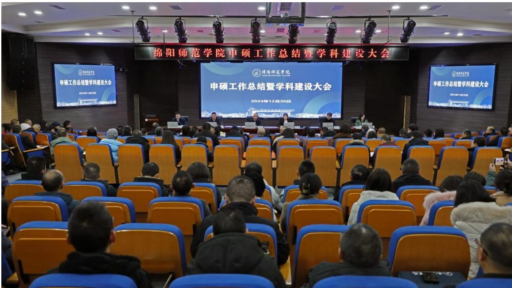

绵阳市人民政府副市长胡进耀，在校校领导陈寒、李敏、王力、何云晓、毕剑、王杨，受表彰的申硕工作先进单位和个人出席会议。大会分两阶段进行，校党委副书记、校长李敏，副校长何云晓分别主持会议。

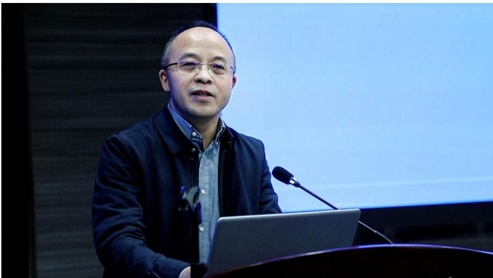

校党委书记陈寒在讲话中指出，本次大会旨在进一步统一思想、凝聚共识，对强化“以学科建设为龙头，硕士点建设为抓手”工作思路的再明确、再动员、再部署。陈寒强调，一要坚定信心，进一步增强干事创业的决心意志。学校申硕取得的新成绩以及在科研成果、师资队伍建设、区域行业影响、省绩效考核等方面取得的新突破，是学校事业发展的根基和底气。只要坚定信心，学科专业建设的水平就一定能上台阶，“升大拼博”的梦想就一定能迈大步。二要直面问题，进一步增强攻坚克难的紧迫感。要认真分析和重点解决“学科专业建设转型所带来的危机感和紧迫感不足、学科专业建设的逻辑遵循不够严密、学科专业特色不够突出、科研工作‘单兵作战’惯性较大、导师队伍建设稍显滞后”等问题。三要创新机制，进一步健全学科专业建设的新机制。要基于高校办学职能，健全学科建设的价值选择机制，基于产出导向，健全学科建设的资源配置机制，基于办学效率，健全学科专业建设的绩效分配机制。他希望全校上下要团结一心、勇于创新、敢于担当，将会议精神转化为行动指南，将事业共识转化为前进动能，共同推动学校学科建设和事业发展迈向新的高度。

校党委副书记、校长李敏作了题为《凝识聚势提质效 鼓足干劲谱新篇 以高标准学科建设引领学校事业高质量发展》的工作报告。从“忆往昔、披荆斩棘，申硕攻坚三战功成”“看今朝，百舸争流，提质晋位时不我待”“展未来，升大拼博，学科建设重任在肩”三方面，回顾总结了我校申硕工作奋斗历程，深入分析了在教育强国背景下学校发展所面临的形势，就全面推进学校新一轮学科建设提出了思路和举措。

李敏指出，成为硕士学位授予单位，办好研究生教育，是学校实现“三步走”发展战略必须完成的首个目标，在这场空前的申硕攻坚战和持久战中，全体绵师人保持顽强斗志和战略定力，唯实惟先、善作善成。她代表学校向申硕攻坚的组织者、建设者和亲历者，向长期投身学科建设事业的教职员工表示衷心感谢，向关心支持学校事业发展的各级领导、专家学者、历届老领导、老教师、老同志、全体校友和社会各界致以崇高敬意。

李敏表示，申硕工作是学校升本以来任务最为艰巨、持续时间最长、投入动员最多、承受压力最大的一次攻坚战。回望申硕之路，获批“特需”项目、抢得发展先机，服务特殊需求、锻造优势特色，全面培育建设、奋力改善指标，两年行动攻坚、申硕终获成功。学校积累了“四个一”宝贵经验和精神财富，“一条心”干事业，班子坚强有力、师生团结奋进；“一盘棋”搞建设，科学谋划部署、全面对标对表；“一股劲”破难题，统筹资源配置、聚力攻坚克难；“一张网”聚合力，深化沟通交流、争取多方支持。

李敏强调，申硕成功后学校发展面临的积极有利形势体现在“四个新”，开辟了发展新赛道、激活了发展新引擎、集聚了发展新优势、承载了发展新使命。面对教育强国建设、经济社会变革和高等教育改革，学校迎来了发展机遇期、转型关键期和提质攻坚期。她要求，学科建设一要紧扣主线、厘清思路，锚定建设目标，二要聚焦要素，抓住重点，落实建设任务，三要产教融合，学科交叉，深化建设举措，四要对标对表，汇聚资源，确保建设实效。希望全体师生要以更高远的历史站位、更宽广的国际视野和更深邃的战略眼光，从中国式现代化的伟大实践中汲取昂扬奋进的力量，不断开创学科建设新局面，在新征程上奋力书写“教育强国、绵师有为”的时代华章。

校党委常委、副校长王力宣读申硕专项表彰决定。授予17个单位“申硕工作先进集体”称号，授予 39 名教师“申硕工作先进个人”称号。与会校领导为受表彰的先进集体和个人颁发了奖牌和荣誉证书。

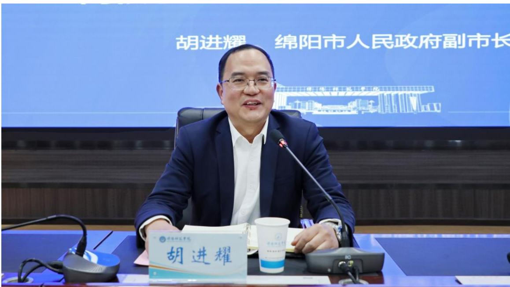

辅导报告环节，绵阳市人民政府副市长胡进耀从地方经济社会发展需求出发，对学校学科建设工作进行指导。他深情回顾了在学校工作期间的点滴和学校的发展历程，强调学科建设需要人人参与、创新办法，精诚团结、共谋发展，契合需求，服务地方。

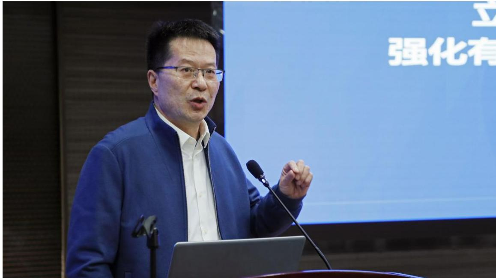

副校长何云晓以《立足“一山一水一城” 强化有组织科研 服务学科建设》为题，提出学科建设瞄准服务基础教育、生物安全、粮食安全和涪江流域文化艺术振兴等需求，对标新农科、新工科、新文科建设，紧抓战略机遇，聚焦优势特色，通过有组织科研提升学科建设辨识度。

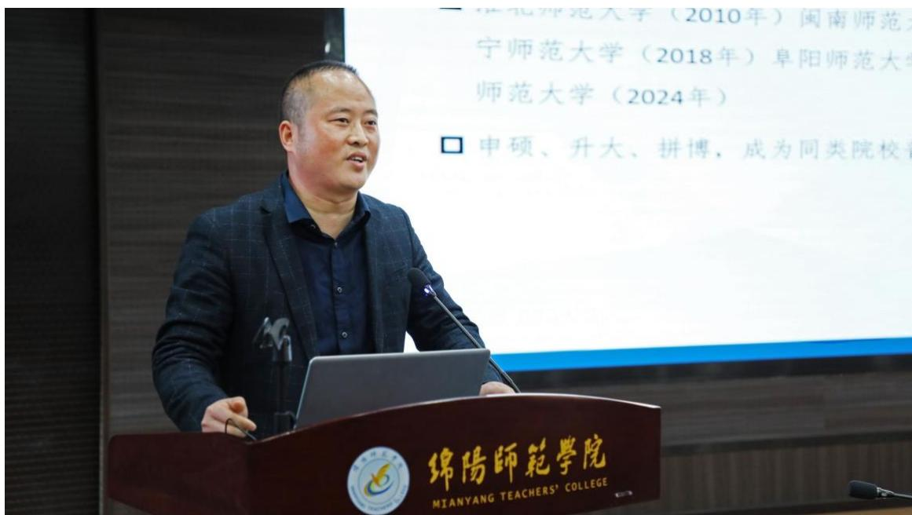

发展规划处处长侯小兵以《形势•思路•方案——以学科专业一体化为突破口，深化教育综合改革》为题，分析了高校学科专业发展所面临的形势以及我校学科专业设置现状，阐释了学校学科专业一体化建设的工作思考。

交流发言环节，四个学位建设点负责人，三个科研团队代表作了工作交流。大会开始前，与会人员共同观看了《扬帆申硕路、砥砺再前行》学科建设宣传片。

学校科级以上干部，各学位建设点负责人、各学院学科和专业负责人参加会议。

# 城乡建设与规划学院举办第二届产教融合校地合作论坛

作者：刘田琳 来源：城乡建设与规划学院编辑：张杰 阅读次数：91 次发布日期：2024 年 12 月 09 日【打印】为深入贯彻落实习近平总书记对高等教育事业发展的重要指示精神，面对新形势、新格局，在国家学科专业建设顶层设计的指引下，围绕学校中心工作，以“学科建设年”为抓手，着力提升培养人居环境建设高层次技术人才水平。学校城乡建设与规划学院成功举办了主题为“迎变聚力·共绘未来”的第二届产教融合校地合作论坛。绵阳市相关职能部门，四川路桥城市建设有限公司、中建三局集团四川有限公司、绵阳市风景园林协会、绵阳市国土空间规划协会、绵阳市建筑业施工企业协会、绵阳市勘察设计协会、西南科技大学、绵阳城市学院、四川文化艺术学院等部门单位近 40 位领导和专家出席论坛。论坛由城乡建设与规划学院副院长（主持工作）朱兵主持。

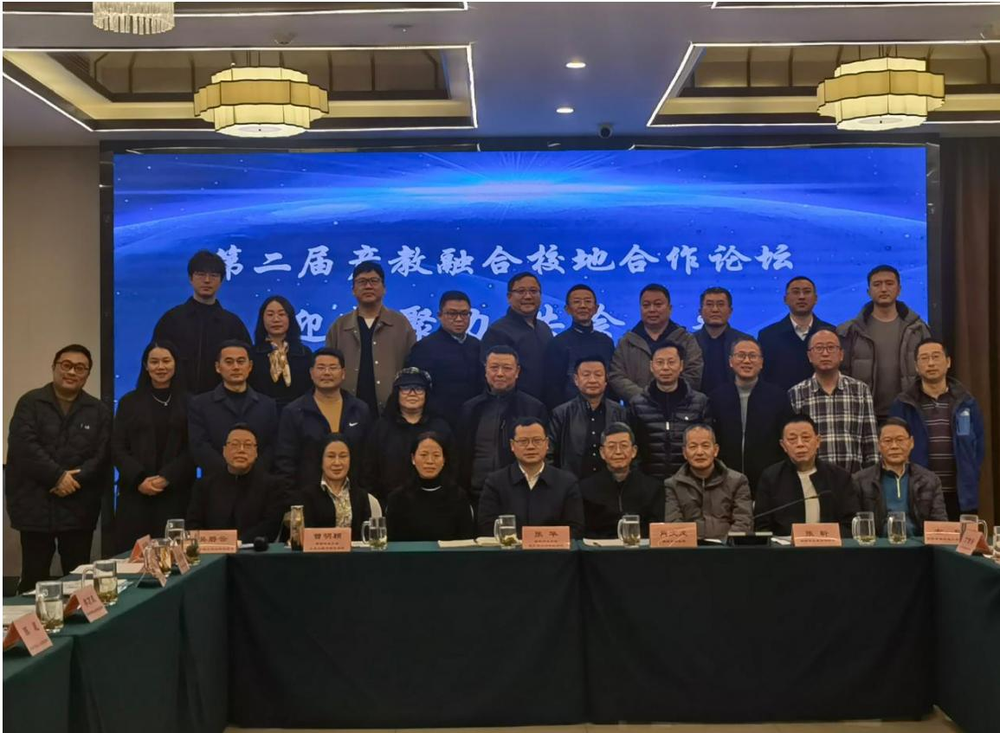

论坛旨在进一步推进产学研协同创新，聚焦于深化地方政府、同行高校、行业协会及企业间的深度合作，共同探讨行业发展趋势和技术需求，以促进高校的人才培养方案修订、科研方向聚焦和服务地方的能力提升。学院党委书记张华做开幕致辞，对莅临此次论坛的领导嘉宾和同行表达了热烈的欢迎和诚挚的感谢。绵阳市林业局党组成员、副局长肖文龙结合绵阳市大熊猫公园建设、绵阳市林产业发展现状进行了深入分析，并就学校学科专业建设提出了宝贵的建议；西南科技大学土木工程与建筑学院副院长曾明颖分享了新形势下学院学科建设和课程改革的创新思路；绵阳市风景园林协会、国土空间规划协会、城市学院现代城市建设学院、建筑施工企业协会以及四川文化艺术学院美术设计学院等兄弟院校和行业企业机构的多位专家，围绕专业建设、行业现状和人才需求等方面作主旨发言和交流分享。

城乡建设与规划学院副院长崔勇彬详细介绍了学院的整体发展情况、人才培养方面取得的成绩，以及未来的校地合作思路。他强调，通过本次论坛，各方承诺将加强“政—产—学—研—赛—用”全过程融合，探索协同育人的新路径，共同努力服务于区域高质量的发展，推进中国式现代化建设。

论坛的成功举办，为校地、校企和校校搭建了交流、沟通和合作的坚实平台，不仅促进了学术界与产业界的交流，也为实现更高效的校地、校企、校校合作互融互通。为未来的合作与发展提供了广阔的前景和扎实的基础。接下来，学院将继续致力于推动学科专业建设上台阶，产教融合谱新篇，培养适应新时代需求的高素质专业人才，助力地方经济社会的繁荣与发展，为推动学校高质量内涵式发展谱写城乡建设与规划续新篇。