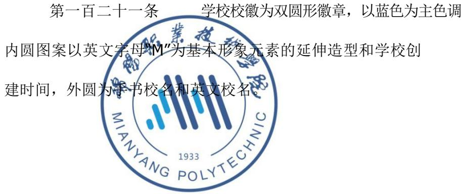

学校简介 ...绵阳职业技术学院章程

# 学校简介

诗仙故里，科技名城，孕育巴蜀高等职教明珠；富乐山麓，芙蓉溪畔，蕴藏读书圣地工匠殿堂。绵阳职业技术学院是绵阳市人民政府举办的一所综合类高等职业院校。2001年，经四川省人民政府批准，在原四川建筑材料工业学校基础上建立绵阳职业技术学院。学校办学历史可以追溯到1933年成立的江苏省立宿迁玻璃科职业学校，学校几易其址，数次更名，经历了江苏省立宿迁玻璃科职业学校、四川省立江津窑业技术学校、重庆建筑工程学校、四川非金属矿山半工半读中等技术学校、四川省建筑材料工业学院、绵阳建筑材料工业学校、四川建筑材料工业学校等发展阶段。先后获得全国职业教育先进单位、国家示范高职院校、全国信息化标杆校建设单位、四川省最佳文明单位、四川省依法治校示范学校、四川省高校毕业生就业工作先进单位等荣誉，被列为四川省首批高端技术技能本科教育试点院校、四川省首批现代学徒制试点院校、四川省全面创新改革试验试点高校、四川省优质高职院校、四川省“双高计划”建设高职院校。

学校占地面积800余亩，校舍面积34.1万平方米，固定资产总值7.27亿元，其中教学实验实训仪器设备1.57万台（套），教学用计算机6.77千台，图书馆纸质图书100万余册、电子图书94.22万册。设有马克思主义学院、公共教育学院、材料工程学院、电子信息学院、智能制造学院、人工智能学院、电气工程学院、建筑工程学院、财经商贸学院、文化旅游学院、艺术设计学院等11个二级教学单位，开设了2个本科专业、40 个专科专业，涵盖先进材料、电子信息、装备制造、财经商贸、文化旅游等13个大类、30个专业领域，现有高职、中职、应用本科、“一带一路”沿线留学生等在校学生1.3万余人。

学校现有在职教职工800余人，高级职称200余人，硕士及以上学位400余人。有国家级和省级强国行专项团队2个、国家和省级样板支部4个、省级党建标杆院系和“双带头人”工作室3个、四川省优秀教学团队2个、四川省高校工程技术创新团队2个、四川省教学名师1人、省级名师工作室1个、教育部行业职业教育教学指导委员会成员5人，荣获黄炎培杰出教师奖2人、国家技能人才培育突出贡献奖3人。有国家示范建设专业5个、国家行业骨干建设专业4个、国家提升服务产业能力建设专业2个、全国职业院校旅游类专业示范点1个、国家级精品在线课程2门、四川省职业教育精品在线开放课程 9 门，创新创业示范课程 2 门、四川省级职业教育专业教学资源库1个、四川省精品专业1个、四川省重点建设专业3个、四川省现代学徒制试点专业 6 个、四川省首批高等学校课程思政标杆院系 1 个。入选首批“十四五”职业教育国家规划教材5部、省级规划教材5部，国家授权专利100余项，省市以上教学成果奖和科技进步奖近30项。

学校始终坚持服务中国科技城建设和区域行业发展，以现代职教理念大力推行产教融合、协同育人，形成了建筑材料领域底蕴深厚、电子信息行业优势明显、智能制造方向特色突出、军民融合协同创新的办学特色。长期与中国工程物理研究院、中国兵器五八研究所、长虹、九洲等院所企业合作，建有长虹电子产业学院、东材科技新材料产业学院、中国（绵阳）科技城低空产业学院、中国（绵阳）科技城软件学院、功能薄膜材料产业学院和绵阳米粉产业学院等 9 个产业学院和 10 个工程技术中心，建成军民融合教师培训基地、现代检测技术工程中心等多个产学研合作平台，立项建设省级首批市域产教联合体1个。现有国家级实训基地1个、省级实训基地4个、技能大师工作室6个，省级产教融合示范项目2个、省级现场工程师培养试点项目3个。学校联合全国13所高职院校和22家企业，牵头主持建设的《建筑材料工程技术专业教学资源库》项目获得教育部专项支持。多次承办中国水泥轻舟赛、全国水泥行业分析与物检技能竞赛决赛和全国职业院校建材类专业学生职业技能大赛等多项赛事。学校牵头组建成立的绵阳职教集团，被确定为第二批国家级示范性职业教育集团培育单位；牵头成立绵阳科技城产教联合体和全国建材行业产教融合共同体、全国数字经济产教融合共同体、四川智能制造行业共同体，整合行业优质资源，搭建协同发展平台，为产业高质量发展提供系统性支撑；牵头成立的涪江流域职业教育协同发展联盟、绵阳职教研究中心，年均发布课题并立项50余项，为助推区域职教发展作出了积极贡献。学校设有创新创业培训学院，成立了以政府主导、学校主管、企业主营等多元体制的富乐绵阳大学生创新创业园和创客俱乐部，被科技部授予全国众创空间，并升级为省级大学科技园，跻身全国高职院校创新创业示范校50强。学校建有12个省市级培训基地，年均社会培训超过3.5万人次，获10项省市级科技成果奖，突破3项“卡脖子”技术，入选2023年“人才培养”“服务贡献”卓越高等职业学校西部50强。

学校通过与国（境）内外本科院校和行业企业合作，积极探索多层次办学之路。与西南科技大学、绵阳师范学院合作共同培养高端技术技能型本科人才，为学生搭建了向上发展的平台；与京东方、惠科、吉利汽车、富临精工、舍得酒业等国内外知名企业携手共建校企合作订单班，深入推进工学结合、多元育人，提高人才培养质量。学校通过引进优质专业课程、教师交流互访、学生“专升本”留学和研修等形式，在中外合作办学各方面取得了突破性进展，先后与加拿大、德国、新西兰等国家和地区20余所院校开展交流与合作，并招收有来自老挝、印度尼西亚、柬埔寨、塔吉克斯坦等“一带一路”国家的国际学生，为埃塞俄比亚等国家制定各类标准 6 份，增强了学校与国际职业教育对接的能力，国际化办学水平进一步提升。

一直以来，学校秉持“诚信为基、能力为本、创新为魂、特色为翼”的办学理念，始终依托和对接科技城建设和区域行业，以社会服务为宗旨，以就业创业为导向，大力推行产教融合、协同育人，人才培养质量和办学水平不断提升，为社会输送了大批高素质技术技能人才。下一步，学校将按照第四次党代会确立的“锚定一个目标，统筹两大任务，走稳三个阶段，抢抓四大机遇，实施五大战略，奋力推动学校实现高质量、跨越式发展”的思路，在省委教育工委、省教育厅和市委、市政府的坚强领导

下，抢抓成渝地区双城经济圈建设重大战略机遇，主动融入绵阳加快建设中国科技城、全力打造成渝副中心的发展大局，以“双高建设”为契机，以立德树人为根本，以提高质量为核心，以改革创新为动力，以必胜的信心、决战的姿态，凝心聚力、深化改革、创新发展，努力把学校建设成为中国特色高水平职业技术大学。

（数据更新至2025年7月）

校 训：重德 精业 求实创新

学校精神：艰苦

奋斗 追求卓越  
办学理念：诚信为基 能力为本 创新为魂 特  
为翼 绵职院发〔2022〕97号  
办学定位：立足中国（绵阳）科技城 服务区域和行业发展

色

# 关于发布《绵阳职业技术学院章程》的公告

校内各单位、全体师生：

《 绵阳职业技术学院章程修正案》经学校第四届教职工代表大会暨工会会员代表大会第四次会议讨论，2022年第 12次校长办公会议、校党委常委会第 143次会议审定。2022年 12月 7 日，《 四川省教育厅关于同意<绵阳职业技术学院章程修正案>的批复》（川教函〔2022〕687号）核准《绵阳职业技术学院章程修正案》。现将新修订的《绵阳职业技术学院章程》予以发布，请认真学习贯彻落实。原 2015年公布实施的《绵阳职业技术学院章程》同时废止。

# 绵阳职业技术学院章程

# 序 言

绵阳职业技术学院起源于 1933年章继南先生创办的江苏省立宿迁玻璃科职业学校。学校几易其址，数次更名，经历了江苏省立宿迁玻璃科职业学校、四川省立江津窑业技术学校、重庆建筑工程学校、四川非金属矿山半工半读中等技术学校、四川建筑材料工业学校等发展阶段。2001 年，经四川省人民政府批准，在原四川建筑材料工业学校（2000 年原绵阳工业学校并入）基础上建立绵阳职业技术学院，后原绵阳机电工业学校、原绵阳水利电力学校部分专业、绵阳财经学校相继并入。学校于 2011年被确立为国家示范性高等职业院校，2020 年通过四川省优质高等职业院校验收，2021年被列为四川省“双高建设”高职院校。

学校传承“艰苦奋斗、追求卓越”精神，秉持“重德、精业、求实、创新”校训，坚持“诚信为基、能力为本、创新为魂、特色为翼”办学理念和“质量立校、特色兴校、人才强校”治校方略，立足于服务中国（绵阳）科技城建设和区域行业发展，主动抢抓成渝地区双城经济圈建设机遇，以现代职教理念大力推行产教融合、协同育人，努力把学校建设成为特色鲜明的区域性一流职业大学。

第一条 为保障学校依法办学和自主管理，根据宪法以及《 中华人民共和国教育法》《中华人民共和国高等教育法》《中华人民共和国职业教育法》等法律法规，制定本章程。

第二条 学校名称为绵阳职业技术学院。学校的英文名称为Mianyang Polytechnic。

第三条 学校建有校本部校区和南校区。校本部校区地址为：四川省绵阳市新一环路北段 6 号，是学校法定住所；南校区地址为：绵阳市游仙经济实验区华兴南街 2 号。

第四条 学校为公益二类事业单位，具有独立法人资格，依法享有办学自主权，独立承担法律责任。校长是法定代表人。

第五条 学校开办资金：52000万元。

第六条 学校以本科层次职业教育为引领，以专科层次为主体，以中职教育为补充，实施全日制职业教育，开展多种形式的非全日制继续教育和社会培训服务，推进中外合作办学和国际合作交流，促进教育国际化。

# 第二章 举办者与学校

第七条 学校由绵阳市人民政府举办，主管部门是四川省人民政府教育行政部门。

第八条绵阳市人民政府根据法律、法规和规章，指导学校改革发展，监督和规范学校办学行为；向省委、省政府及干部主管部门推荐学校党委书记、校长人选，按干部管理权限和程序任免学校其他负责人；依法对学校经费和资产使用进行监督；对学校工作绩效进行综合性或专项考核评价；向上级教育行政主管部门提出关于学校分立、合并及终止等重大方案。

第九条 绵阳市人民政府依法落实学校办学自主权，为学校提供必要的办学条件，保障学校办学经费，维护学校合法利益和良好的办学环境、办学秩序，制止和排除任何单位、个人所进行的任何侵害或者妨碍学校行使办学自主权的行为，支持学校改革发展。

第十条 学校坚持社会主义办学方向，全面贯彻党和国家的教育方针，以人才培养为办学基本内容和中心工作，围绕人才培养开展教育教学、技术研发、社会服务、文化传承与创新、国际交流与合作。坚持立德树人根本任务，坚持为党育人、为国育才，大力弘扬工匠精神，培育高素质技术技能人才，培养德、智、体、美、劳全面发展的社会主义建设者和接班人。

第十一条 学校遵循职业教育规律，坚持“质量立校、特色兴校、人才强校”治校方略，并根据社会需求变化合理调整办学规模、专业布局和教学单位设置，妥善处理办学规模、结构、质量、效益关系，促进学校事业全面、协调和可持续发展。学校办学规模由国家有关部门根据社会需求、教育规划、办学条件及相关标准指标统筹核定。

第十二条 学校享有下列权利：

（ 一）依法自主办学，依照章程自主管理；（ 二）确定学校发展战略和发展目标，制定学校事业发展规划，管理学校内部事务；（ 三）根据经济社会发展的需求设置和调整专业；（ 四）根据核定的办学规模，拟定招生方案，自主调节专业

招生比例；

（ 五）制定人才培养方案，组织实施教育教学活动；（ 六）实施学生教育和管理，依法颁发相应的学业证书和学历证书；

（ 七）管理和使用绵阳市人民政府提供的财产、国家财政性资助、受捐赠财产及其他由学校合法所有的财产等；

（ 八）自主开展技术研发、成果转化和社会服务，依法与境内外教育机构、企业等组织合作办学；

（ 九）确定内部组织机构的设置、人员配备和调整；

（ 十）自主聘用和管理教职工，决定教师和其他专业技术人员的聘任、晋升和解聘，发放教职员工的薪酬和福利待遇；

（ 十一）拒绝任何组织和个人对教育教学活动的非法干涉；  
（ 十二）法律、法规和规章规定的其他权利。

第十三条 学校应当履行下列义务：

（ 一）坚持社会主义办学方向，贯彻党和国家的教育方针，遵守国家的法律法规，执行国家教育教学标准，保证教育教学质量；

（ 二）学校办学活动接受绵阳市人民政府的领导、监督、评估和考核。

（ 三）在绵阳市人民政府的指导下，制定和实施学校事业发展规划，高效使用各类资产资源，确保发展目标的实现；

（ 四）履行人才培养、科学研究、社会服务、文化传承与创新、国际交流与合作等基本职能，不断提高办学绩效；

（ 五）保护学校资产不被侵占、破坏和流失；

（ 六）遵照国家有关规定收取和使用费用，建立健全财务管理制度，严格管理学校经费，公开收费项目和收费标准；

（ 七）尊重和维护学生、教职工的合法权益；

（ 八）依法接受监督；

（ 九）法律、法规和规章规定的其他义务。

# 第三章 党的领导

第十四条 学校根据《中国共产党普通高等学校基层组织工作条例》的规定,建立中国共产党绵阳职业技术学院委员会，按照党章和党内法规有关规定开展党的活动，加强党的建设。党组织关系隶属于中国共产党绵阳市委员会。

第十五条 学校实行中国共产党绵阳职业技术学院委员会（ 以下简称学校党委）领导下的校长负责制，坚持党委领导、校长负责、教授治学、依法治校、民主管理、社会参与。学校党委实行民主集中制，健全集体领导和个人分工负责相结合的制度。

第十六条 学校党委全面领导学校工作，承担管党治党、办学治校的主体责任，发挥把方向、管大局、作决策、抓班子、带队伍、保落实的领导作用，支持校长按照《中华人民共和国高等教育法》的规定积极主动、独立负责开展工作，保证教学、科研、行政管理等各项任务完成。

第十七条 学校党委实行民主集中制，重大问题按照集体领导、民主集中、个别酝酿、会议决定的原则，通过全体会议方式集体讨论作出决定。

十八条 学校党委由绵阳职业技术学院党员代表大会选

举产生，每届任期 5 年。

第十九条 学校党委根据工作需要，经上级党组织批准，设立常务委员会。书记、副书记、纪委书记、党委常委可由上级党组织选派或由学校依照党章和党内法规等选举产生。党员校长、副校长，组织部长、宣传部长、统战部长按照党的有关规定进入党委常委领导班子。

第二十条 学校党的委员会职责包括:

（ 一）宣传和执行党的路线方针政策，宣传和执行党中央、四川省委、绵阳市委以及上级党组织和本组织的决议，坚持社会主义办学方向，依法治校，依靠全校师生员工推动学校科学发展，培养德智体美劳全面发展的社会主义建设者和接班人。

（ 二）坚持马克思主义指导地位，组织党员认真学习马克思列宁主义、毛泽东思想、邓小平理论、“三个代表”重要思想、科学发展观、习近平新时代中国特色社会主义思想，学习党的路线方针政策和决议，学习党的基本知识，学习业务知识和科学、历史、文化、法律等各方面知识。

（ 三）审议确定学校基本管理制度，讨论决定学校改革发展稳定以及教学、科研、行政管理中的重大事项。

（ 四）讨论决定学校内部组织机构的设置及其负责人的人选。按照干部管理权限，负责干部的教育、培训、选拔、考核和监督。加强领导班子建设、干部队伍建设和人才队伍建设。

（ 五）按照党要管党、全面从严治党要求，加强学校党组织建设。落实基层党建工作责任制，发挥学校基层党组织战斗堡垒作用和党员先锋模范作用。

（ 六）履行学校党风廉政建设主体责任，领导、支持内设纪检组织履行监督执纪问责职责，接受同级纪检组织和上级纪委监委及其派驻纪检监察机构的监督。

（ 七）领导学校思想政治工作和德育工作，落实意识形态工作责任制，维护学校安全稳定，促进和谐校园建设。

（ 八）领导学校群团组织、学术组织和教职工代表大会。

（ 九）做好统一战线工作。对学校内民主党派的基层组织实行政治领导，支持其依照各自章程开展活动。支持无党派人士等统一战线成员参加统一战线相关活动，发挥积极作用。加强党外知识分子工作和党外代表人士队伍建设。加强民族和宗教工作，深入开展铸牢中华民族共同体意识教育，坚决防范和抵御各类非法传教、渗透活动。

第二十一条 设立中国共产党绵阳职业技术学院纪律检查委员会（以下简称学校纪委）。学校纪委是学校的党内监督专责机关，履行监督执纪问责职责，在学校党委和上级纪委双重领导下进行工作。主要任务是：

（ 一）维护党章和其他党内法规，检查党的路线方针政策和决议的执行情况，协助学校党委推进全面从严治党、加强党风廉政建设和组织协调反腐败工作。

（ 二）经常对党员进行遵守纪律的教育，作出关于维护党纪的决定。

（ 三）对党的组织和党员领导干部履行职责、行使权力进行监督，受理处置党员群众检举举报，开展谈话提醒、约谈函询。

（ 四）按照相关规定检查和处理党的组织和党员违反党章和其他党内法规的比较重要或者复杂的案件，决定或者取消对这些案件中的党员的处分；进行问责或者提出责任追究的建议。

（ 五）受理党员的控告和申诉，保障党员权利不受侵犯。

第二十二条 党员队伍建设：

（ 一）学校各级党组织构建多层次、多渠道的党员经常性学习教育体系，加强政治理论教育和党史学习教育，突出政治教育和政治训练，强化党章党规党纪教育、党的宗旨教育、革命传统教育、形势政策教育和知识技能教育，推进“两学一做”学习教育常态化制度化，建立和落实不忘初心、牢记使命的制度。

（ 二）严格党的组织生活，坚持开展批评和自我批评，提高“ 三会一课”质量，开好民主生活会和组织生活会，健全落实谈心谈话、民主评议党员、主题党日等制度，确保党的组织生活经常、认真、严肃。

（ 三）强化党员日常管理，及时转接党员组织关系，督促党员按期足额交纳党费。加强流动党员管理和服务，做好毕业生党员、出国（境）学习研究党员组织关系和党籍管理工作。关心党员思想、学习、工作和生活，健全党内关怀、帮扶长效机制。搭建党员发挥先锋模范作用平台，健全党员联系和服务群众工作体系。妥善处置不合格党员，严格执行党的纪律。

（ 四）尊重党员主体地位，发扬党内民主，保障党员权利，推进党务公开。学校各级党组织讨论决定重要事项前，应当充分听取党员的意见，党内重要情况及时向党员通报。

（ 五）按照坚持标准、保证质量、改善结构、慎重发展的方针和有关规定，把政治标准放在首位，加强对入党积极分子的教

育、培养和考察，加强在高层次人才、优秀青年教师和优秀学生中发展党员工作。建立党员领导干部和党员学术带头人直接联系培养教师入党积极分子制度。将团组织推优作为确定学生入党积极分子的重要渠道。建立从高中到大学、从大学到研究生阶段入党积极分子接续培养机制，加大在高校低年级学生中发展党员力度。

（ 六）学校党委设立党校。党校的主要任务是培训党员、干部和入党积极分子。

第二十三条 干部和人才工作：

（ 一）学校党委坚持党管干部原则，按照干部管理权限对学校干部实行统一管理。选拔任用干部，必须突出政治标准，坚持德才兼备、以德为先，坚持五湖四海、任人唯贤，坚持事业为上、公道正派，坚持注重实绩、群众公认，努力实现干部队伍革命化、年轻化、知识化、专业化，建设忠诚干净担当的高素质专业化干部队伍。选拔任用学校中层管理人员，由学校党委及组织部门按照有关规定进行分析研判和动议、民主推荐、考察，充分听取有关方面意见，经学校党委（常委会）集体讨论决定，按照规定程序办理。

（ 二）二级学院党组织在干部队伍建设中发挥主导作用，同二级学院行政领导一起，做好本单位干部的教育、培训、选拔、考核和监督工作，以及学生辅导员、班主任的配备、管理工作。对二级学院行政领导班子的配备及其成员的选拔，二级学院党组织可以向学校党委提出建议，并协助学校党委组织部门进行考察。

（ 三）学校党委建立健全优秀年轻干部发现培养选拔制度，制定并落实年轻干部队伍建设规划，大胆选拔使用经过实践考验的优秀年轻干部。统筹做好女干部、少数民族干部和党外干部的培养选拔工作。

（ 四）学校党委坚持党管人才原则，贯彻人才强国战略，实施更加积极、更加开放、更加有效的人才政策，健全人才培养、引进、使用、评价、流动、激励机制，大力弘扬科学家精神和工匠精神，营造潜心育人、潜心科研、激发创造活力的工作环境，用好用活党内和党外、国内和国外等各方面优秀人才，形成人才辈出、人尽其才的良好局面。加强对人才的政治引领和政治吸纳，健全党组织联系服务专家工作制度，不断提高各类人才的思想政治素质和业务素质。

第二十四条 思想政治工作：

（ 一）学校党委牢牢掌握党对学校意识形态工作的领导权，统一领导学校思想政治工作。发挥行政系统、群团组织、学术组织和广大教职工的作用，共同做好思想政治工作。

（ 二）学校各级党组织把理想信念教育放在首位，对师生员工进行马克思列宁主义、毛泽东思想和中国特色社会主义理论体系的教育，推动习近平新时代中国特色社会主义思想进教材、进课堂、进头脑，做好党的基本路线教育，爱国主义、集体主义和社会主义思想教育，党史、新中国史、改革开放史、社会主义发展史教育，中华优秀传统文化、革命文化、社会主义先进文化教育，国情教育、形势政策教育、社会主义民主法治教育、国家安全教育和民族团结进步教育。把培育和践行社会主义核心价值观融入大学生思想政治教育工作和师德师风建设的全过程，帮助广大师生员工树立正确的世界观、人生观和价值观，坚定中国特色社会主义道路自信、理论自信、制度自信、文化自信。

（ 三）学校各级党组织把立德树人作为根本任务，构建思想政治工作体系，加强意识形态阵地管理。充分发挥课堂教学的主渠道作用，办好思想政治理论课，推进课程思政建设，拓展新时代大学生思想政治教育的有效途径，形成全员全过程全方位育人的良好氛围和工作机制。

（ 四）思想政治工作坚持理论联系实际，定期分析师生员工的思想动态，坚持解决思想问题与解决实际问题相结合，注重人文关怀和心理疏导，区别不同层次，采取多种方式，推动思想政治工作传统优势和信息技术高度融合，增强思想政治工作的针对性、实效性。

第二十五条 群众团体工作：

（ 一）学校党委研究工会、共青团、妇女组织等群团组织和学生会、学术组织工作中的重大问题，加强学生社团管理，支持他们依照法律和各自章程开展工作。

（ 二）学校党委领导教职工代表大会，支持教职工代表大会正确行使职权，在参与学校民主管理和民主监督、维护教职工合法权益等方面发挥积极作用。

第二十六条 领导和保障：

（ 一）学校党委根据工作需要，本着精干高效和有利于加强党建工作的原则，设立党委办公室、组织部、宣传部、统战部和教师工作、学生工作、人民武装、保卫工作部门等机构。

（ 二）按照社会主义政治家、教育家标准，配合上级党组织选好配强学校领导班子，把政治过硬、品行优良、业务精通、锐意进取、敢于担当的优秀干部选配到学校领导岗位。

学校党委按照专职为主、专兼结合、数量充足、素质优良的要求，将党务工作和思想政治工作队伍建设纳入学校人才队伍建设总体规划，完善选拔、培养、激励机制。专职党务工作人员和思想政治工作人员应当在编制内配足，总数不低于全校师生人数的 $1 \%$ ，每个学院至少配备 1 名专职组织员。专职辅导员岗位按照师生比不低于 1:200 的比例设置，专职思想政治理论课教师岗位按照师生比不低于 1:350 的比例核定。完善保障机制，为学校党的建设和思想政治工作提供经费和物质支持。

（ 三）学校党的建设和思想政治工作情况纳入巡察内容，作为学校领导班子综合评价和领导人员选拔任用的重要依据。开展党组织书记抓基层党建述职评议考核工作，强化考核结果运用。对党的建设和思想政治工作重视不够、落实不力的，应当及时提醒、约谈；对出现严重问题的，按照有关规定严肃追责问责，督促抓好问题的整改落实。

# 第四章 学校组织与治理结构

第一节 决策机制

第二十七条 学校实行以学校党委领导下的校长负责制为核心的决策与领导体制，建设和完善中国特色现代大学制度。

第二十八条 学校实行校院两级管理体制。

学校党委会和常务委员会是学校的决策机构，校长办公会是学校行政议事决策机构。

二级学院实行集体领导、党政分工合作、协调运行的工作机制。二级学院党政联席会是二级学院决策机构。

第二十九条 学校建立和完善议事规则与决策程序，凡重大决策、重要人事任免、重大项目安排和大额度资金运作等事项必须经校长办公会和党委常委会或党委会集体研究决定。坚持民主集中制原则，充分发扬民主，完善群众参与、专家咨询和集体决策相结合的决策机制。

# 第二节 组织结构

第三十条 学校党委根据工作需要设立党的工作委员会和专门委员会。

学校党委本着精干高效和有利于加强党的建设的原则，设置、变更或者撤销相应工作机构和党委部门，并可根据实际情况合理调整各党委部门的职能。

学校党委根据工作需要设立二级党组织（党的委员会，总支部委员会，或直属支部委员会）。学校党委批准二级党组织根据工作需要设立党支部。

第三十一条 学校按照科学规范、精简高效和促进改革发展的原则，依法设立、变更或者撤销学校内部行政管理机构和单位，并根据实际情况合理调整其职能。其增设和调整由相关部门提出、研究论证后，提请党委常委会审核批准。

第三十二条 学校以专业群为主要依据设置二级学院，也可根据人才培养和专业建设需要设置产业学院或特色学院，并根据需要适时调整。其增设及调整由相关部门研究提出，学术委员会组织咨询论证后，提请党委常委会审核批准。

第三十三条 学校根据办学职能的需要，设置研究中心、工程技术中心等科研机构或学术组织。

学校可以与社会机构或个人合作设置教育机构、研究机构或学术组织，依照有关法律和规定进行管理。

学校对具有独立法人资格的附属单位，依照有关法律和规定进行管理。

第三十四条 学校实行校院两级学术管理体系。学校设立学校学术委员会；二级学院设立学术分委员会。

第三十五条 学校根据法律法规及有关规定，成立工会、教职工代表大会、共青团委员会、妇女联合会、学生会等群团组织，并支持其按照相关法律法规和各自章程开展活动。

第三十六条 学校根据发展需要，设立办学理事会、校友会等组织机构。

第三十七条 学校支持各民主党派基层组织根据各自章程规定的建设目标和原则开展工作。

第三节 学校党委

第三十八条 学校党委是学校的领导核心，对学校工作实行全面领导，对学校党的建设全面负责，履行管党治党、办学治校的主体责任，把握学校发展方向，决定学校重大问题，监督重大决议执行，支持校长依法独立负责地行使职权，保证以人才培养为中心的各项任务完成。

第三十九条 学校党委由党员代表大会选举产生，每届任期五年，按照有关规定开展工作。

第四十条 学校党委贯彻执行民主集中制原则，实行集体领导和个人分工负责相结合的制度，坚持集体领导、民主集中、个别酝酿、会议决定的议事决策原则。

学校党委全会是党员代表大会闭会期间领导全校党的工作、执行党的决议的最高决策机构。

全会会议每学期至少召开一次，出席人员为党委委员，三分之二以上党委委员到会方能举行。会议由常委会召集，议题由常委会确定，党委书记主持会议，根据会议内容可指定相关人员列席。全会会议进行表决时，以赞成票超过应到会党委委员人数的半数为通过，未到会党委委员的书面意见不能计入票数。

第四十一条 全会闭会期间，由其常务委员会行使党委职权，主持党委日常工作，执行上级党组织的指示和全会的决议，对党的委员会负责并定期报告工作。

常委会会议由党委书记召集并主持，出席人员为党委常委会委员，会议必须有半数以上常委到会方能召开；讨论决定干部任免等重要事项时，应有三分之二以上常委到会方能举行。根据会议内容可指定相关人员列席会议。会议议题由党委书记在征求校长及学校领导班子成员意见的基础上确定。

常委会会议进行表决时，以赞成票超过应到会常委会委员人数的半数为通过。未到会常委会委员的书面意见不能计入票数。

第四十二条 党委书记主持学校党委的全面工作，履行学校思想政治工作和党的建设第一责任人的职责。其他党委班子成员履行“一岗双责”，结合业务分工抓好思想政治工作和党的建设工作。

第四十三条 校长是学校行政主要负责人，在学校党委领导下，贯彻党的教育方针，组织实施学校党委有关决议，全面负责教学、科研、后勤保障和其他行政管理事务。校长的主要职责是：

（ 一）组织拟订和实施学校发展规划、基本管理制度、重要行政规章制度、重大教学科研改革措施、重要办学资源配置方案。组织制定和实施具体规章制度、年度工作计划。

（ 二）组织拟订和实施学校内部组织机构的设置方案。按照国家法律和干部选拔任用工作有关规定，任免内部组织机构的负责人。

（ 三）组织拟订和实施学校人才发展规划、重要人才政策和重大人才工程计划。负责教师队伍建设，依据有关规定聘任与解聘教师以及内部其他工作人员。

（ 四）组织拟订和实施学校重大基本建设、年度经费预算等方案。加强财务管理和审计监督，管理和保护学校资产。

（ 五）组织开展教学活动和科学研究，创新人才培养机制，提高人才培养质量，推进文化传承创新，服务国家和地方经济社会发展，把学校办出特色、争创一流。

（ 六）组织开展思想品德教育，负责学生学籍管理并实施奖励或处分，开展招生和就业工作。

（ 七）做好学校安全稳定和后勤保障工作。

（ 八）组织开展学校对外交流与合作，依法代表学校与各级政府、社会各界和境外机构等签署合作协议，接受社会捐赠。

九）向党委报告重大决议执行情况，向教职工代表大会报（告工作，组织处理教职工代表大会、学生代表大会、工会会员代

表大会和团员代表大会有关行政工作的提案。支持学校各级党组织、民主党派基层组织、群众组织和学术组织开展工作。

（ 十）履行法律法规和学校章程规定的其他职权。

第四十四条 校长、副校长按照国家有关规定遴选任免。

第四十五条 校长办公会的主要职责是提出拟由党委讨论决定的重要事项方案，具体部署落实党委决议的有关措施，研究处理教学、科研、行政管理工作。

校长办公会由校长或校长授权的副校长召集并主持，按照相应议事规程开展工作。会议成员一般为学校行政领导班子成员。

校长办公会须一半以上应到会人员出席方能举行。校长于必要时可指定其他部门负责人、教师代表、学生代表或相关人员列席校长办公会。

第四十六条 学校内设职能部门和直属单位是学校的办事机构，按照授权履行相应的教学科研服务、管理和保障职责。

第五节 二级学院

第四十七条 二级学院是学校履行学校办学职能的主要实施单位，是学校办学的主体。

第四十八条 二级学院接受学校党委和行政的领导，学校在人员、经费、资源等方面赋予二级学院相应的管理和使用自主权，建立和完善二级学院教学、科研、绩效等系列工作的规章制度。二级学院的主要职责是：

（ 一）制定二级学院发展规划、年度工作计划、人才培养方案、专业教学计划和相关管理制度并组织实施。

（ 二）组织开展教学活动、科学研究、社会服务、国际交流

和学生教育与管理。

（ 三）组织实施专业建设、人才队伍建设。

（ 四）拟订和执行年度经费预算方案，负责二级学院资产和财务管理。

（ 五）学校赋予的其他自主权。

第四十九条 二级学院实行党政共同负责、分工协作的领导机制，其最高决策形式为党政联席会议制度，按照其议事规则实施决策。二级学院党政联席会遵循“集体领导、民主集中、个别酝酿、会议决定”的工作原则，按照学校有关规定召开。

第五十条 二级学院根据办学需要，设置和调整基层教学研究组织，并依照有关规定进行管理。

第五十一条 学校根据需要建立独立建制的研究中心、基地，以及授权设立相应级别的其他教学科研机构，享有与二级学院同等的权利，履行相应义务，参照二级学院相关规定开展工作。

第六节 民主管理

第五十二条 学校教职工代表大会是教职工在学校党委领导下依法行使民主权利，参与学校民主管理和监督的基本形式，依据《学校教职工代表大会规定》开展工作。

学校教职工代表大会有以下职权：

（ 一）听取学校章程草案的制定和修订情况报告，提出修改意见和建议。

（ 二）听取学校发展规划、教职工队伍建设、教育教学改革、校园建设以及其他重大改革和重大问题解决方案的报告，听取学校年度工作、财务工作、工会工作报告以及其他专项工作报告，

提出意见和建议。

（ 三）讨论通过学校提出的与教职工利益直接相关的福利、校内分配实施方案以及相应的教职工聘任、考核、奖惩办法。（ 四）按照有关工作规定和安排评议学校领导干部。（ 五）通过多种方式对学校工作提出意见和建议，监督学校章程、规章制度和决策的落实，提出整改意见和建议。

第五十三条 学校建立二级教职工代表大会制度。二级教职工代表大会每届任期为五年，期满应当进行换届选举。

第五十四条 学校工会是学校党委和上级工会领导下的教职工自愿参加的群众组织，是教职工代表大会的工作机构。依照《 中华人民共和国工会法》和《中国工会章程》开展工作，履行维护、建设、参与、教育四项基本职能。学校建立二级工会组织。在学校党政机关、二级学院建立分工会。

第五十五条 学校工会与学校教职工代表大会采取两会合一的组织形式。分工会与二级教职工代表大会采取两会合一的组织形式。

第五十六条 学校妇联是妇女群众组织，代表和维护女性教职工和学生的权益，按照《中华全国妇女联合会章程》开展工作。

第五十七条 中国共产主义青年团绵阳职业技术学院委员会是学校先进青年的群众组织，在学校党委领导和上级共青团组织指导下，依照《中国共产主义青年团章程》开展工作。

第五十八条 绵阳职业技术学院学生代表大会是学生参与学校民主管理和监督的重要形式，在学校党委领导和学校共青团组织指导下，依据《中华全国学生联合会章程》开展工作。学生

代表大会代表是经班级、二级学院学生分会选举产生，代表名额一般不低于学生会会员人数的 $1 \%$ ，名额分配覆盖各个二级学院、年级及主要学生社团，非校、院（系）级学生组织骨干的学生代表不少于 $60 \%$ ，女代表不少于 $25 \%$ ，少数民族不少于 $20 \%$ ，设列席代表。学生会主席团，按照民主集中制的原则由学生代表大会选举产生。学代会闭会期间由学生会代为行使职权。

第五十九条 校内各民主党派、社会团体依据法律和各自章程开展活动，参与学校民主管理和监督。

第六十条 学校教职工和学生个人可通过各种正当渠道对学校发展提出意见和建议，参与学校民主管理。

第五章 教育、教学与科研

第六十一条 学校举办的高等职业教育包括学历教育和社会培训，采用全日制和非全日制教育形式。学校根据社会需要积极拓展多种形式的高等职业教育，为社会提供多样化优质教育服务。

第六十二条 学校遵循国家招生政策，根据经济社会发展需要、办学条件和办学规模，编制和调整招生方案，按照公平、公正、公开和择优的原则开展招生活动，接受教育行政部门和社会的监督。

第六十三条 学校建立专业动态调整机制，根据社会需求、办学目标和办学条件，依据有关规定、程序设置和调整专业。根据国家和区域经济发展以及产业结构调整需要，优化和拓展专业门类，构建以工为主，财经商贸、旅游、公共管理与服务和文化

艺术等专业大类协调发展，国、省、校三级重点特色专业发展体系。

第六十四条 学校根据国家教育行政主管部门的规定，建立学籍管理制度，实行并不断完善学分制。对于取得学籍并在规定的学习年限内修完规定学分、达到毕业要求的，颁发毕业证书。

第六十五条 学校遵循高等职业教育教学的基本规律，不断深化教育教学改革，创新人才培养模式，优化课程体系，更新教学内容，改进教学方法和评价方式，建立健全教学质量保障体系，引入第三方评价，确保教育教学质量达到国家规定标准。

第六十六条 学校加大优质教学资源建设力度。校企共建校内外实习实训基地，提升学生技能培养水平。大力建设线上线下混合式课程和活页式、工作手册式新形态教材，教材编写修订必须依据职业院校教材规划以及国家教学标准和职业标准（规范）等。新建和选用教材必须体现党和国家意志。坚持马克思主义指导地位，体现马克思主义中国化要求，体现中国和中华民族风格，体现党和国家对教育的基本要求，体现国家和民族基本价值观，体现人类文化知识积累和创新成果。全面贯彻党的教育方针，落实立德树人根本任务，扎根中国大地，站稳中国立场，充分体现社会主义核心价值观。加强爱国主义、集体主义、社会主义教育，引导学生坚定道路自信、理论自信、制度自信、文化自信，成为担当中华民族伟大复兴的时代新人。促进“互联网 $^ +$ 教育”，提升信息化教育教学水平。

第六十七条 学校以中青年教师培养和教学团队建设为重点，培育以“双师”结构为主体、教学与科研相结合的优秀教学

团队和教学名师。

第六十八条 学校注重职业教育教学模式的数字化升级、管理服务体系数字化改造，为学生、教师、管理人员和校外人员等提供“集成的数字资源、数字化教育教学、培训和管理服务，提高管理效率，提升服务水平，确保教学、生活及学校长远发展需要。”组织开展职业技能竞赛活动，为技术技能人才提供展示技能、切磋技艺的平台，持续培养更多高素质技术技能人才、能工巧匠和大国工匠。实施职业启蒙、职业认知、职业体验，开展职业规划指导、劳动教育。学校实施职业资格证书制度，鼓励学生取得相应的职业资格证书或职业技能等级证书。

第六十九条 学校注重教学保障体系建设，建立完善现代图书信息系统，推行现代教育技术，推进数字校园和智慧校园建设，提高管理效率，提升服务水平，确保教学、生活及学校长远发展需要。

第七十条 学校以服务中国（绵阳）科技城建设和区域行业发展为目标，以促进专业建设、提升社会服务能力为目的，以科学研究、成果转化、创新服务为重点，产学研共建科技创新平台，建立健全科技创新服务体系。

第七十一条 学校依法保障学术自由，加强学术道德建设，倡导严谨求实的学术风气，反对和杜绝学术不端行为。

第七十二条 学术委员会是学校最高学术机构，统筹行使学术事务的审议、评定、咨询和评价等职权，保障学术民主和学术自由。学校二级学院根据需要成立学术分委员会，作为其最高学术机构。

学术委员会按照其章程开展活动。

第七十三条 学校设立教学指导委员会。教学指导委员会是学校教学工作的指导机构，对学校教学工作进行研究、咨询、指导、评估、审议、服务等。教学指导委员会由院长办公会批准设立。选聘一定数量热衷于高等职业教育、关心支持学院建设和发展，思想政治素质好、学术水平高、工作责任心强、具备副高及以上职称的校外专家和学院、二级学院两级分管教学工作的领导和相关职能部门负责人担任。

学校教学指导委员会按照其章程开展活动。

第七十四条 学校设立专业技术职务评聘委员会。专业技术职务评聘委员会为学校负责专业技术职务评聘的专门机构，根据学校学科组评议推荐情况及评审权限，对专业技术职务任职资格进行评审、评议或推荐评审。

学校专业技术职务评聘委员会按照其章程开展工作。

第七十五条 学校成立教材建设与选用审核领导小组，负责把握教材建设与选用过程中的政治方向和价值导向，统筹教材建设的顶层设计与整体规划。学校党委书记、校长任组长，分管意识形态工作、教学工作的校领导担任副组长，教务处处长及各二级学院书记、院长为成员。各教学单位成立由书记、院长为组长，主管教学副主任为副组长、教研室主任为成员的教材建设与选用审核委员会，由审核委员会具体负责本单位教材的建设规划、选用审核、建设评审、推广使用等方面的工作。

第七十六条 学校充分发挥文化育人功能，加强理想信念教育和爱国主义教育，推动文化建设贯穿德智体美劳“五育”全过

程，实现文化建设与人才培养有机结合，促进师生的全面发展。

第七十七条学校通过中外合作办学、留学生教育、国际文化交流等，多渠道开展国际教育合作。积极开展国际学术和教育合作，引进国外优质教育资源。

# 第六章 教职工与学生

第一节 教职工

第七十八条 学校教职工由教师、其他专业技术人员、管理人员、工勤人员等组成。

第七十九条 学校教职工享有下列权利：

（ 一）公平使用学校公共资源，享受国家和学校相关福利待遇；

（ 二）公平获得自身发展所需的相应的学习、工作机会和条件；

（ 三）在品德、能力和业绩等方面获得公正评价，公平获得各种奖励和荣誉称号；

（ 四）从事科学研究、学术交流，参加专业学术团体，在学术活动中充分发表意见；

（ 五）参与民主管理和民主监督，知悉学校改革、建设和发展及关涉切身利益的重大事项；

（ 六）就职务评聘、福利待遇、评优评奖、纪律处分等事项表达异议和提出申诉；

（ 七）法律法规、学校规章制度和聘约规定的其他权利。

第八十条 学校教职工应当履行下列义务：

（ 一）遵守学校制度，恪守职业道德规范，珍惜和维护学校  
声誉，维护学校利益；（ 二）贯彻党和国家的教育方针，履行岗位职责，不断提高  
思想政治觉悟和教育教学业务水平；（ 三）尊重和爱护学生，教书育人，管理育人，服务育人，  
促进学生在品德、智力、体质等方面全面发展；四）遵守学术道德规范，发展和传播科学技术、先进思想（  
和先进文化，积极服务社会；五）制止有害于学生的行为或者其他侵犯学生合法权益的（  
行为，批评和抵制有害于学生健康成长的现象；（ 六）爱护学校教育教学设施，合理使用学校资源；（ 七）履行法律法规、学校规章制度和聘约规定的其他义务。

第八十一条 学校实行合同聘用制度、公开考核招聘制度。学校实行聘岗、轮岗、转岗、待岗和退出（退休）制度。学校按照两级管理要求对教职工进行岗位考核，考核结果作为续聘、解聘、晋升、奖惩、岗位及薪酬调整的依据。

第八十二条 学校根据国家有关规定、地区经济发展水平和自身实际，确定教职工薪酬待遇和薪酬体系，积极创造条件改善教职工工作和生活条件。

第八十三条 学校坚持办学以教师为本，尊重和爱护人才，为教师开展教学和技术研发、学术创新、社会服务、职业发展、个人成长提供必要的条件和保障，建立和完善教职工培养培训体系，努力提高教职工素质能力和履职水平。

第八十四条 学校对在办学活动中成绩与贡献突出的教职工给予表彰和奖励，对违反法律、法规、学校规章制度和聘用合同约定的教职工依法依规进行处理。

第八十五条 学校依法建立权益保护和救助机制，设立教职工申诉委员会和人事争议调解委员会，依法维护教职工合法权益。

第八十六条 学校根据事业发展需要对外聘请行业领域专家、学者、教授来校工作或授予名誉教授、客座教授称号。

第八十七条 学校关心离退休教职工的生活、关爱他们的健康，依据国家法律法规和政策规定，切实保障离退休教职工的合法权益。

# 第二节 学生

第八十八条 学生是指按照国家招生规定被学校依法录取，取得学校入学资格，具有学校注册学籍，接受学历教育的受教育者。

第八十九条 学生在校期间依法享有下列权利：

（ 一）参加学校教育教学计划安排的各项活动，使用学校提供的教育教学资源；

（ 二）参加社会实践、志愿服务、勤工助学、文娱体育及科技文化创新等活动，获得就业创业指导和服务，接受创业就业指导和服务，参加社会实践、志愿服务、勤工助学、文娱体育、创业就业及科技文化创新等活动；

（ 三）申请奖学金、助学金及助学贷款；

（ 四）在思想品德、学业成绩等方面获得科学、公正评价，完成学校规定学业后获得相应的学历证书、学位证书；

（ 五）在校内组织、参加学生团体，以适当方式参与学校管理，对学校与学生权益相关事务享有知情权、参与权、表达权和监督权；

（ 六）对学校给予的处理或者处分有异议，向学校、教育行政部门提出申诉，对学校、教职员工侵犯其人身权、财产权等合法权益的行为，提出申诉或者依法提起诉讼；

（ 七）学生一般应在被录取的专业完成学业。学生在学习期间对其他专业有兴趣和专长的，可以按规定申请转专业。

八）学生可以分阶段完成学业，因病或创业等其他原因，（可以申请休学或退学。

（ 九）学生因患病或者有特殊困难、特别需要，无法继续在本校学习或者不适应本校学习要求的，可以申请转学。

（ 十）法律、法规及学校章程规定的其他权利。

第九十条 学生在校期间依法履行下列义务：

（ 一）遵守宪法和法律、法规；（ 二）遵守学校章程和规章制度；（ 三）恪守学术道德，完成规定学业；（ 四）按规定缴纳学费及有关费用，履行获得奖学金及助学金的相应义务；（ 五）遵守学生行为规范，尊敬师长，养成良好的思想品德和行为习惯；

（ 六）法律、法规及学校章程规定的其他义务。

第九十一条 学校坚持立德树人，坚持全员全过程全方位育人，充分发挥在课程、科研、实践、文化、网络、心理、管理、服务、资助、组织等方面工作的育人功能，促进学生成长成才。

第九十二条 学校鼓励建立学生社团并在法律法规和学校管理制度范围内开展活动，提倡和支持学生开展课外科技、文化、艺术、体育等健康向上的校园文化活动，鼓励学生参与技术创新、创业实践，参加专业技能大赛和社会实践活动。

第九十三条 学校对学生进行全面的综合素质培养、评价和考核，对在德、智、体、美、劳等方面全面发展或者在思想品德、学业成绩、科技创造、体育竞赛、文艺活动、志愿服务及社会实践等方面表现突出的学生，给予表彰和奖励；对违纪、违规学生给予批评教育或相应的纪律处分。

第九十四条 学校建立学生权益保护与救济机制，对在学习和生活中遇到特殊困难的学生提供指导和帮助，设立学生申诉处理委员会，依照有关法律法规及学校规定，按规定范围和程序受理学生申诉，维护学生合法权益。

第九十五条 在学校接受继续教育、培训等无学籍受教育者，其权利义务由学校参照学生的相关规定另行规定或约定。

第七章 财务与资产管理

第九十六条 学校办学经费来源主要包括财政拨款收入、事业收入、经营收入、附属单位上缴收入、上级补助收入和其他收入，以接受政府财政拨款为主，多种渠道筹措办学经费。

第九十七条 学校实行统一领导、集中核算的财务管理体制，建立健全财务预算管理制度、财务审批制度、经济责任制度和审计监察制度，完善法律监督机制，保证资金运行安全。学校执行国家统一规定的会计制度，包括《高等学校财务制度》等，依法

进行会计核算、建立健全内部会计监督制度，保证会计资料合法、真实、准确、完整。

第九十八条 学校资产是指学校占有或者使用的能以货币计量的经济资源，包括各种财产、债权和其他权利，其表现形式为流动资产、固定资产、在建工程、无形资产和对外投资等。学校资产属于国有资产，学校对拥有的资产享有法人财产权，依法进行自主管理和使用。

第九十九条 学校建立国有资产管理体系，健全国有资产管理制度，维护国有资产的安全完整；科学配置资产，合理利用资产，充分发挥资产的使用价值和社会价值，实现国有资产的保值增值；规范资产处置程序，按有关规定处置国有资产。

第一百条 学校坚持勤俭办学原则，建设节约型校园，不断完善后勤管理和服务体系，为学校发展提供切实保障，为学生和教职员工提供优质服务。

第一百零一条 学校不断完善基础设施以及自然和人文景观设施建设，打造智慧校园、生态校园、人文校园、平安校园、和谐校园。

第八章 校友会、基金会及其他组织

第一百零二条 采取多元化模式，注重产教融合，实行校企合作，增强社会服务能力。坚持走集团化办学道路，与行业组织、企业、事业单位等开展合作，实现资源共享、优势互补、共同发展。

第一百零三条 学校积极开展国际合作与交流，通过中外合作办学、留学生培养、中外合作交流平台和职业教育走出去等方式，推进学校国际化发展。

第一百零四条 学校设立理事会。学校理事会是学校建设和发展的咨询建议机构，由热心高等职业教育、关心支持学校发展的各界人士自愿组成，依据其章程开展工作。学校理事会章程另行制定。

第一百零五条 学校校友包括在学校及前身学习或工作过的学生、学员和教职工，被学校授予荣誉职衔的中外各界人士，学校聘请的客座教授、兼职教师，学校授予校友会会员资格的其他个人。学校鼓励校友参与学校建设，为学校发展建言献策，对作出杰出贡献的校友给予表彰。

第一百零六条 学校建立“绵阳职业技术学院校友总会”，以多种方式联系和服务校友，凝聚校友力量，拓展社会资源，促进学校事业发展。学校校友总会章程另行制定。

第一百零七条 学校依法设立教育基金会。教育基金会按照其章程开展活动，接受社会捐赠，多渠道筹措办学经费。教育基金会尊重捐赠方对捐赠资产的使用意愿，接受相关部门的税务和财务监督，接受社会公众的查询、监督。社会捐赠活动要依照我国《高等教育法》《公益事业捐赠法》及《基金会管理条例》的有关规定开展。捐赠由受赠部门提出申请，与捐赠单位签订捐赠协议或捐赠意向书。凡签订的捐赠协议或意向书需报学院办公室备案。涉及货币类、实物类捐赠，由分管副校长和校长审核后，由计划财务处、资产设备管理处等部门确认并进行处理。学校教育基金会章程另行制定。

# 第九章 信息公开

第一百零八条 学校依法实行校务公开制度和信息公开制度，确保社会公众和广大师生员工的教育知情权、参与权，主动接受社会监督和评价。

第一百零九条 学校遵循公正、公平、便民的原则，建立信息公开工作机制和各项工作制度。公开的信息，不得危及国家安全、公共安全、经济安全、社会稳定和学校安全稳定。

第一百一十条 学校主动公开以下信息：

（ 一）学校名称、办学地点、办学性质、办学宗旨、办学层次、办学规模，内部管理体制、机构设置、学校领导等基本情况；

（ 二）学校章程以及学校制定的各项规章制度；

（ 三）学校发展规划和年度工作计划；

（ 四）各层次、类型学历教育招生、考试与录取规定，学籍管理、学位评定办法，学生申诉途径与处理程序；毕业生就业指导与服务情况等；

（ 五）学科与专业设置，重点学科建设情况，课程与教学计划，实验室、仪器设备配置与图书藏量，教学与科研成果评选，国家组织的教学评估结果等；

（ 六）学生奖学金、助学金、学费减免、助学贷款与勤工俭学的申请与管理规定等；

（ 七）教师和其他专业技术人员数量、专业技术职务等级，岗位设置管理与聘用办法，教师争议解决办法等；

（ 八）收费的项目、依据、标准与投诉方式；

（ 九）财务、资产与财务管理制度，学校经费来源、年度经费预算决算方案，财政性资金、受捐赠财产的使用与管理情况，仪器设备、图书、药品等物资设备采购和重大基建工程的招投标；

（ 十）自然灾害等突发事件的应急处理预案、处置情况，涉及学校的重大事件的调查和处理情况；

十一）对外交流与中外合作办学情况，外籍教师与留学生（的管理制度；

（ 十二）法律、法规和规章规定需要公开的其他事项。

第一百一十一条 学校根据实际情况，通过学校网站、校报校刊、校内广播等校内媒体和报刊、杂志、广播、电视等校外媒体以及新闻发布会、年鉴、会议纪要或者简报等方式予以公开；并根据需要设置公共查阅室、资料索取点、信息公告栏或者电子屏幕等场所、设施。

第一百一十二条 学校校长领导学校的信息公开工作。学校办公室为信息公开工作机构，负责学校信息公开的日常工作。

第一百一十三条 学校信息公开情况接受四川省教育行政部门的日常监督检查。

# 第十章 终止与剩余资产处理

第一百一十四条 学校在如下情况发生时应终止办学：

（ 一）根据本章程规定要求终止，并经审批机关批准的；  
（ 二）法律法规规定的其他应当终止的情形。

第一百一十五条 学校申请终止办学，应向原审批机关提交申请材料，获得原审批机关批准后方可终止办学。

第一百一十六条 学校终止办学，应妥善安置学生，制定学生安置方案，并按相关法律法规进行财务清算，制定财务清算报告、财产处置方案等。

第一百一十七条 学校终止办学，应当根据国家有关规定办理相关国有资产评估、清查、划转、交接手续。

第一百一十八条 学校终止后由业务主管单位收回办学许可证和销毁印章，并到登记管理机关注销登记。

第一百一十九条 学校清偿上述债务后的剩余财产，按照有关法律、行政法规的规定处理。

# 十一章 学校标识

第一百二十条 学校校训为“重德、精业、求实、创新”。

第一百二十二条 学校校旗为白底蓝字的长方形旗帜，长宽尺寸比例为 3:2，旗面中央印有校徽、手书校名。

第一百二十三条 学校校歌为《花之愿》。  
第一百二十四条 学校校庆日为 9 月 29日。  
第一百二十五条 学校网址为 www.mypt.edu.cn。

# 第十二章 附则

第一百二十六条 本章程是学校依法自主办学、实施管理和履行公共职能的基本准则和基本规范。学校其他规章制度应依据本章程进行制定、修改或废止，不得与本章程相抵触。

第一百二十七条 本章程的制定和修订，需提交学校教职工代表大会讨论并提出意见，由校长办公会审议通过，学校党委会讨论审定，报经绵阳市人民政府同意后，报四川省教育厅核准。

第一百二十八条 本章程由学校党委常委会负责解释。学校教育督导办公室监督章程的执行情况，依据章程审查学校内部规章制度、规范性文件，受理对违反章程的管理行为和活动的举报和投诉。

第一百二十九条 本章程经四川省教育厅核准，自发布之日起施行。