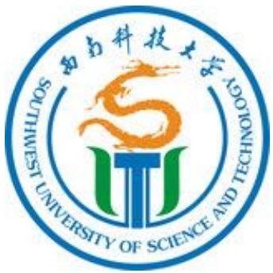

学校简介 ...  
《西南科技大学章程》  
西南科技大学校园交通车“小白龙”2024年秋季学期运行公告. 24

学校简介

西南科技大学（简称“西南科大”，英文简称“SWUST”）坐落于中国科技城——四川省绵阳市。学校是四川省人民政府与教育部共建高校，四川省人民政府与国家国防科技工业局共建高校，被教育部确定为国家重点建设的西部14所高校之一。中共第十五届中央政治局常委、国务院原副总理李岚清同志赞誉学校“共建与区域产学研联合办学”走出了一条有自己特色的办学路子。

学校办学历史源远流长。源起于1952年创办的重庆第一土木建筑学校和西南建筑工程学校，以及由两校合并成立的重庆建筑工程学校。学校历经重庆、石棉、绵阳三地办学，1978年四川建筑材料工业学院迁至原清华大学绵阳分校校址，吸纳了清华大学绵阳分校部分职工及办学资源，1993年更名为西南工学院。2000年，原西南工学院与绵阳经济技术高等专科学校合并组建西南科技大学。

学校是“全国文明单位”“全国文明校园”，环境优美，设施完善，是读书治学、静心研学的美好园地。学校现占地5448亩，建筑面积119万平方米，固定资产总值29.2亿元，教学科研仪器设备值已达10.9亿元。学校图书馆建筑面积约3.6万平方米，藏有纸质图书270万余册，电子图书902万余册。现有全日制本科生、研究生、留学生等3.97万余人。设有材料与化学学院等20个教学学院。

学校已形成布局科学、结构合理、协调发展的学科体系。现有工学、农学、理学、经济学、法学、文学、管理学、教育学、艺术学9个学科门类，3个博士后科研流动站，5个一级学科博士学位授权点，24个一级学科硕士学位授权点，18个硕士专业学位类别。有5个学科入选四川省“双一流”建设贡嘎计划；有省级优势学科4个，省级重点学科11个。材料科学、工程学、化学、环境/生态学、植物学与动物学、地球科学6个学科进入ESI排名前 $1 \%$ ，其中材料科学、工程学和化学3个学科进入ESI排名前$3 \text{‰}$ 。

学校持续优化人才自主培养体系。现有本科专业77个，其中有机械设计制造及其自动化等18个国家级和四川省卓越人才教育培养计划专业，材料科学与工程等6个国家特色专业，环境工程等 38 个国家和四川省一流本科专业建设点，电子信息工程专业为国防重点专业，辐射防护与核安全专业为国防紧缺专业，土木工程等 12 个专业通过国家工程教育专业认证（评估）。在 2025 软科中国大学专业排名中上榜专业 66 个。建有 13个国家级、省级实验教学示范中心和虚拟仿真实验教学中心，1 个省级现代产业学院，1个省级特色化示范性软件学院，1个省级特色学院。拥有电子技术与创新、化学实验教学等国家级和省级高校教学团队8个。光电子技术、液压与气压传动、思想政治理论课实践教学等国家级、省级一流课程、高阶课程、思政课程等127门。四川省“十四五”规划教材 8 部。学校创新创业教育成果丰硕，在中国国际大学生创新大赛、“挑战杯”全国大学生课外学术科技作品竞赛、“挑战杯”中国大学生创业计划大赛等各类竞赛中屡获佳绩，学校机器人小组荣获全国大学生机器人大赛冠军、最佳技术奖，亚太地区亚军、最佳技术奖等。长期位居全国普通高校学科竞赛排行榜 60 余位。学校构建了覆盖所有高等学历继续教育和非学历教育的全民终身学习服务体系，是全国现代远程教育试点高校、高等学校继续教育示范基地、高等教育自学考试全国示范学习服务中心、四川省专业技术人员继续教育基地。

学校深入实施“龙山人才强校”战略。现有教职工2735人，其中正高级职称人员337人，副高级职称人员579人；博士生、硕士生导师1631人；从董事单位等聘任院士29人；有国家A类/B类青年基金（原国家杰青/优青）获得者、“国家特支计划”领军人才、“长江学者奖励计划”特聘教授/青年学者、国家优秀青年科学基金获得者(海外)、“百千万人才工程”国家级人选、“教育部新世纪人才计划”人选等国家级人才 15名；有享受国务院政府特殊津贴专家、四川省有突出贡献的优秀专家、四川省学术和技术带头人、四川省教学名师等200余人次，20名教师进入全球前 $2 \%$ 顶尖科学家榜单。拥有全国高校黄大年式教师团队、国家国防科技创新团队、四川省科技创新团队等省部级团队15个。

学校积极构建自主创新体系。拥有国家科技工业创新中心1个（国家原子能机构核环境安全技术创新中心），国家大学科技园1个，国家重点实验室1个，国家工程技术研究中心（共建）1个，国家遥感中心绵阳科技城分部1个，教育部重点实验室2个、教育部重点实验室（培育）1个，教育部工程研究中心1个，省部共建协同创新中心1个，技术与创新支持中心（TISC）1个，四川省重点实验室4个（含共建2个），四川省工程技术研究中心3个，四川省国际科技合作基地3个，四川省工程研究中心4个，四川省中试平台 1 个，四川省协同创新中心 3 个，四川省科技资源共享服务平台 1个，四川省军民两用技术转移和产业孵化中心 1 个，教育部国别和区域研究培育基地 1个，首批四川新型智库 1 个，四川省哲学社会科学重点实验室 1 个，四川省哲学社会科学重点研究基地3个、省级社科普及基地2个。近年来，学校完成了多项国家重大、重点项目，如国家重点基础研究发展计划（973计划）、国家高技术研究发展计划（863计划）、国家科技支撑计划、国家自然科学基金重点项目、国家重大仪器专项、国防重点项目、国家社科基金项目等，获得国家科技进步二等奖等国家级和省部级科技奖励240余项。在2025年最新自然指数中国内地高校TOP200排行榜中位居四川省属高校第1位。

学校科技成果转化成效显著。西南科技大学国家大学科技园已建设成为“国家技术转移示范机构”“国家级科技企业孵化器”“国家级高校学生科技创业实习基地”“四川省大学生创新创业示范俱乐部”，孵化规上企业、高新技术企业、军民融合企业等300余家。学校是四川省全面创新改革试验定点联系高校，联合组建成立了“四川省军民融合研究院”，在国防科技人才培养、协同创新、技术转移和区域特色高端智库方面深入推进军民融合。学校拉美研究中心研究成果积极服务国家拉美战略，获得时任国务院副总理刘延东充分肯定。学校充分发挥核能关键材料、核环境安全、绿色建材、资源环境、特殊环境机器人技术、人工智能、现代农业等科研特色和传统优势，构建“产业需求 $^ +$ 科研团队 $\cdot ^ { + }$ 龙头企业 $^ +$ 技术成果”技术转化体系，围绕产业共性技术难题，加强校企协同攻关，服务经济社会发展，产生了显著经济社会效益。

学校扎实推进高水平国际交流合作。与英、法、美、德等国家100余所高校建立了校际合作关系，现有国家公派出国项目6个，海外一流大学校际联合培养项目4个，中外合作办学项目1个。已建成四川省首批“来华留学示范基地”，累计培养来自全球45个国家的留学生1000余人。携手萨尔瓦多大学共建“中文 $+$ 科技”创新性孔子学院，推动人文交流与合作。

学校坚持以高质量党建引领学校事业高质量发展。始终坚持和加强党的全面领导，准确把握和全面落实新时代党的建设总要求，获评全国高校党建工作标杆院系、样板支部、全国百名研究生党员标兵、全国百个研究生样板党支部、全国高校“双带头人”教师党支部书记工作室等7项国家级党建示范项目、8项省级党建示范项目，有效推动党建与业务深度融合、互相促进。

“西南明珠出沧海，桃李春风物华新”。在新的发展征程中，学校坚持以习近平新时代中国特色社会主义思想为指导，全面贯彻党的教育方针，落实立德树人根本任务，锚定“双一流”建设目标，聚力特色发展、人才强校、改革图强，赓续“艰苦奋斗、拼搏创新”精神，踔厉奋发、乘势而上，为建设特色鲜明的国内一流大学而努力奋斗！

《西南科技大学章程》

《西南科技大学章程》2022年修订，经学校校长办公会、教代会代表组长联席会、党委常委会审议通过，学校党委全委会审定，并已通过省教育厅核准。内容如下：

# 序 言

西南科技大学源起于1952年创办的重庆第一土木建筑学校和西南建筑工程学校以及由两校合并成立的重庆建筑工程学校。学校曾在重庆、石棉、绵阳三地办学，几经更名，先后由中央建筑工程部、国家建筑材料工业部、国家建筑材料工业局主管。1978年升格为本科办学，更名为四川建筑材料工业学院，迁至原清华大学绵阳分校校址，清华大学绵阳分校部分职工及办学资源并入学院。1993 年更名为西南工学院。1998 年由国家建筑材料工业局划转至四川省人民政府管理。2000年，在党中央、国务院部署实施西部大开发战略和建设中国(绵阳)科技城之际，经教育部批准，原西南工学院与绵阳经济技术高等专科学校合并组建西南科技大学。2006年学校成为国家国防科技工业局(原国防科工委)与四川省人民政府共建高校，2013 年学校成为四川省人民政府与教育部共建高校。

学校坚持社会主义办学方向，坚持把立德树人作为根本任务，艰苦创业，励精图治。在长期的办学实践和探索中，学校形成了“共建与区域产学研联合办学”的鲜明特色。学校秉持“厚德、博学、笃行、创新”校训，弘扬“艰苦奋斗、拼搏创新”的学校精神，坚持“育人为本、德育为先、科学理性、开放包容、彰显卓越”办学理念和“质量立校、人才强校、特色建校、和谐兴校”办学思路，致力于建设成为特色鲜明的高水平大学。

# 第一章 总 则

第一条 为保障学校依法办学和自主管理，根据《中华人民共和国教育法》《中华人民共和国高等教育法》《中华人民共和国教师法》《关于坚持和完善普通高等学校党委领导下的校长负责制的实施意见》《中国共产党普通高等学校基层组织工作条例》《高等学校章程制定暂行办法》《高等学校学术委员会规程》等法律法规和规章，结合学校实际，制定本章程。

第二条 学校的中文名称是西南科技大学，简称“西南科大”,英文名为“Southwest University of Science and Technology”, 缩写为“SWUST”

第三条 学校法定住所地为四川省绵阳市涪城区青龙大道中段 59 号。学校另有西山校区和城南校区，西山校区地址：四川省绵阳市涪城区西山南路4号；城南校区地址：四川省绵阳市涪城区沿江西街10号。在剑阁县武连镇有一定的划拨教育用地。

第四条 学校是非营利性教育事业单位，具有独立法人资格，依法享有相应的权利，履行相应的义务，独立承担法律责任。

# 第二章 举办者与学校

第五条 学校由四川省人民政府举办，举办者为学校提供必要的办学经费和条件，维护学校的合法权益，落实学校办学自主权，支持学校依法治校、民主管理、科学发展。举办者对学校的办学活动依法进行管理和监督，任命学校校长和其他须由举办者任命的人员，考核办学水平和教育质量，决定学校的分立、合并及终止等事宜。

第六条 四川省人民政府通过四川省教育厅对学校进行行政管理和绩效考核。

第七条 学校由四川省人民政府与教育部和国家国防科技工业局分别共建。

第八条 学校的权利

(一)按照国家法律、法规和本章程自主管理；  
(二)自主制定学校事业发展规划和人才培养方案；  
(三)组织实施教育教学活动；  
(四)招收学生或者其他受教育者；  
(五)对学生进行学籍管理，实施奖励或者处分；  
(六)对学生颁发相应的学业证书；  
(七)聘任教职工，实施奖励或者处分；  
(八)管理、使用本单位的资产和经费；  
(九)拒绝任何组织和个人对教育教学活动的非法干涉；  
(十)法律、法规规定的其他权利。

# 第九条 学校的义务

(一)遵守国家的法律、法规；  
(二)贯彻国家的教育方针，执行国家教育教学标准，保证教育教学质量；  
(三) 维护学生、教职工的合法权益；  
(四) 积极参加社会公益活动；  
(五) 遵照国家有关规定实行信息公开制度；  
(六) 依法接受监督；  
(七) 法律、法规规定的其他义务。

第十条 西南科技大学董事会是学校实施共建与区域产学研联合办学的指导、协调、审议、监督机构。董事会成员单位和个人担任董事会职务由四川省人民政府决定。董事会董事长由四川省人民政府主管教育的副省长担任，由四川省人民政府任命。学校董事会依照法律法规和自身章程开展活动。

第十一条 学校坚持社会主义办学方向，全面贯彻党和国家教育方针，履行人才培养、科学研究、社会服务、文化传承与创新、国际交流合作等各项办学职能，努力培养品德优良、身心健康、基础宽厚、专业扎实、能力突出、视野开阔，具有责任意识、科学精神和人文素养，德智体美劳全面发展的复合型和创新型人才，致力于建设成为特色鲜明的高水平大学。

第十二条 学校的开办资金为 23820 万元，以财政拨款为主、其他多种渠道经费筹措为辅。

第十三条 学校设有本(专)科和研究生教育，办学规模由国家有关部门根据社会需求、教育规划、办学条件及相关标准指标统筹核定。

第十四条 学校根据经济社会发展需求，按照国家规定，自主设置、调整学科和专业，保持合理的学科结构、专业规模，保持学科发展的前瞻性、战略性，实行以工为主，理工结合，文理渗透，理工农经管法文教艺多学科协调发展

第十五条 学校的主要教育形式为全日制学历教育，以本科教育为主，大力发展研究生教育，积极发展国际教育和继续教育。学校依法确定和调整学历教育修业年限。

# 第三章 党的领导

第十六条 学校以马克思列宁主义、毛泽东思想、邓小平理论、“三个代表”重要思想、科学发展观、习近平新时代中国特色社会主义思想为指导，坚持中国共产党的全面领导，遵守中华人民共和国宪法和有关法律法规，贯彻党的教育方针，合法地开展活动。

第十七条 学校根据《中国共产党普通高等学校基层组织工作条例》的规定，设立中国共产党西南科技大学委员会(以下简 称“学校党委”),并设置工作机构和下属基层组织，按照党章和党内法规有关规定开展党的各种活动，加强党的建设。党组织关系隶属于中国共产党绵阳市委员会。

第十八条 学校实行中国共产党西南科技大学委员会领导下的校长负责制。学校党委实行民主集中制，健全集体领导和个人分工负责相结合的制度。重大问题按照集体领导、民主集中、个别酝酿、会议决定的原则，通过全体会议方式集体讨论作出决定。

第十九条 学校党委全面领导学校工作，承担管党治党、办学治校的主体责任，发挥把方向、管大局、作决策、抓班子、带队伍、保落实的领导作用，支持校长按照《中华人民共和国高等教育法》的规定积极主动、独立负责地开展工作，保证教学、科研、行政管理等各项任务落地落实。

第二十条 学校党委根据工作需要，经上级党组织批准，设立常务委员会。书记、副书记、纪委书记、党委常委可由上级党组织选派或由学校依照党章和党内法规等选举产生。党员校长、 副校长，组织部部长、宣传部部长、统战部部长按照党的有关规定进入党委常委领导班子。

第二十一条 学校党委主要职责是：

(一)宣传和执行党的路线方针政策，宣传和执行党中央、 四川省委以及上级党组织和本组织的决议，坚持社会主义办学方向，依法治校，依靠全校师生员工推动学校科学发展，培养德智体美劳全面发展的社会主义建设者和接班人。

(二)坚持马克思主义指导地位，组织党员认真学习马克思列宁主义、毛泽东思想、邓小平理论、“三个代表”重要思想、科学发展观、习近平新时代中国特色社会主义思想，学习党的路线方针政策和决议，学习党的基本知识，学习业务知识和科学、历史、文化、法律等各方面知识。

(三)审议确定学校基本管理制度，讨论决定学校改革发展稳定以及教学、科研、行政管理中的重大事项。

(四)讨论决定学校内部组织机构的设置及其负责人的人选。按照干部管理权限，负责干部的教育、培训、选拔、考核和监督。加强领导班子建设、干部队伍建设和人才队伍建设。

(五)按照党要管党、全面从严治党要求，将政治建设摆在首位，加强学校党组织建设。落实基层党建工作责任制，发挥学校基层党组织战斗堡垒作用和党员先锋模范作用。

(六)履行学校党风廉政建设主体责任，领导、支持内设纪检组织履行监督执纪问责职责，接受同级纪检组织和上级纪委监委及其派驻纪检监察机构的监督。

(七)领导学校思想政治工作和德育工作，落实意识形态工作责任制，维护学校安全稳定，促进和谐校园建设。

(八)领导学校群团组织、学术组织和教职工代表大会。

(九)做好统一战线工作。对学校内民主党派的基层组织实行政治领导，支持其依照各自章程开展活动。支持无党派人士等统一战线成员参加统一战线相关活动，发挥积极作用。加强党外知识分子工作和党外代表人士队伍建设。加强民族和宗教工作， 深入开展铸牢中华民族共同体意识教育，坚决防范和抵御各类非法传教、渗透活动。

第二十二条 设立中国共产党西南科技大学纪律检查委员会 (以下简称“学校纪委”),学校纪委是学校的党内监督专责机关， 履行监督执纪问责职责，在学校党委和上级纪委双重领导下进行工作。主要职责是：

(一)维护党章和其他党内法规，检查党的路线方针政策和决议的执行情况，协助校党委推进全面从严治党、加强党风廉政建设和组织协调反腐败工作。

(二)经常对党员进行遵守纪律的教育，作出关于维护党纪的决定。

(三)对党的组织和党员领导干部履行职责、行使权力进行监督，受理处置党员群众检

举举报，开展谈话提醒、约谈函询。

(四)检查和处理党的组织和党员违反党章和其他党内法规的比较重要或者复杂的案件，决定或者取消对这些案件中党员的处分；进行问责或者提出责任追究的建议。

(五)受理党员的控告和申诉，保障党员权利不受侵犯。

# 第二十三条 党员队伍建设

(一)学校各级党组织构建多层次、多渠道的党员经常性学习教育体系，加强政治理论教育和党史教育，突出政治教育和政治训练，强化党章党规党纪教育、党的宗旨教育、革命传统教育、形势政策教育和知识技能教育。

(二)严格党的组织生活，坚持开展批评和自我批评，提高“三会一课”质量，开好民主生活会和组织生活会，健全落实谈心谈话、民主评议党员、主题党日等制度，确保党的组织生活经常、认真、严肃。

(三)强化党员日常管理，及时转接党员组织关系，督促党员按期足额交纳党费。加强流动党员管理和服务，做好毕业生党员、出国(境)学习研究党员组织关系和党籍管理工作。关心党员思想、学习、工作和生活，健全党内关怀、帮扶长效机制。搭建党员发挥先锋模范作用平台，健全党员联系和服务群众工作体系。妥善处置不合格党员，严格执行党的纪律。

(四)尊重党员主体地位，发扬党内民主，保障党员权利，推进党务公开。学校各级党组织讨论决定重要事项前，应当充分听取党员的意见，党内重要情况及时向党员通报。

(五)按照坚持标准、保证质量、改善结构、慎重发展的方针和有关规定，把政治标准放在首位，加强对入党积极分子的教育、培养和考察，加强在高层次人才、优秀青年教师和优秀学生中发展党员工作。建立党员领导干部和党员学术带头人直接联系培养教师入党积极分子制度。将团组织推优作为确定学生入党积极分子的重要渠道。建立从高中到大学、从大学到研究生阶段入党积极分子接续培养机制，加大在高校低年级学生中发展党员力度。

(六)学校党委设立党校。党校的主要任务是培训党员、干部和入党积极分子。

# 第二十四条 干部和人才工作

(一)学校党委坚持党管干部原则，按照干部管理权限对学校干部实行统一管理。选拔任用干部，必须突出政治标准，坚持德才兼备、以德为先，坚持五湖四海、任人唯贤，坚持事业为上、公道正派，坚持注重实绩、群众公认，努力实现干部队伍革命化、年轻化、知识化、专业化，建设忠诚干净担当的高素质专业化干部队伍。选拔任用学校中层管理人员，由学校党委及组织部门按照有关规定进行分析研判和动议、民主推荐、考察，充分听取有关方面意见，经学校党委常委会集体讨论决定，按照规定

程序办理。

(二)学院党组织在干部队伍建设中发挥主导作用，同学院行政领导一起，做好本单位干部的教育、培训、选拔、考核和监督工作，以及学生辅导员、班主任的配备、管理工作。对学院行政领导班子的配备及其成员的选拔，学院党组织可以向学校党委提出建议，并协助学校党委组织部门进行考察。

(三)学校党委建立健全优秀年轻干部发现培养选拔制度， 制定并落实年轻干部队伍建设规划，大胆选拔使用经过实践考验的优秀年轻干部。统筹做好女干部、少数民族干部和党外干部的培养选拔工作。

(四)学校党委坚持党管人才原则，贯彻人才强省战略，实施更加积极、更加开放、更加有效的人才政策，健全人才培养、 引进、使用、评价、流动、激励机制，大力弘扬科学家精神，营造潜心育人、潜心科研、激发创造活力的工作环境，用好用活党内和党外、国内和国外等各方面优秀人才，形成人才辈出、人尽其才的良好局面。加强对人才的政治引领和政治吸纳，健全党组织联系服务专家工作制度，不断提高各类人才的思想政治素质和业务素质。

# 第二十五条 思想政治工作

(一)学校党委牢牢掌握党对学校意识形态工作的领导权， 统一领导学校思想政治工作。发挥行政系统、群团组织、学术组织和广大教职工的作用，共同做好思想政治工作。

(二)学校各级党组织把理想信念教育放在首位，对师生员工进行马克思列宁主义、毛泽东思想和中国特色社会主义理论体系的教育，推动习近平新时代中国特色社会主义思想进教材、进课堂、进头脑，做好党的基本路线教育，爱国主义、集体主义和社会主义思想教育，党史、新中国史、改革开放史、社会主义发展史教育，中华优秀传统文化、革命文化、社会主义先进文化教育，国情教育、形势政策教育、社会主义民主法治教育、国家安 全教育和民族团结进步教育。把培育和践行社会主义核心价值观融入大学生思想政治教育工作和师德师风建设的全过程，帮助广 大师生员工树立正确的世界观、人生观和价值观，坚定中国特色社会主义道路自信、理论自信、制度自信、文化自信。

(三)学校各级党组织把立德树人作为根本任务，构建思想政治工作体系，加强意识形态阵地管理。充分发挥课堂教学的主 渠道作用，办好思想政治理论课，推进课程思政建设，拓展新时代大学生思想政治教育的有效途径，形成全员全过程全方位育人的良好氛围和工作机制。

(四)思想政治工作坚持理论联系实际，定期分析师生员工的思想动态，坚持解决思想问题与解决实际问题相结合，注重人文关怀和心理疏导，区别不同层次，采取多种方式，推动思想政 治工作传统优势和信息技术高度融合，增强思想政治工作的针对性、实效性。

# 第二十六条 群众团体工作

(一)学校党委研究工会、共青团、妇女组织等群团组织和学生会(研究生会)、学术组织工作中的重大问题，加强学生社团管理，支持他们依照法律和各自章程开展工作。

(二)学校党委领导教职工代表大会，支持教职工代表大会正确行使职权，在参与学校民主管理和民主监督、维护教职工合法权益等方面发挥积极作用。

# 第二十七条 领导和保障

(一)学校党委根据工作需要，本着精干高效和有利于加强党建工作的原则，设立办公室、组织部、宣传部、统战部、巡察办和教师工作、学生工作、武装、保密部门等机构。

(二)按照社会主义政治家、教育家标准，配合上级党组织选好配强学校领导班子，把政治过硬、品行优良、业务精通、锐意进取、敢于担当的优秀干部选配到学校领导岗位。学校党委按照专职为主、专兼结合、数量充足、素质优良的要求，将党务工作和思想政治工作队伍建设纳入学校人才队伍建设总体规划，完善选拔、培养、激励机制。专职党务工作人员和思想政治工作人员应当在编制内配足，总数不低于全校师生人数的 $1 \%$ ,每个学院至少配备1名专职组织员。专职辅导员岗位按照师生比不低于1:200的比例设置，专职思想政治理论课教师岗位按照师生比不低于1:350的比例核定。完善保障机制，为学校党的建设和思想政治工作提供经费和物质支持。

(三)学校党的建设和思想政治工作情况纳入巡察内容，作为学校领导班子综合评价和领导人员选拔任用的重要依据，作为“双一流”建设等工作成效评估的重要内容。开展党组织书记抓 基层党建述职评议考核工作，强化考核结果运用。对党的建设和 思想政治工作重视不够、落实不力的，应当及时提醒、约谈；对 出现严重问题的，按照有关规定严肃追责问责，督促抓好问题的整改落实。

# 第四章 学校组织与治理机构

# 第一节 组织机构

第二十八条 校长是学校的法定代表人。

第二十九条 校长在学校党委领导下，贯彻党的教育方针，组织实施学校党委有关决议，行使高等教育法等规定的各项职权，全面负责教学、科研、行政管理工作。

校长的主要职责是：

(一)组织拟订和实施学校发展规划、基本管理制度、重要行政规章制度、重大教学科研改革措施、重要办学资源配置方案。组织制定和实施具体规章制度、年度工作计

划。

(二)组织拟订和实施学校内部组织机构的设置方案。按照国家法律和干部选拔任用工作有关规定，任免内部组织机构的负责人。

(三)组织拟订和实施学校人才发展规划、重要人才政策和重大人才工程计划。负责教师队伍建设，依据有关规定聘任与解聘教师及内部其他工作人员。

(四)组织拟订和实施学校重大基本建设、年度经费预算等方案。加强财务管理和审计监督，管理和保护学校资产，维护学校的合法权益。

(五)组织开展学校教学活动和科学研究，创新人才培养机制，提高人才培养质量，推进文化传承创新，服务国家和地方经济社会发展，把学校办出特色、争创一流。

(六)组织开展思想政治教育，负责学生学籍管理并实施奖励或处分，开展招生和就业工作。

(七)履行职责范围内党风廉政建设第一责任人的职责。

(八)做好学校安全稳定和后勤保障工作。

(九)组织开展学校对外交流与合作，依法代表学校与各级政府、社会各界和境外机构等签署合作协议，接受社会捐赠。

(十)向学校党委报告重大决议执行情况，向教职工代表大 会报告工作，组织处理教职工代表大会、学生代表大会、工会会员代表大会和团员代表大会有关行政工作的提案。支持学校各级党组织、民主党派基层组织、群众组织和学术组织开展工作。做好离退休工作。

(十一)履行法律法规规定的其他职权。

第三十条 校长根据《党政领导干部选拔任用工作条例》等规定进行选拔，可采用内部推选、外部选派等方式进行。按照干部管理权限，校长、副校长由学校举办者依法任免。

第三十一条 校长办公会议是学校行政议事决策机构，主要研究提出拟由党委讨论决定的重要事项方案，具体部署落实党委 决议的有关措施，研究处理教学、科研、行政管理工作。会议由校长召集并主持，会议成员为学校行政领导班子成员，学校党委书记、副书记、纪委书记可视情况参加会议，学校办公室主任列席会议。会议议题由学校领导班子成员提出，校长确定。会议必须有半数以上成员到会方能召开。校长在广泛听取与会人员意见基础上，对讨论研究的事项作出决定。

第三十二条 学校实行校、院两级管理体制，保障和支持学院在学校授权范围内的管理自主权。学校根据社会需求、人才培养目标、学科专业建设需要设置若干二级学院；学校可根据发展需要，提出院系设置和调整方案，经学校党委常委会研究审定后予以设置或调整。

第三十三条 学院根据学校的规划、规定或者授权，履行以下职责：

(一)发展学科和建设师资队伍；  
(二)制定本院的专业人才培养方案、教学计划并组织实施；  
(三)组织开展科学研究和学术活动；  
(四)负责设置本院机构；  
(五)负责院聘岗位的人员聘用和管理；  
(六)负责本院学生的教育与管理；  
(七)负责院内资产和财务管理；  
(八)开展社会服务、文化传播活动；  
(九)开展国际交流与合作；  
(十)行使学校赋予的其他职权。

第三十四条 学院设院长一人，全面负责学院的行政工作，设副院长若干人，协助院长履行职责。

第三十五条 学院党委应当强化政治功能，履行政治责任， 保证教学科研管理等各项任务完成，支持本单位行政领导班子和 负责人开展工作，健全集体领导、党政分工合作、协调运行的工作机制。主要职责是：  
(一)宣传和执行党的路线方针政策以及上级党组织的决议，并为其贯彻落实发挥保证监督作用。  
(二)通过党政联席会议，讨论和决定本单位重要事项。召开党组织会议研究决定干部任用、党员队伍建设等党的建设工作。涉及办学方向、教师队伍建设、师生员工切身利益等事项的，应当经党组织研究讨论后，再提交党政联席会议决定。  
(三)加强党组织自身建设，建立健全党支部书记工作例会等制度，具体指导党支部开展工作。  
(四)领导本单位思想政治工作，加强师德师风建设，落实意识形态工作责任制。把好教师引进、课程建设、教材选用、学术活动等重要工作的政治关。  
(五)做好本单位党员、干部的教育、培训和管理工作，做好人才的教育引导和联系服

务工作。

(六)领导本单位群团组织、学术组织和教职工代表大会。做好统一战线工作。

第三十六条 学校根据发展需要可建设孔子学院及外设研究院，根据上级要求及自身章程开展相关工作。

# 第五章 教育、教学与科研

第三十七条 学校设立学术委员会。学术委员会是学校最高学术机构，统筹行使学术事务的决策、审议、评定和咨询等职权。

第三十八条 学术委员会委员的产生，应当经自下而上的民主推荐、公开公正的遴选等方式产生候选人，由民主选举等程序确定，充分反映基层学术组织和广大教师的意见，经校长办公会讨论确定，由校长聘任。学校学术委员会设主任委员 1 名，副主任委员若干名，学术委员会主任委员由校长提名，学术委员会主任委员、副主任委员经学校学术委员会全体委员选举产生。学术委员会委员实行任期制，每届任期为五年。

第三十九条 学校学术委员会实行例会制度，每学期至少召开一次全体会议。根据工作需要，可临时召开学校学术委员会全体会议。学术委员会全体会议原则上应有三分之二以上委员出席才能举行。

第四十条 学术委员会议事决策实行少数服从多数的原则，重大事项应当有与会委员的三分之二以上同意，方可通过。

第四十一条 学术委员会依据《高等学校学术委员会规程》 履行审议学科、专业设置及教学、科研计划方案；评定教学、科研成果等职责。

第四十二条 学校设立学位评定委员会，负责学位事务，审 议学校研究生导师资格，向上级学位委员会推荐委员和学科评议组人选等有关学位事项。

第四十三条 学位评定委员会由学校不同学科、专业的教授及具有正高级以上专业技术职务的人员组成，人数为21-25人的单数，任期五年。学位评定委员会组成人员名单由学校确定。

第四十四条 学位评定委员会依照《中华人民共和国学位条例》规定履行学位评定、授予或撤销的相关职责。

第四十五条 学校设立教学指导委员会。学校教学指导委员会主要开展教学质量和教学过程监督、教学质量评估等工作。

第四十六条 学校设立专业技术职务评审委员会。学校专业技术职务评审委员会负责职称评审等工作。

第四十七条 教育教学是学校办学活动的基本内容，各二级教学科研单位、学术机构(含成都创新研究院及产业技术研究院)、科研平台等是学校教育教学的基本载体。

第四十八条 学校的基本教育形式为全日制本科生教育和研究生教育；学校依法依规招收和培养留学生，引进境外优质教育资源，开展中外合作办学，稳步发展继续教育等不同形式的教育。

第四十九条 学校人才培养坚持质量为先，建立健全自我监控评估和校外监控评估相结合的教学质量保障体系，对教学各环节进行全过程严格监控和评估，确保人才培养质量。

第五十条 学科建设是学校发展的基础。学校以学科建设为引领，促进整体办学实力的提升。

第五十一条 学校制定学科建设规划，促进学科交叉、融合、创新，构建以国家级、省(部)级、校级重点学科以及硕士、博士学位授权点为重点的学科体系。

第五十二条 学校遵循教育发展规律，有计划地自主设置和调整学科、专业，并报上级主管部门备案。

第五十三条 科学研究是建设高水平大学的重要支撑。学校科学研究紧紧围绕国家重大理论问题与现实问题，结合学校实际，促进学科全面发展，提高教育质量，提升创新能力，建立具有学校特色的学术科研创新体系。

第五十四条 学校倡导瞄准学术前沿，发挥中外合作优势，汇聚高端研究队伍，构筑学术高地，打造学术智库。

第五十五条 学校组织并支持师生开展学术研究，建立科学的评价体系，不断提高科研水平和创新能力。

第五十六条 学校加强基础理论研究，突出应用对策研究，不断提高协同创新能力和科学研究质量。

第五十七条 学校坚持政产学研用结合的原则，推进科研成果的转化应用，依法保护知识产权。

第五十八条 国际化办学是学校重要发展战略。学校以国际化办学为导向，围绕高端国际型人才培养，不断提升学校的核心竞争力和国际影响力。

第六章 教职工与学生第一节 教职工

第五十九条 学校教职工由教师、其他专业技术人员、管理人员和工勤人员等组成。

第六十条 教职工享有下列权利：

(一)进行教育教学活动，开展教育教学改革和实验；  
(二)按规定使用学校公共资源，享受相应的福利待遇；  
(三)公平获得自身发展所需的机会和条件；  
(四)在品德、能力和业绩等方面获得公正评价；  
(五)公平获得劳动报酬、各种奖励及荣誉称号；  
(六)知悉学校建设、改革和发展状况及关系切身利益的重大事项；  
(七)参与学校民主管理，对学校工作提出合理意见、建议；  
(八)就职务聘用、福利待遇、评优评奖、纪律处分等事项表达异议和提出申诉；  
(九)法律、法规、规章中规定的以及合同约定的其他权利。

第六十一条 教职工应当履行下列义务：

(一)贯彻党和国家的教育方针，遵守宪法、法律法规和职业道德，遵守学校各项规章制度；  
(二)恪尽职守，勤勉工作，按规定完成本职岗位工作任务；  
(三)珍惜爱护学校声誉，维护学校利益，自觉为学校事业发展建言献策；  
(四)尊重和爱护学生，保护学生权益，促进学生全面发展；  
(五)爱护学校教育教学设施设备，合理使用学校资源；  
(六)法律、法规、规章规定以及聘任合同约定的其他义务。  
第六十二条 学校根据社会功能、职责任务和工作需要，依据编制和岗位设置管理办法分类设岗，对教职工实行聘用制度和岗位管理制度。  
第六十三条 学校关注教职工的职业生涯发展，通过体制机制创新，为其个人成长、能力提升提供和创造良好的制度环境和必要的条件保障。  
第六十四条 学校对在办学活动中成绩与贡献突出的教职工个人和集体予以表彰奖励，对违反法律、法规及学校规章制度和聘用合同约定的教职工依法依规进行处理。第六十五条 学校依法建立教职工权利保护和救济机制，设立教职工申诉处理委员会，依法维护教职工合法权益。

第六十六条 教职工申诉处理委员会委员任期为三至五年，可以连选连任。教职工申诉处理委员会委员由学校相关领导、相关职能部门负责人及教师代表5-7人组成。

第六十七条 教师认为与教育教学相关的合法权益受到侵犯或未得到有效保障的，应首先向学校有关部门积极反映；相关部门应认真解释、说明；在政策规定和职责权限范围内应予以解决或处理的，必须予以解决处理。

第六十八条 教师认为有关部门的解释、说明不合法、不公正，对处理意见不服的，可以依据教职工申诉处理办法向教职工申诉处理委员会提出书面申诉。

第六十九条 学校关心离退休教职工的生活和健康，按照国家政策规定保障离退休人员的待遇。

第七十条 学校实行教职工代表大会制度。教职工代表大会是教职工在学校党委领导下依法行使民主权利，参与学校民主管 理和民主监督的基本形式，依据《学校教职工代表大会规定》开展工作。

第七十一条 教职工代表大会享有对学校工作提出意见和建议、审议与教职工切身利益有关的重要规章制度和集体福利事项、监督和民主评议学校各级领导干部、积极参与学校的民主管理等权利。教代会和教代会代表要遵守国家法律法规和学校规章制度，正确处理国家、学校、集体与教职工个人之间的利益关系。

第七十二条 教职工代表大会代表以教师为主体，教师代表不得低于代表总数的 $6 0 \%$ ,保证一定比例的青年教师和女教师代表。教职工代表大会代表接受选举单位教职工的监督。

第七十三条 教职工代表大会每五年一届，每年至少召开1次会议。遇有重大事项，经学校、学校工会或三分之一以上教职工代表大会代表提议，可以临时召开教职工代表大会。

第七十四条 教职工代表大会须有三分之二以上教职工代表大会代表出席。教职工代表大会的议题，应当根据学校的中心工作、教职工的普遍要求，由学校工会提交学校党委研究确定，并提请教职工代表大会表决通过。教职工代表大会的选举和表决，须经教职工代表大会代表总数半数以上通过方为有效。

# 第二节 学生与学员

第七十五条 学生是指被学校依法录取、取得入学资格，具有学校学籍的受教育者。

第七十六条 学生享有下列权利：

(一)参加学校教育教学计划安排的各项活动，使用学校提供的教育教学资源；按相关规定和程序选择专业、选修课程、升降级、转退学等；

(二)参加社会服务、勤工助学，在校内组织、参加学生团体及文化体育等活动；

(三)申请各类奖学金和荣誉称号；

(四)申请各类助学金、国家助学贷款；

(五)在思想品德、学业成绩等方面获得公正评价，完成学校规定学业后获得相应的学历证书；

(六)在校内组织、参加学生团体，以适当方式参与学校管理，对学校与学生权益相关事务享有知情权、参与权、表达权和监督权；

(七)对学校给予的处分或者处理有异议，向学校、教育行政部门提出申诉。对学校、教职员工侵犯其人身权、财产权等合法权益，提出申诉或者依法提起诉讼；

(八)法律、法规规定的其他权利。

第七十七条 学生应当履行下列义务：

(一)拥护中国共产党的领导，热爱祖国、热爱人民，维护学校声誉与利益；(二)遵守宪法、法律、法规；

(三)遵守学校管理制度和学生行为规范；

(四)努力学习，完成规定学业；

(五)按规定缴纳学费及有关费用，履行获得贷学金及助学金的相应义务；

(六)遵守学生行为规范，尊敬师长，养成良好的思想品德和行为习惯；

(七)法律、法规规定的其他义务。

第七十八条 学校加强对学生的思想引领和人生导航，为学生提供职业规划与就业创业指导、心理健康教育与咨询等服务。建立学生帮扶体系，关怀和帮助困难学生顺利完成学业。

第七十九条 学校对取得突出成绩和为学校争得荣誉的学生集体和个人进行表彰奖励；对违规、违纪学生给予批评教育或相应处分。

第八十条 学校配备与学科门类和专业相适应的教学设施设备和校内实习实训场所，积极拓展校外实习实训场所，不断完善学生学习、实训条件。

第八十一条 学校建立学生权益保护和救济机制，设立学生申诉处理委员会，依法维护学生的合法权益。

第八十二条 学生申诉处理委员会由学校相关领导、有关职 能部门负责人、教师代表、法律顾问、学生代表等组成。学生申诉处理委员会下设办公室，办公室设在学校办公室，负责接收学生申诉申请书，处理相关申诉的日常事务工作。

第八十三条 学生认为违纪处分、学籍处理等涉及学生本人重大利益的行政决定不合法、不公正，对处理意见不服的，可以依据学生校内申诉处理办法向学生申诉处理委员会提出书面申诉。

第八十四条 学生可依法向学校申请成立学生团体。学生团体在法律法规和学校管理制度范围内开展活动，接受学校的指导和管理。

第八十五条 学校按照《普通高等学校学生管理规定》的要求，完善学籍相关管理制度，学生在校期间的学籍管理按照学校 管理制度执行。学生成绩考核、升降级、转退学等按学校规定执行。

第八十六条 学生在学校规定学习年限内，修完教育教学计划规定内容，成绩合格，达到毕业要求的，学校颁发毕业证书； 符合学位授予条件的，学校颁发学位证书。学生在学校规定学习年限内，修完教育教学计划规定内容，但未达到毕业要求的，可准予结业，学校颁发结业证书，并可在结业后两年内完成课程进修，通过课程进修达到毕业要求的，学校颁发毕业证书，符合学位授予条件的，学校颁发学位证书。对退学学生，发给肄业证书或者写实性学习证明。

第八十七条 学员是指在学校登记，接受非学历教育培训、没有学籍的受教育者。学员在学习期间依法律法规和教育服务协 议的约定，享有相应权利，履行相应义务。学校为学员提供必要 的学习生活条件和帮助，依法依规对接受非学历教育的学员颁发结业证书或学业证明。

第八十八条 学生代表大会是学生参与学校民主管理和民主监督的重要形式，在学校党委领导和学校共青团组织指导下，依据《中华全国学生联合会章程》开展工作。学生代表大会闭会期间由学生会代为行使职权。

第八十九条 学生代表大会由学院选出的代表组成。代表依照各学院本(专)科学生人数按比例民主推选产生。

第九十条 学生代表大会代表每届任期为一年。

第九十一条 学生代表大会每年召开 1 次。学生代表大会须有应到会代表总数三分之二以上代表出席方能召开。学生代表大会的选举和表决须经全体应到会代表过半数以上通过方为有效。 对学生会组织章程及其修正案的表决等重大事项需经全体应到会代表人数的三分之二以上同意为通过。

# 第七章 财务与资产管理

第九十二条 学校的经费来源主要包括财政补助收入、事业收入、上级补助收入、经营收入和其他收入。学校多渠道筹措办学和发展资金，积极拓展经费来源渠道；鼓励和支持校内各单位和教职工面向社会筹措教学、科学研究经费和各类发展基金等。

第九十三条 学校严格遵照国家有关法律、法规和制度对财务与资产进行管理，依法建立财务、会计制度、资产管理制度和内部审计制度，坚持勤俭节约，强化绩效管理。

第九十四条 学校根据《政府会计制度》《事业单位财务规则》 和国家有关财经法律法规，实行“统一领导，分级管理，集中核 算”的财务管理体制，制定财务管理制度，设置会计账簿，依法 进行独立的会计核算，建立健全内部会计监督制度，保证会计资 料合法、真实、准确、完整。接受税务、会计主管部门依法实施的税务监督和会计监督，防范财务风险，保障资金安全。

第九十五条 学校资产包括流动资产、固定资产、在建工程、 无形资产和对外投资等。学校占有、使用的用国家财政资金形成的资产、国家无偿调拨给学校的资产、按照国家政策规定运用国有资产组织收入形成的资产、接受捐赠等经法律确认为国家所有的其他资产，均属国有资产。

第九十六条 学校国有资产管理实行“统一领导、归口管理、 分级负责、责任到人”的管理体制，建立健全国有资产配置、使用、处置管理制度，维护国有资产的安全完整和有效利用，保障和促进学校各项工作的可持续发展。

第九十七条 学校建立内部审计制度，设立审计机构，在校长领导下依法独立行使审计职权，对学校及所属机构的业务活动、内部控制进行审计，对各内部组织机构负责人经济责任进行审计。

第九十八条 学校劳动用工、社会保险制度按国家法律、法规及国务院劳动保障行政部门的有关规定执行。

第九十九条 学校分立、合并、换届或更换法定代表人之前必须进行财务审计。

# 第八章 校友会、基金会与其他组织

第一百条 学校设立西南科技大学校友总会，校友总会为非营利性社会团体，需依法注册，依据国家有关规定及校友总会章 程开展工作。其宗旨是团结、凝聚和依靠海内外校友的力量，为学校发展、校友发展和地方经济社会发展服务。

第一百零一条 学校鼓励和支持校友成立具有学院、届别、 行业特点的校友会和校友分会，在校友总会的指导下依据国家有关规定开展活动。

第一百零二条 校友总会根据工作需要召开校友会负责人会议和校友代表大会，讨论、审议校友会重大事项等。

第一百零三条 学校设立教育发展基金会，积极吸引社会捐赠，拓展办学资源。学校接受捐赠的基本原则是：

(一)符合法律、法规和有关规定；  
(二)遵循捐赠自愿原则，各类捐赠须是捐赠者的自愿行为；  
(三)遵循褒扬原则，凡捐赠者，学校给予相应形式的奖励。

第一百零四条 学校设立科学技术协会和社会科学联合会， 作为党委行政联系和团结全校科学工作者的桥梁和纽带，依据国家有关规定和自身章程开展工作。

第一百零五条 校内各民主党派、社会团体依据法律和各自章程开展活动，参与学校民主管理和监督。

第九章 信息公开

第一百零六条 学校实行党务和校务信息公开，信息公开以保障师生员工知情权、参与权和监督权为目标，以推进重点领域信息公开、及时回应社会关切为重点，有效发挥信息公开对学校工作的促进作用。

第一百零七条 信息公开的主要内容包括学校基本信息、招生考试信息、财务、资产及收费信息、人事师资信息、教学质量信息、学生管理服务信息、学风建设信息、学位、学科信息、对外交流与合作信息及其他突发事件处理情况。

第一百零八条 信息公开主要通过学校信息公开网站、内部办公系统、会议通报、新媒体等途径和方式公开。

第一百零九条 信息公开实行学校统一领导，党委办公室、学校办公室统一协调，业务部门各负其责的工作机制。

第一百一十条 信息公开工作须建立保密审查和监督检查机 制。拟公开的信息中含涉密内容的，须按上级和学校有关规定进行脱密处理。信息公开工作应纳入年度考核内容。

# 第十章 学校标识

第一百一十一条 学校校训为“厚德、博学、笃行、创新”。

第一百一十二条 学校徽识由 “SWUST” 基本元素组合构成， 图案呈圆形，以蔚蓝色为基调。图案内圆上弧为李岚清同志题写的“西南科技大学”字体；下弧是西南科技大学英文全称，中英文校名首尾相连。中间图案为 “SWUST”变体。

西南科技大学校徽图案

第一百一十三条 学校校旗为蓝底白字的长方形，由校徽图案和中英文校名组成，从上到下依次排列。

第一百一十四条 学校校庆日为 9 月 29 日。

第一百一十五条 学校网址为 www.swust.edu.cn

第十一章 附则

第一百一十六条 本章程经学校教职工代表大会讨论、校长办公会讨论通过，经学校党委会讨论审定后，由校长签发，报四川省人民政府教育行政部门核准。章程经核准后生效。

第一百一十七条 本章程的解释权归学校党委常委会。党委办公室、学校办公室监督章程的执行情况，依据章程审查学校内部规章制度、规范性文件，受理对违反章程的管理行为和活动的举报和投诉。

第一百一十八条 出现下列情形之一时，由校长或学术委员会或教代会提议，经校长办公会审议通过，启动章程的修订：

(一)本章程依据的法律发生变化；  
(二)学校的举办者发生更替；  
(三)学校发生更名、合并等变化；  
(四)学校办学宗旨、发展目标、管理体制、运行机制等发生重大变化；  
(五)举办者依法要求学校修订章程；

(六)其他影响本章程执行的环境或实质内容发生重大变化。

第一百一十九条 本章程生效之后制定的学校规章制度，不得与本章程相抵触。本章程生效之前制定的学校规章制度与本章程不一致的，以本章程为准。

第一百二十条 本章程生效后须向校内外公开发布。

校长祝效华率队赴四川省自然资源投资集团调研交流 共谋校企协同创新发布人：张建楠 发布时间：2025-04-24 动态浏览次数:103为深化产学研合作，推动科技创新与产业需求精准对接，4月21日，学校校长祝效华带队赴四川省自然资源投资集团（以下简称：四川资源集团）调研交流，双方围绕校企资源互补、科研协同攻关、人才联合培养等展开深入探讨。四川资源集团党委副书记、副董事长、总经理江涛及集团高层管理人员参加座谈，共绘校企合作蓝图。

祝效华介绍了学校优势特色学科建设情况与未来发展方向。他指出，学校近年来通过“共建与区域产学研联合办学”的特色办学模式，以服务国家需求和区域发展为导向，在先进材料、绿色建材、战略新兴矿产、信息与控制工程、环境综合治理、固体废弃物资源化等领域形成了鲜明科研优势，许多技术实现产业化应用。希望双方以此次交流为契机，建立长效合作机制，在技术联合攻关、双向揭榜挂帅、科研平台共建、成果转化应用、多层级人才培养等方面深化合作。祝效华表示，西南科技大学将充分发挥多学科交叉优势，以有组织的科研、有组织的服务加速科技成果转化，愿携手四川资源集团提升产学研协同创新能力，实现双方高质量发展，为服务国家资源安全战略、推动四川经济社会高质量发展贡献智慧与力量。

江涛介绍了四川资源集团产业布局情况与近年来重点发展方向。他指出，四川资源集团以服务资源大省、建设资源强省为重要使命，以“科技型战略性矿产资源勘查开发”为主体定位，近年来聚焦矿产资源开发、生态治理、四川资源集团产业延伸及新能源布局，形成了多元化、可持续的发展格局，当前正全力助力打造保障国家重要初级产品供给战略基地。江涛表示，西南科技大学学科特色与集团业务发展方向高度契合，双方合作空间广阔，期待双方未来在矿产资源绿色开发、智慧矿山建设等领域联合申报重大项目、开展人才培养、协同技术攻关，推动校企资源双向赋能，助力自然资源领域技术创新与产业升级，为区域经济高质量发展注入新动能。

座谈会上，与会人员围绕矿产资源勘探开发、绿色矿山建设、尾矿资源综合高效利用、矿山环境恢复治理等可合作方向展开了洽谈交流。

座谈前，在江涛的陪同下，祝效华一行参观了四川资源集团展厅，详细了解了集团在矿产资源勘查开发、土地综合整治、生态修复与地灾防治、自然资源置业等领域的核心业务布局及科技创新成果。

西南科技大学校园交通车“小白龙”2024 年秋季学期运行公告

全校师生：

校园交通车“小白龙”于暑期通过专业鉴定机构完成了所有车辆检验检测及维修保养，并组织驾驶人员开展了安全培训并考核。同时，为切实保障校园交通出行，2024年秋季学期拟新增运行线路3号线（西区至东区专线）和4号线（中区至东区专线），并于9月1日-10月31日试运行，线路图及检验报告附后。

现将相关信息予以公告，敬请监督并提出宝贵意见。监督电话 15892657272。

